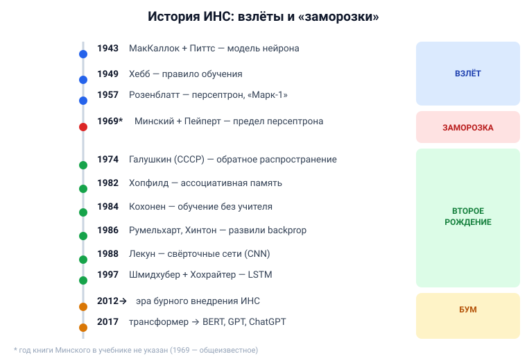

# Вопрос 3. История искусственных нейросетей.

## 🎯 Коротко для запоминания (прочитал → повторил → вспомнил)
- **1943 МакКаллок и Питтс** — первая модель искусственного нейрона.
- **1949 Хебб** — правило обучения. **1957 Розенблатт** — персептрон, нейрокомпьютер «Марк-1».
- **Минский и Пейперт** — показали ограниченность однослойного персептрона → **первая «заморозка»**.
- **1974 Галушкин (СССР)** → **1986 Румельхарт, Хинтон, Вильямс** — обратное распространение ошибки.
- **1982 Хопфилд** (ассоц. память), **1984 Кохонен** (без учителя), **1988 Лекун** (свёрточные сети).
- **1997 Шмидхубер и Хохрайтер — LSTM**. **~2012** — эра бурного внедрения. **2017 — трансформер**.

## В двух словах (для начала ответа)
История ИНС — это «качели»: всплески энтузиазма сменялись «заморозками», когда упирались в
ограничения. Идея родилась в **1943** (модель нейрона), пережила взлёт с персептроном, спад после
критики Минского, второе рождение благодаря **методу обратного распространения ошибки**, а с
**2012** — взрывной рост, приведший к трансформерам и нынешним большим моделям.

## Тезисы (для пересказа вслух)
Всё ниже — по [Тюгашев, «ИСТОРИЯ ИСКУССТВЕННЫХ НЕЙРОННЫХ СЕТЕЙ», ~стр. 24–25]:

- **1943 — МакКаллок и Питтс.** Работа «Логическое исчисление идей, относящихся к нервной
  деятельности». Предложили **модель искусственного нейрона** — это исток ИНС.
- **1949 — Хебб.** Предложил **правило (способ) обучения** нейронной сети.
- **1957 — Розенблатт.** Разработал **персептрон** — классический вариант ИНС. Создал первый
  нейрокомпьютер **«Марк-1»**, распознававший буквы английского алфавита (первая *аппаратная*
  реализация нейросети).
- **Минский и Пейперт** (книга о персептронах). Показали **принципиальную ограниченность
  однослойного персептрона** → спад интереса, **первые «заморозки»**: про нейросети «подзабыли»,
  финансирование ушло в другие области ИИ.
- **Возрождение — обратное распространение ошибки.** Идея: распространять сигнал ошибки от выходов
  к входам сети. Впервые описан **в 1974 г. в СССР Галушкиным**; существенно развит **в 1986 г.
  Румельхартом, Хинтоном и Вильямсом** (и независимо Барцевым и Охониным). Это «оживило» обучение
  многослойных сетей.
- **1982 — Хопфилд.** Семейство сетей, моделирующих **ассоциативную память**.
- **1984 — Кохонен.** Сеть с **обучением без учителя** (визуализация, кластеризация).
- **1988 — Ян Лекун.** **Свёрточные сети (CNN)**. Идея навеяна зрительной корой мозга («простые» и
  «сложные» клетки); название — от операции свёртки (обработка малых фрагментов изображения).
- **Конец 1990-х — новый всплеск. 1997 — Шмидхубер и Хохрайтер: LSTM** (рекуррентная сеть с
  «долгой краткосрочной памятью»; универсальна — при достаточном числе элементов может выполнить
  любое вычисление).
- **~2012 — настоящее: «эра бурного внедрения ИНС»**, огромные успехи (распознавание образов,
  речи и т.д.).

**Доведём до современности (мостик к трансформерам):**
- **2017 — архитектура «трансформер»** с механизмом внимания — революция в обработке текста.
  [Тюгашев, «АРХИТЕКТУРА ТРАНСФОРМЕР», ~стр. 73; История GPT.doc]
- Далее: **BERT → GPT-3 (2020) → ChatGPT (2022) → DeepSeek R1 (2025)** — большие языковые модели.
  [История GPT.doc]

## Иллюстрация (таймлайн — нарисовать на листочке)

\* год книги Минского точно в учебнике не назван — см. блок «вне источников».

## Аналогия / пример на пальцах
История ИНС — как **погода с заморозками и оттепелями**. Сначала «весна» (персептрон, большие
надежды), потом «заморозки» (Минский показал предел — финансирование заморозили), потом «оттепель»
(придумали, как обучать многослойные сети — обратное распространение), и наконец «жаркое лето» с
2012 года, когда нейросети стали везде.

---

## ⚠️ Чего нет в источниках / вне источников
- В учебнике **не указан точный год книги Минского и Пейперта** (сказано лишь «опубликовали»).
  *Вне источников (общеизвестное):* книга «Perceptrons» вышла в **1969** году.
- В учебнике эра с 2012 названа, но **не назван конкретный триггер**. *Вне источников
  (общеизвестное):* переломом 2012 года считают победу свёрточной сети **AlexNet** (Крижевский,
  Хинтон) в конкурсе распознавания изображений ImageNet.
- Даты BERT/GPT-3/ChatGPT взяты из `История GPT.doc` (GPT-3 — 2020, ChatGPT — ноябрь 2022).
