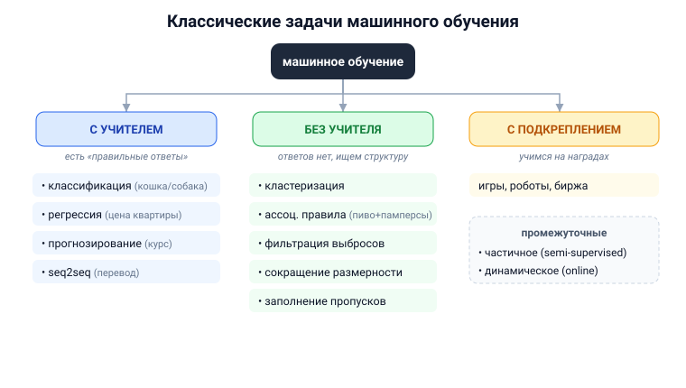

# Вопрос 4. Классические задачи машинного обучения и их разновидности. Плюсы и проблемы машинного обучения.

## 🎯 Коротко для запоминания (прочитал → повторил → вспомнил)
- **3 больших режима:** с учителем / без учителя / с подкреплением (+ частичное, +online).
- **С учителем** (есть «правильные ответы»): **классификация** (метки, кошка/собака),
  **регрессия** (число, цена квартиры), **прогнозирование** (ряды, курс акций), **seq2seq** (перевод).
- **Без учителя** (ответов нет): **кластеризация**, **ассоциативные правила** (пиво+памперсы),
  **фильтрация выбросов**, **сокращение размерности**, заполнение пропусков.
- **С подкреплением** — обучение через награды (игры, роботы, биржа).
- **Плюс МО:** учится само, без явного программирования; масса применений.
- **Проблемы:** **переобучение**, вычислительная сложность, нужны данные и эвристики.

## В двух словах (для начала ответа)
Машинное обучение — это когда система **учится на примерах**, а не получает прописанные правила.
Задачи делят по тому, **есть ли «правильные ответы»** в данных: если есть — обучение **с учителем**
(классификация, регрессия…), если нет — **без учителя** (кластеризация…), а если система учится
методом проб и наград — **с подкреплением**. Главный плюс — не надо программировать поведение
вручную; главные проблемы — переобучение и зависимость от данных.

## Тезисы (для пересказа вслух)

**Что такое задача МО (общая постановка)** [Тюгашев, гл.1, ~стр. 6]:
- Есть **обучающая выборка** — набор прецедентов (примеров). Нужно по частным данным выявить
  **общую зависимость** «вход → выход», работающую и на новых, ещё не виденных объектах.
- Термин «машинное обучение» ввёл **Артур Сэмюэль (1959)**: это когда компьютер показывает
  поведение, **которое в него явно не запрограммировали**. [Тюгашев, «История МО», ~стр. 7]

**① Обучение с учителем (supervised)** — у каждого примера известен «правильный ответ»
[Тюгашев, ~стр. 9–10]:
- **Классификация** — ответов конечное число (метки классов). Пример: на входе картинка → на выходе
  «кошка» или «собака».
- **Регрессия** — ответ это произвольное число/вектор. Пример: признаки квартиры → её цена.
- **Прогнозирование (forecasting)** — на входе отрезок временного ряда, нужен прогноз на будущее.
  Пример: курс акций за прошлый период → курс завтра.
- **seq2seq** — последовательность → последовательность. Пример: машинный перевод.
- Ещё: преобразование изображений, распознавание речи (звук→текст), генерация картинки по тексту и
  наоборот, **мультимодальные** модели (смесь текста/звука/видео).

**② Обучение без учителя (unsupervised)** — «правильных ответов» нет, ищем структуру в данных
[Тюгашев, ~стр. 11–12]:
- **Кластеризация** — сгруппировать похожие объекты (классификация с заранее неизвестными классами).
  Пример: сегментация клиентов в маркетинге.
- **Поиск ассоциативных правил** — найти часто встречающиеся вместе признаки. Пример: «пиво и
  памперсы» по чекам (если купил X, вероятно купит Y).
- **Фильтрация выбросов (outliers)** — найти нетипичные объекты. Пример: обнаружение мошенничества.
- **Сокращение размерности** — заменить много признаков меньшим числом без потери сути. Пример:
  свидетель описывает преступника словами (пол, рост, причёска) вместо миллионов пикселей фото;
  метод главных компонент.
- **Заполнение пропущенных значений** — достроить недостающие данные в таблице «объекты–признаки».

**③ Промежуточные и особые режимы** [Тюгашев, ~стр. 12–13]:
- **Частичное обучение (semi-supervised)** — ответы известны лишь для части примеров.
- **Обучение с подкреплением (reinforcement)** — система учится через **награды** среды; важен
  фактор времени. Примеры: компьютерные игры, самообучение роботов, инвестиционные стратегии.
- **Динамическое (online)** — примеры идут потоком, модель доучивается «на лету».

**Плюсы машинного обучения:**
- Учится **на данных**, поведение не надо программировать вручную. [Тюгашев, ~стр. 7]
- **Очень широкий спектр применений:** биоинформатика, медицина и диагностика, геология, экономика
  (кредитный скоринг, предсказание ухода клиентов, обнаружение мошенничества, биржевой анализ),
  техника, офисная автоматизация (распознавание текста, спам, суммаризация). [Тюгашев, ~стр. 13]
- Решает задачи, которые **прямым перебором не решаются** (помогают эвристики). [Тюгашев, ~стр. 6]

**Проблемы машинного обучения:**
- **Переобучение (overfitting)** — модель «зазубривает» обучающие примеры и **теряет способность к
  обобщению**: на новых данных работает плохо. [Тюгашев, ~стр. 100]
- **Вычислительная эффективность** — обучение требует больших ресурсов. [Тюгашев, ~стр. 6]
- МО — **инженерная** дисциплина: теория не сразу применима, нужны **эвристики** и обязательные
  **эксперименты** на данных. [Тюгашев, ~стр. 6]
- Зависимость от **качества и количества данных** (подробнее — вопрос 19); риск необъяснимости
  (вопрос 2).

## Иллюстрация (дерево задач — нарисовать на листочке)

## Аналогия / пример на пальцах
- **С учителем** — ученик решает задачи **с ответами в конце задачника**: сверяется и
  корректируется.
- **Без учителя** — дали кучу фотографий без подписей и сказали «разложи на похожие стопки».
- **С подкреплением** — как дрессировка: за правильное действие — «вкусняшка» (награда), и животное
  само понимает, как себя вести.
- **Переобучение** — как студент, **вызубривший** конкретные билеты наизусть: на чуть изменённый
  вопрос «плывёт», потому что не понял суть, а заучил.

---

## ⚠️ Чего нет в источниках / вне источников
- Всё содержание ответа — из учебника Тюгашева (разделы «Классические задачи МО», «История МО»,
  определение переобучения из раздела про Keras).
- *Вне источников (мелкое уточнение):* классические **методы** под эти задачи (которые препод может
  спросить дополнительно) — например, k-средних для кластеризации, линейная/логистическая регрессия,
  решающие деревья, метод главных компонент (PCA) для сокращения размерности. В разбираемом разделе
  учебника они подробно не перечислены.
