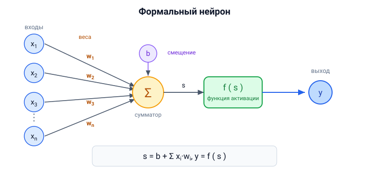
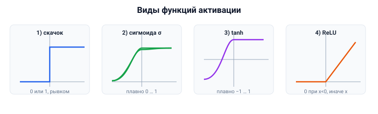

# Вопрос 5. Формальный нейрон. Функция активации. Виды функций активации.

## 🎯 Коротко для запоминания (прочитал → повторил → вспомнил)
- **Формальный нейрон** = входы xᵢ → умножаем на веса wᵢ → суммируем + смещение b → функция
  активации f → выход y. Формула: **s = b + Σ xᵢ·wᵢ,  y = f(s)**.
- **Функция активации** — решает, «возбудиться» ли нейрону; даёт **нелинейность** и порог.
- **Виды (из учебника):** ① единичный скачок (порог) ② линейный порог ③ сигмоида (логистическая,
  0…1) ④ гиперболический тангенс tanh (−1…1).
- **Ещё используют:** ⑤ ReLU (обнуляет отрицательные, max(0,x)) ⑥ softmax (на выходе → вероятности).
- **Для глубокого обучения** нужны **дифференцируемые** функции (сигмоида, tanh, ReLU) — чтобы
  работал backprop.

## В двух словах (для начала ответа)
Формальный нейрон — это упрощённая математическая модель живого нейрона: он берёт входы, взвешивает
их, складывает и пропускает сумму через **функцию активации**, которая решает, какой будет выход.
Функция активации задаёт «порог возбуждения» и нелинейность. Видов несколько: ступенька, сигмоида,
тангенс, ReLU и др.

## Тезисы (для пересказа вслух)

**От биологического к формальному** [Тюгашев, «Биологический нейрон», ~стр. 28–29]:
- Мозг — это ~80 млрд нейронов, каждый связан с тысячами других (всего ~10¹⁴–10¹⁵ связей).
- Биологический нейрон: **тело (сома)** + отростки; принимает импульсы через волокна, передаёт через
  единственный **аксон**; сила связи задаётся **синапсами** (их изменчивость = память и обучение).
- Формальный нейрон — искусственная модель этого: синапсы → **веса**.

**Структура формального нейрона** [Тюгашев, «Структура формального нейрона», ~стр. 29–31]:
- Имеет **n входов** x₁…xₙ и **один выход** y. С математической точки зрения — «скалярная функция
  векторного аргумента».
- Шаги работы:
  1. Каждый вход умножается на свой **вес** wᵢ.
  2. Произведения **суммируются**, добавляется **смещение b** → получаем значение **s** (это
     «сумматор»).
  3. s подаётся в **функциональный преобразователь f** — это и есть **функция активации**.
  4. Выход **y = f(s)**.
- Формула: **s = b + Σᵢ xᵢ·wᵢ,  y = f(s)**.
- Сети бывают **бинарные** (сигналы 0/1) и **аналоговые** (произвольные значения).

**Зачем нужна функция активации** [Тюгашев, ~стр. 30]:
- Чтобы воспроизвести поведение живого нейрона: возбуждения на входах могут долго нарастать, выход
  не меняется, и лишь при **преодолении порога** выход «скачком» переходит в другое состояние —
  нейрон **«возбуждается»**.
- Она же вносит **нелинейность** (без неё сеть из многих слоёв схлопывается в одно линейное
  преобразование).

**Виды функций активации (из учебника)** [Тюгашев, ~стр. 31]:
1. **Функция единичного скачка** (порог, «ступенька»): равна 0, при достижении порога **скачком**
   = 1. **Недифференцируема** — поэтому плохо подходит для обучения градиентами.
2. **Линейный порог** (гистерезис): как ступенька, но переход не вертикальный, а с небольшим
   **линейным** участком.
3. **Сигмоида (логистическая функция)**: гладкая монотонная S-образная кривая, область значений
   **0…1**, гладкий «скачок» около нуля. **Дифференцируема** → годится для обратного распространения.
   Формула: σ(x) = 1 / (1 + e⁻ˣ).
4. **Гиперболический тангенс (tanh)**: похож на сигмоиду, но область значений **−1…1**, переход
   более пологий.

**Ещё две важные (используются в современных сетях, в учебнике — в примерах кода):**
5. **ReLU** (выпрямитель): **обнуляет отрицательные** значения, положительные пропускает как есть,
   т.е. f(x) = max(0, x). Главная «рабочая лошадка» скрытых слоёв. [Тюгашев, примеры PyTorch/Keras,
   ~стр. 110]
6. **Softmax**: ставится на **выходном слое** для классификации — превращает выходы в **вероятности**
   классов (сумма = 1). [Тюгашев, пример Keras, ~стр. 100]

## Иллюстрация (нарисовать на листочке)

Схема формального нейрона:



Формы функций активации:



## Пример кода (формальный нейрон с сигмоидой, Python — из учебника)
[Тюгашев, «Пример создания нейросети на Питоне», ~стр. 45]
```python
import numpy as np

# функция активации: f(x) = 1 / (1 + e^(-x))
def sigmoid(x):
    return 1 / (1 + np.exp(-x))

class Neuron:
    def __init__(self, w):
        self.w = w
    def y(self, x):              # сумматор
        s = np.dot(self.w, x)    # суммируем взвешенные входы
        return sigmoid(s)        # применяем функцию активации

Xi = np.array([0, 0, 1, 1])      # значения входов
Wi = np.array([5, 4, 3, 1])      # веса входов
n = Neuron(Wi)
print('Y= ', n.y(Xi))            # обращение к нейрону
```
*(в этом учебном примере смещения b нет — оно опущено для простоты; в общей формуле b присутствует.)*

## Аналогия / пример на пальцах
Нейрон — как **приёмная комиссия с весами голосов**: каждый «эксперт» (вход) подаёт сигнал, но у
кого-то голос важнее (больший вес). Голоса складывают, и если сумма перевалила за **порог** — решение
принято (нейрон «сработал»). Функция активации — это и есть **правило**, как из суммы голосов
получить итог: резко (ступенька) или плавно (сигмоида).

---

## ⚠️ Чего нет в источниках / вне источников
- Все 4 «классические» функции и структура нейрона — прямо из учебника (раздел «Структура
  формального нейрона», стр. 29–31). ReLU и softmax в учебнике даны **в примерах кода**, а не как
  отдельный теоретический список — я свёл их вместе для полноты.
- *Вне источников (общеизвестное, если препод копнёт):* у ReLU есть проблема «**мёртвых нейронов**»
  (если вход всегда отрицателен, нейрон навсегда выдаёт 0) — отсюда варианты **Leaky ReLU**, **GELU**
  и др. В разбираемых разделах учебника эти варианты не описаны.
