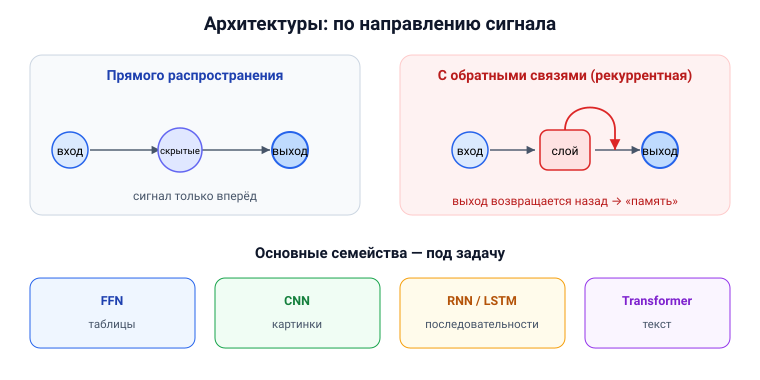

# Вопрос 6. Основные архитектуры современных искусственных нейронных сетей.

## 🎯 Коротко для запоминания (прочитал → повторил → вспомнил)
- **4 главных семейства:** ① полносвязная (FFN/MLP) ② свёрточная (CNN) ③ рекуррентная (RNN/LSTM/GRU)
  ④ трансформер.
- **Базовая идея — многослойная (глубокая) сеть** → отсюда «глубокое обучение».
- **По направлению сигнала:** прямого распространения (только вперёд) vs **рекуррентные**
  (есть обратные связи).
- **Под задачу:** картинки → CNN; последовательности/текст → RNN/LSTM/трансформер; таблицы → FFN.
- **Прочие классификации:** с обратными связями / без; гомогенные/гетерогенные; синхронные/асинхронные.

## В двух словах (для начала ответа)
Нейроны соединяют в сети разными способами («топологиями»), и от способа соединения зависит, для
чего сеть хороша. Базовая архитектура — **многослойная (глубокая)** сеть. Дальше есть несколько
основных семейств: **полносвязные**, **свёрточные** (для изображений), **рекуррентные** (для
последовательностей) и **трансформеры** (современный лидер для текста).

## Тезисы (для пересказа вслух)

**Базис — многослойная (глубокая) сеть** [Тюгашев, «Архитектуры нейронных сетей», ~стр. 33]:
- Сигналы идут: входной слой → **скрытые слои** → выходной слой. Именно из «многослойности»
  («глубины») вырос термин **глубокое обучение (Deep Learning)**.
- Если сигнал идёт строго от входа к выходу — это **сеть прямого распространения**. Если есть
  **обратные связи** (выход слоя n идёт на вход более раннего слоя) — это **рекуррентная** сеть.
- **Однослойный персептрон** — вырожденный случай (n=1), исторически ограничен.

**Основные семейства современных архитектур** (по решаемым задачам):
1. **Полносвязная (FFN, многослойный персептрон MLP)** — каждый нейрон связан со всеми нейронами
   соседнего слоя. Базовая универсальная сеть (см. вопрос 7). [Тюгашев, ~стр. 33–34]
2. **Свёрточная (CNN)** — для **изображений**; сама выделяет признаки свёрточными слоями
   (см. вопрос 10). [Тюгашев, «Сверточные сети», ~стр. 56]
3. **Рекуррентная (RNN), в т.ч. LSTM и GRU** — для **последовательностей** (текст, аудио,
   временные ряды): имеет «память» о предыстории (см. вопросы 8, 9). [Тюгашев, «Рекуррентные…», ~стр. 66]
4. **Трансформер** — современный лидер для текста; вместо рекурренции — **механизм внимания**
   (см. вопрос 12). [Тюгашев, «Архитектура трансформер», ~стр. 72]

**Дополнительные классификации (из учебника)** [Тюгашев, ~стр. 33–35]:
- **Монотонные** — слой делится на возбуждающие и тормозящие блоки.
- **Без обратных связей** vs **с обратными связями** (рекуррентные). Среди рекуррентных:
  слоисто-циклические, слоисто-полносвязные, полносвязанно-слоистые; примеры — сети **Элмана** и
  **Жордана**, а также **LSTM**.
- **Гомогенные/гетерогенные** — одинаковые или разные функции активации у нейронов.
- **Синхронные/асинхронные** — состояние меняет один нейрон за такт или целый слой сразу.
- **Однородные/неоднородные** — нейроны выполняют одинаковые или разные функции.

**Важный вывод** [Тюгашев, «Теоремы…», ~стр. 37]:
- Архитектуру выбирают **под задачу**; для многих классов задач оптимальные конфигурации уже
  известны. Подбор архитектуры — сложная задача, которую сейчас даже поручают самому ИИ
  («нейросеть строит нейросеть», см. вопрос про AutoML).

## Иллюстрация (нарисовать на листочке)

## Аналогия / пример на пальцах
Архитектура сети — как **планировка цеха** под конкретное производство: для потока деталей
(картинок) удобен один конвейер (CNN), для текста, где важен порядок слов, — другой (RNN/
трансформер). Из одних и тех же «станков»-нейронов собирают разные линии под разные задачи.

---

## ⚠️ Чего нет в источниках / вне источников
- Группировку «4 семейства» (FFN/CNN/RNN/Transformer) я свёл сам из разных разделов учебника
  (главы 2 и 3); сами архитектуры и классификации — из учебника.
- Аббревиатуры FFN/MLP/CNN/RNN — общеупотребительные; в учебнике используются русские названия
  (полносвязная, свёрточная, рекуррентная).
