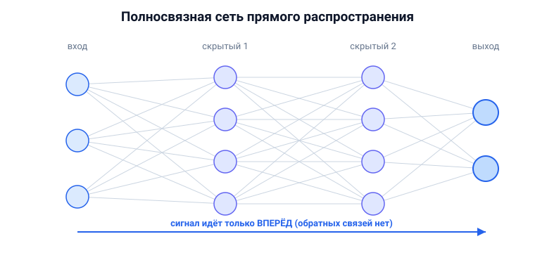

# Вопрос 7. Полносвязная глубокая нейронная сеть прямого распространения — особенности.

## 🎯 Коротко для запоминания (прочитал → повторил → вспомнил)
- **Прямого распространения** = сигнал идёт только вперёд: вход → скрытые → выход, без обратных связей.
- **Полносвязная** = каждый нейрон слоя связан со **всеми** нейронами следующего слоя.
- **Глубокая** = много скрытых слоёв → «глубокое обучение».
- **Теорема Хехт-Нильсена (1987):** двухслойная сеть способна представить почти любую функцию →
  нейросети **универсальны**.
- **Особенности:** обрабатывает один пример **независимо** (нет памяти), вход **фиксированной длины**,
  обучается **обратным распространением**.

## В двух словах (для начала ответа)
Это самая базовая «классическая» нейросеть: нейроны выстроены слоями, сигнал течёт строго от входа
к выходу, и каждый нейрон связан со всеми нейронами соседнего слоя. «Глубокая» — потому что скрытых
слоёв много. Главное теоретическое свойство — **универсальность**: такая сеть может приблизить
практически любую зависимость.

## Тезисы (для пересказа вслух)

**Что значат три слова в названии** [Тюгашев, «Архитектуры нейронных сетей», ~стр. 33]:
- **Прямого распространения (feedforward):** сигнал передаётся строго от входного слоя к выходному,
  слой n → слою n+1, **обратных связей нет** (в отличие от рекуррентных).
- **Полносвязная (fully connected):** каждый выход предыдущего слоя соединён со **всеми** входами
  каждого нейрона следующего слоя.
- **Глубокая:** между входом и выходом много **скрытых слоёв**; отсюда и термин **глубокое
  обучение (Deep Learning)**.

**Как устроена и работает:**
- Слои: **входной → скрытые → выходной**. Каждый нейрон: взвешенная сумма входов + смещение →
  функция активации (см. вопрос 5).
- Результат сети зависит от **весов**, а веса настраиваются **обучением**: сначала случайные
  малые значения, затем итеративная корректировка. Один проход по выборке — **эпоха**.
  [Тюгашев, «Обучение нейронной сети», ~стр. 38]
- Обучается методом **обратного распространения ошибки** (см. вопросы 16–17).

**Главная особенность — универсальность (теоремы)** [Тюгашев, «Теоремы Колмогорова–Арнольда и
Хехт-Нильсена», ~стр. 35–37]:
- **Колмогоров и Арнольд** доказали: непрерывную функцию многих переменных можно представить
  суперпозицией функций меньшего числа переменных.
- **Хехт-Нильсен (1987)** применил это к нейросетям: функцию достаточно общего вида можно
  представить **двухслойной** сетью прямого распространения с n входными, **(2n+1)** скрытыми
  (сигмоидальными) и m выходными нейронами.
- **«Теорема о полноте нейронных сетей»:** любая непрерывная функция на замкнутом ограниченном
  множестве может быть равномерно приближена нейросетью (если функция активации непрерывна и дважды
  дифференцируема). **Вывод: нейросети — универсальные вычислительные структуры.**

**Особенности/ограничения (что отличает от других архитектур):**
- Обрабатывает **каждый пример независимо** — нет «памяти» о предыдущих (в отличие от рекуррентных).
  [Тюгашев, «Рекуррентные…», ~стр. 66]
- Требует **вход фиксированного размера** (вектор фиксированной длины). [Тюгашев, ~стр. 67]
- Хорошо подходит для **табличных данных** (признак→значение); для картинок и текста есть более
  удачные архитектуры (CNN, RNN, трансформер).
- Теорема гарантирует **существование** подходящей сети, но **не говорит, как её обучить** —
  это неконструктивный результат.

## Иллюстрация (нарисовать на листочке)



## Пример кода (полносвязная сеть на Keras — из учебника)
[Тюгашев, «Применение библиотеки Keras», ~стр. 98]
```python
from keras.models import Sequential
from keras.layers import Dense, Activation

model = Sequential([
    Dense(32, input_shape=(784,)),  # полносвязный слой: 784 входа (28×28) → 32 нейрона
    Activation('relu'),             # функция активации скрытого слоя
    Dense(10),                      # выходной полносвязный слой: 10 классов
    Activation('softmax'),          # вероятности классов на выходе
])
```
*(`Dense` — это и есть полносвязный слой: он соединяет каждый вход с каждым нейроном.
784 = 28×28 — типичный размер картинки MNIST, развёрнутой в вектор.)*

## Аналогия / пример на пальцах
Полносвязная сеть — как **многоступенчатая комиссия**: на каждом этаже сидят эксперты, каждый
слушает **всех** экспертов с предыдущего этажа, делает свой вывод и передаёт **только наверх**
(назад — никогда). На верхнем этаже выносят итоговое решение. «Глубокая» = таких этажей много.

---

## ⚠️ Чего нет в источниках / вне источников
- Всё — из учебника (разделы «Архитектуры», «Теоремы Колмогорова–Арнольда и Хехт-Нильсена»,
  «Обучение нейронной сети», пример Keras).
- *Вне источников (общеизвестное уточнение):* современную «теорему об универсальной аппроксимации»
  чаще связывают с именами **Цыбенко (1989)** и **Хорника (1991)**; в учебнике этот результат
  изложен через теорему **Хехт-Нильсена** — на неё и опирайся как на источниковую.
