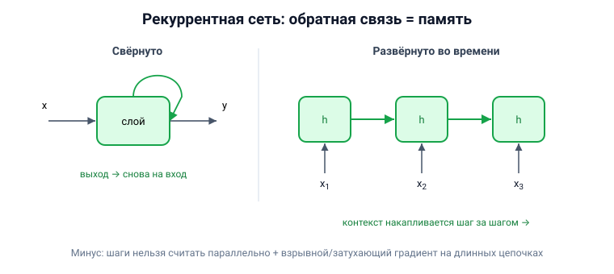

# Вопрос 8. Нейросети с обратными связями. Классификация. Примеры, сферы использования.

## 🎯 Коротко для запоминания (прочитал → повторил → вспомнил)
- **Сеть с обратными связями (рекуррентная)** = выход слоя возвращается на вход → у сети есть **«память»**.
- **Зачем:** для **последовательностей** (текст, аудио, временные ряды) — важна предыстория.
- **Как:** разворачивается во времени; каждый шаг получает новый элемент + результат прошлого шага.
- **Классы (учебник):** слоисто-циклические, слоисто-полносвязные, полносвязанно-слоистые.
- **Примеры:** Элман, Жордан, Хопфилд, **LSTM, GRU**.
- **Минусы:** нет параллелизма (медленно) + **взрывной/затухающий градиент**.

## В двух словах (для начала ответа)
Обычная сеть обрабатывает каждый пример отдельно и «забывает» предыдущие. А **рекуррентная** сеть
имеет **обратную связь** — её выход возвращается ей же на вход, поэтому она **помнит предысторию**.
Это нужно там, где важен порядок и контекст: текст, речь, временные ряды.

## Тезисы (для пересказа вслух)

**Что такое сеть с обратными связями** [Тюгашев, «Архитектуры…», ~стр. 33; «Рекуррентные…», ~стр. 66]:
- В обычной (прямого распространения) сети сигнал идёт только вперёд. В **рекуррентной** выход
  нейрона слоя n может подаваться на вход более раннего слоя m (m<n) — это и есть **обратная связь**.
- За счёт этого сеть **хранит информацию о предыдущих примерах** — появляется эффект «памяти»
  (реализуется **рекуррентными блоками**).
- Память **не абсолютная**: чем длиннее последовательность, тем сильнее «размывается» информация о
  самых первых элементах.

**Как работает (разворачивание во времени)** [Тюгашев, ~стр. 66–67]:
- Рекуррентный слой принимает не только новый вход, но и **свой же результат с прошлого шага**.
- Если «развернуть во времени» — получается цепочка обычных слоёв: на шаге t слой получает
  t-й элемент последовательности + накопленный результат предыдущих шагов.
- **Плюс:** не важна **длина** входной последовательности (предложение из 1 или 20 слов — без
  разницы), в отличие от полносвязных/свёрточных, требующих фиксированный размер.

**Классификация сетей с обратными связями** [Тюгашев, «Архитектуры…», ~стр. 34]:
- **а) слоисто-циклические** — слои замкнуты в кольцо: выходной слой передаёт сигнал входному, все
  слои равноправны.
- **б) слоисто-полносвязные** — каждый слой внутри полносвязный; сигналы идут и между слоями, и
  внутри слоя (такт делится на: приём → обмен внутри слоя → выдача).
- **в) полносвязанно-слоистые** — похожи, но без разделения фаз: на каждом такте нейроны принимают
  сигналы и от своего, и от последующих слоёв.

**Примеры конкретных архитектур:**
- **Сети Элмана и Жордана** — классические частично-рекуррентные сети. [Тюгашев, ~стр. 34–35]
- **Сеть Хопфилда (1982)** — моделирует **ассоциативную память**. [Тюгашев, «История ИНС», ~стр. 25]
- **LSTM и GRU** — улучшенные рекуррентные архитектуры для длинных зависимостей (см. вопрос 9).
- Замечание: рекуррентная сеть может описывать **конечный автомат**. [Тюгашев, ~стр. 35]

**Минусы (важно назвать)** [Тюгашев, ~стр. 67–68]:
- **Нет параллелизма:** чтобы обработать N-й элемент, нужно обработать все предыдущие → медленно.
- **Проблема градиента:** из-за многократного перемножения весов в длинной цепочке возникает либо
  **взрывной градиент** (веса >1 → растёт экспоненциально), либо **затухающий градиент** (веса <1 →
  убывает экспоненциально). Поэтому «классические» RNN на практике почти не используют — их заменили
  LSTM/GRU и трансформеры. (Эта проблема — ядро вопроса 18.)

**Сферы использования** [Тюгашев, ~стр. 34, 66, 70]:
- Обработка **текста** (машинный перевод, генерация текста), **речи/аудио**, **временных рядов**.
- Конкретные примеры применения LSTM: робототехника, распознавание речи и рукописного ввода,
  генерация музыки, анализ временных рядов, выявление гомологичных белков.

## Иллюстрация (нарисовать на листочке)

## Аналогия / пример на пальцах
Рекуррентная сеть — как **человек, читающий предложение слово за словом**: смысл каждого нового
слова он понимает **с учётом уже прочитанного**. Обычная сеть так не умеет — она бы смотрела на
каждое слово «с чистого листа», будто не читала предыдущие.

---

## ⚠️ Чего нет в источниках / вне источников
- Всё содержание — из учебника (разделы «Архитектуры нейронных сетей» и «Рекуррентные нейронные
  сети»). Различия сетей Элмана и Жордана учебник оставляет как **задание читателю** и подробно
  не расписывает.
- *Вне источников (общеизвестное):* у Элмана обратная связь идёт от **скрытого** слоя, у Жордана —
  от **выходного** слоя (это типичное различие, но в тексте учебника явно не приведено).
