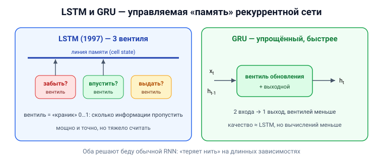

# Вопрос 9. Архитектуры нейросетей LSTM и GRU.

## 🎯 Коротко для запоминания (прочитал → повторил → вспомнил)
- **Зачем:** обычные рекуррентные сети «теряют нить» на длинных зависимостях — LSTM/GRU это чинят.
- **LSTM** (1997, Шмидхубер и Хохрайтер) = «долгая краткосрочная память»; модуль с **вентилями**
  (входной, забывания, выходной), которые регулируют поток информации в память и из неё.
- **Вентили** = слои с сигмоидой/tanh (значение 0…1) → «сколько информации пропустить».
- **GRU** (gated recurrent unit) = упрощённый LSTM: **меньше вычислений**, работает **быстрее**.
- **Оба** — разновидности рекуррентных сетей (с обратными связями).

## В двух словах (для начала ответа)
LSTM и GRU — это «умные» рекуррентные сети, которые решают главную беду обычных RNN: те быстро
забывают далёкий контекст. Внутри у них **вентили (gates)** — управляемые «краники», которые решают,
что запомнить, что забыть и что выдать. GRU — это упрощённая и более быстрая версия LSTM.

## Тезисы (для пересказа вслух)

**Проблема, которую они решают** [Тюгашев, «Рекуррентные…», ~стр. 68–69]:
- Обычная рекуррентная сеть по мере удлинения последовательности «**теряет нить**» — связь между
  далёкими словами слабеет.
- Пример из учебника: «Я вырос во Франции … я свободно говорю на **французском**». Чтобы предсказать
  язык, нужно «дотянуться» памятью до слова «Франция» далеко в начале — обычная RNN это плохо умеет.

**LSTM — Long Short-Term Memory («долгая краткосрочная память»)** [Тюгашев, ~стр. 69–70]:
- Предложена в **1997 году Шмидхубером и Хохрайтером**; относится к рекуррентным сетям.
- Состоит из **LSTM-модулей**, способных запоминать значения как на **короткие, так и на длинные**
  промежутки времени.
- Внутри модуля — **три-четыре «вентиля»** (gates), контролирующих потоки информации:
  - **входной вентиль** — сколько нового значения впустить в память;
  - **вентиль забывания** — сколько старого значения сохранить;
  - **выходной вентиль** — в какой мере содержимое памяти влияет на выход.
- Вентили реализованы через **сигмоиду/гиперболический тангенс** (значение в диапазоне [0;1]):
  умножение на это число = «частично пропустить или перекрыть» поток информации.
- **Применения:** робототехника, анализ временных рядов, распознавание речи и рукописного ввода,
  генерация музыки, распознавание активности человека, выявление гомологичных белков.

**GRU — Gated Recurrent Unit («закрытый рекуррентный блок»)** [Тюгашев, ~стр. 70–71]:
- Создан как **более простой и быстрый** аналог LSTM (тот точен, но тяжёл в вычислениях).
- По сути **похож на LSTM, но вычислений меньше**. У ячейки **два входа** (вектор текущего слова xₜ
  и состояние прошлой ячейки hₜ₋₁) и **один выход** (новое состояние hₜ).
- Вместо трёх вентилей LSTM использует меньше: **вентиль обновления** (заменяет вентили «забывания»
  и входной) и **выходной вентиль**; оба — слои с сигмоидой, плюс промежуточное состояние через tanh.
- Работает **быстрее LSTM**, поэтому применяется довольно часто.

**Итог сравнения:**
- LSTM — мощнее и точнее на сложных длинных зависимостях, но **тяжелее** считать.
- GRU — **проще и быстрее**, при этом качество часто сопоставимо.
- Оба нужны там же, где и рекуррентные сети: текст, речь, временные ряды.

## Иллюстрация (нарисовать на листочке)

## Аналогия / пример на пальцах
LSTM — как **конспект с тремя правилами**: что **записать** нового (входной вентиль), что **вычеркнуть**
из старого (вентиль забывания) и что **зачитать вслух** прямо сейчас (выходной вентиль). Благодаря
этому важное (например, «Франция») сохраняется надолго, а мусор стирается. GRU — тот же конспект,
но с **меньшим числом правил**, поэтому вести его **быстрее**.

---

## ⚠️ Чего нет в источниках / вне источников
- Всё — из учебника (раздел «Рекуррентные нейронные сети»). Учебник описывает вентили словами и даёт
  пошаговую схему GRU; точные формулы вынесены на рисунки (которые в извлечённом тексте недоступны).
- *Вне источников (общеизвестное):* в LSTM ключевую роль играет отдельная «линия памяти» —
  **состояние ячейки (cell state)**, по которой информация течёт почти без изменений; именно она
  спасает от затухания градиента. В тексте учебника этот термин явно не выделен.
