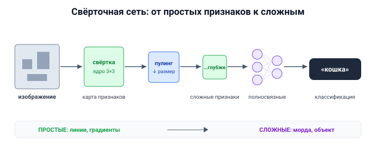

# Вопрос 10. Сверточные нейронные сети. История. Основные идеи, сферы применения.

## 🎯 Коротко для запоминания (прочитал → повторил → вспомнил)
- **Для чего:** изображения. Сеть **сама выделяет признаки**, не надо придумывать их вручную.
- **История:** 1962 Хьюбел и Визель (зрительная кора) → **1988 Ян Лекун** (рукописные цифры) →
  **2012 Крижевский и Хинтон** на ImageNet (ошибка 26→15%) → 2015 побили человека.
- **Главные слои:** **свёрточный** (ядро 3×3 «сканирует» картинку → карта признаков) + **подвыборка
  (pooling)** (уменьшает).
- **Идея иерархии:** ранние слои — простые признаки (линии), глубокие — сложные (морда собаки).
- **Сферы:** медицина, беспилотный транспорт, распознавание лиц. Сети: **ResNet, VGGNet, EfficientNet**.

## В двух словах (для начала ответа)
Свёрточная сеть — это архитектура для **изображений**. Её фишка: вместо того чтобы человек придумывал,
по каким признакам отличать кошку от собаки, сеть **сама** учится выделять признаки — от простых линий
на первых слоях до сложных объектов на глубоких. Работает похоже на **зрительную кору** мозга.

## Тезисы (для пересказа вслух)

**Зачем понадобились** [Тюгашев, «Сверточные сети», ~стр. 55–56]:
- Понять по картинке «кошка или собака» — легко для ребёнка, но долго было **почти неподъёмно для
  машины** (разные позы, освещение, фон).
- **Старый подход (до нейросетей):** человек вручную придумывал признаки (у дома — много прямых
  линий, у птицы — яркий окрас) и подавал их в простой линейный классификатор.
- **Подход CNN:** не придумывать признаки руками — подать на вход само изображение, и сеть **сама
  выделит** нужные признаки.

**История** [Тюгашев, ~стр. 56, 59]:
- **1962 — Хьюбел и Визель** открыли: в зрительной коре есть нейроны, реагирующие на границы
  определённой ориентации (вертикальные, горизонтальные, диагональные). Это вдохновило архитектуру.
- **1988 — Ян Лекун** предложил свёрточные сети, успешно применив их для распознавания **рукописных
  цифр**.
- **2012 — Алекс Крижевски и Джефф Хинтон** на конкурсе **ImageNet** (≈1 млн изображений, 1000
  классов) показали свёрточную сеть, снизившую ошибку почти вдвое: **с 26% до 15%**.
- **2015** — нейросеть **побила уровень человека** на ImageNet (Top-5 ошибка ~4,5%).

**Основные идеи и устройство** [Тюгашев, ~стр. 56–59]:
- Два главных типа слоёв: **свёрточный** и **подвыборка (pooling)**.
- **Свёрточный слой** (ключевой): по изображению «сканером» проходит **ядро свёртки** — небольшая
  матрица (часто **3×3**). Пиксели в окне умножаются на веса ядра → получается **карта признаков**
  (какие признаки и где есть на изображении). Разные ядра выделяют контур, текстуру, цвет.
- **Слой подвыборки (pooling)** — уменьшает карту признаков, оставляя самое важное.
- **Иерархия признаков:** свёртку+подвыборку повторяют несколько раз. Ранние слои выделяют простое
  (линии, градиенты), глубокие — сложное (например, нейрон, реагирующий на морду собаки).
- На **выходе** — обычные **полносвязные слои** для классификации/регрессии.
- **Плюсы:** меньше весов (быстрее настраивать), **менее подвержена переобучению**, чем полносвязная.
- Обучается так же, как полносвязная: forward → функция потерь → backpropagation (стохастический
  градиентный спуск). Часто используют **предобученные** модели.

**Сферы применения** [Тюгашев, ~стр. 60–61]:
- **Медицина:** анализ рентгена, МРТ, КТ, УЗИ — поиск патологий, диагностика.
- **Транспорт/робототехника:** беспилотники распознают знаки, полосы, объекты.
- **Распознавание лиц:** аутентификация в банке, видеонаблюдение.
- Известные свёрточные сети: **ResNet** (остаточные связи / skip connections — позволяют обучать
  очень глубокие сети), **VGGNet** (маленькие фильтры), **EfficientNet** (большая, много параметров).
- **Ограничение:** плохо подходят для **последовательных данных и временных рядов** (там лучше RNN/
  трансформеры).

## Иллюстрация (нарисовать на листочке)

## Аналогия / пример на пальцах
Свёрточная сеть — как **зрение, идущее от деталей к целому**. Сначала глаз замечает **штрихи и
линии**, потом из них складываются **формы** (круг, ухо), потом — **целый объект** (морда собаки).
Ядро свёртки — это **лупа-сканер**, которая бежит по картинке и в каждом месте проверяет: «есть тут
мой признак или нет?».

---

## ⚠️ Чего нет в источниках / вне источников
- Всё — из учебника (раздел «Сверточные сети»). Названия ResNet/VGGNet/EfficientNet, даты и метрики
  ImageNet (26→15%, ~4,5%) — оттуда же.
- *Вне источников (мелкое уточнение):* сеть Крижевского–Хинтона 2012 года носит имя **AlexNet**, а
  ключевая операция pooling чаще всего реализуется как **max-pooling** (берётся максимум в окне) —
  в учебнике эти конкретные названия не приводятся.
