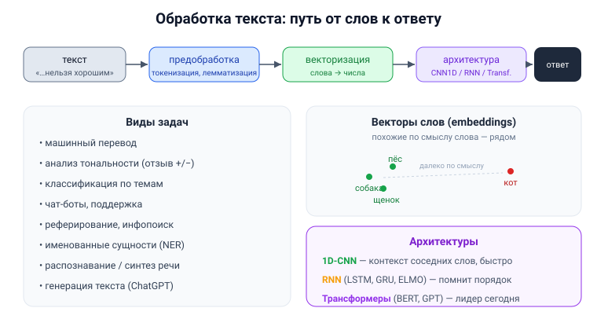

# Вопрос 11. Использование нейросетей для обработки текста. Виды решаемых задач, применяемые архитектуры.

## 🎯 Коротко для запоминания (прочитал → повторил → вспомнил)
- **NLP** = обработка естественного языка; две большие задачи: **анализ** (понять смысл) и **синтез** (сгенерировать текст).
- **Сначала предобработка:** регистр → очистка → токенизация → части речи → лемматизация → **векторизация** (текст → числа).
- **Задачи:** перевод, тональность, классификация по темам, чат-боты, реферирование, NER, распознавание/синтез речи, генерация.
- **Архитектуры:** **1D-CNN**, **RNN (LSTM/GRU/ELMO)**, **трансформеры (BERT)**.
- **Векторы слов (embeddings):** близкие по смыслу слова — рядом в пространстве (собака≈пёс≈щенок). word2vec.

## В двух словах (для начала ответа)
Нейросеть не понимает буквы — текст сначала **превращают в числа** (векторы). Затем его обрабатывают
специальные архитектуры. Задач много: от перевода и анализа тональности отзывов до чат-ботов и
генерации текста (ChatGPT — это как раз нейросеть для текста). Главные архитектуры — одномерные
свёрточные, рекуррентные (LSTM/GRU) и трансформеры.

## Тезисы (для пересказа вслух)

**Что такое NLP** [Тюгашев, «Нейросети для анализа естественного языка», ~стр. 133]:
- NLP — на пересечении **ИИ и математической лингвистики**. Две большие задачи: **анализ** (понять
  смысл текста) и **синтез** (сгенерировать свой текст).

**Предобработка текста (обязательный этап)** [Тюгашев, ~стр. 133]:
1. привести к единому **регистру**;
2. **очистка** (убрать пунктуацию, разметку, незначимые слова);
3. **токенизация** — разбить на части (слова, n-граммы);
4. **разметка частей речи** (различить «село» — глагол/существительное);
5. **лемматизация / стемминг** — привести к словарной форме / основе;
6. **векторизация** — превратить текст в числа.

**Виды решаемых задач** [Тюгашев, ~стр. 134]:
- распознавание речи (речь → текст) и синтез речи (голосовые помощники);
- **машинный перевод**; **генерация текста**;
- **анализ тональности** (положительный/отрицательный отзыв);
- классификация текста **по темам**; реферирование/аннотирование; информационный поиск (Google/Yandex);
- выделение **именованных сущностей** (NER): имена, даты, марки авто;
- **чат-боты** (поддержка клиентов, поиск авиабилетов).
- *Замечание из учебника:* ChatGPT — именно нейросеть для текста, по сути предсказывает следующее слово.

**Применяемые архитектуры** [Тюгашев, ~стр. 135]:
1. **Одномерные свёрточные (CNN 1D)** — как 2D-свёртки, но «бегут» по последовательности слов;
   учитывают контекст соседних слов, быстрые. Для классификации текста — частый выбор.
2. **Рекуррентные (RNN)** — «помнят» предыдущие слова, важен порядок. На их основе:
   - **LSTM** (долгая краткосрочная память), **GRU** (вентильная, проще);
   - **ELMO** — две параллельные LSTM (слева-направо и справа-налево) → контекст с обеих сторон.
3. **Трансформеры** — современный лидер; **BERT** (Bidirectional Encoder Representations from
   Transformers) — самая передовая, учится предсказывать «замаскированные» слова.

**Как текст превращают в числа (векторизация)** [Тюгашев, ~стр. 136–139]:
- **Частотный подход:** «мешок слов» (Bag of Words) → нумеруем уникальные слова; **One-Hot**
  (вектор длины словаря: 1 если слово есть) и **TF-IDF** (частота слова × обратная частота в
  корпусе — гасит «частые везде» слова-предлоги).
- **Тематическое моделирование:** PLSA, LDA — «мягкое» отнесение слова к нескольким темам
  (слово «рецепт» → больше «кулинария», немного «медицина»).
- **Дистрибутивная семантика — векторы слов (word embeddings):** слово = точка в многомерном
  пространстве (обычно ~300 чисел); **семантически близкие слова лежат рядом** («собака», «пёс»,
  «щенок» ближе друг к другу, чем к «кот»). Нейросетевые: **word2vec** (режимы CBOW и SKIP-GRAM),
  **fasttext** (по n-граммам — понимает незнакомые слова); не нейросетевой — **GloVe**.

**Почему важен контекст (пример из учебника)** [Тюгашев, ~стр. 140]:
- Фраза «данный товар **нельзя** назвать **хорошим**»: по слову «хорошим» — позитив, но слово
  «нельзя» меняет смысл на негатив. Именно поэтому нужны архитектуры, учитывающие соседние слова.

## Иллюстрация

## Аналогия / пример на пальцах
Текст для нейросети — как **иностранный язык, записанный незнакомым алфавитом**. Сначала надо
перевести буквы в понятные машине числа (векторизация), причём так, чтобы похожие по смыслу слова
получали похожие числа. И только потом «читатель» (CNN/RNN/трансформер) разбирает смысл, **глядя
не на отдельные слова, а на их сочетания** (ведь «нельзя хорошим» ≠ «хорошим»).

---

## ⚠️ Чего нет в источниках / вне источников
- Всё — из учебника (раздел «Нейросети для анализа естественного языка», «Одномерные свёрточные
  сети»). Конкретные формулы word2vec/TF-IDF учебник не приводит, только идеи.
- *Вне источников (для связки с вопросом 12):* сегодня в большинстве задач NLP победили
  **трансформеры** (GPT, BERT) — они вытеснили RNN/LSTM из-за параллельности и работы с длинным
  контекстом.
