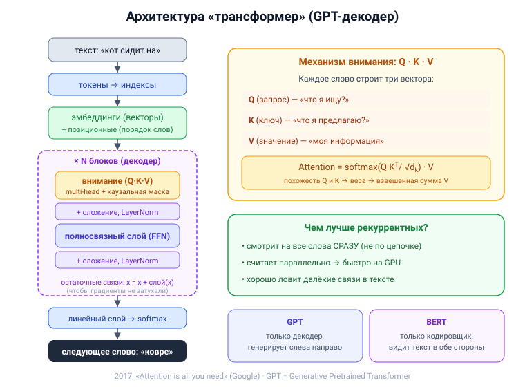

# Вопрос 12. Архитектура «трансформер».

## 🎯 Коротко для запоминания (прочитал → повторил → вспомнил)
- **2017, «Attention is all you need»** (Google) — трансформер, НЕ рекуррентная сеть.
- **Главное — механизм внимания (attention):** каждое слово смотрит на все нужные слова **сразу**
  (а не по цепочке).
- **Зачем:** RNN медленные (по шагам, нет параллелизма) — трансформер считает всё параллельно.
- **Путь данных:** текст → токены → эмбеддинги + позиционные → N блоков (внимание + полносвязный) → softmax.
- **Внимание = Q·K·V:** запрос·ключ → веса (softmax) → взвешенная сумма значений. **Multi-head** — несколько «голов».
- **GPT** = Generative **Pretrained Transformer** (только декодер); **BERT** = только кодировщик.

## В двух словах (для начала ответа)
Трансформер — это архитектура 2017 года, которая заменила рекуррентные сети в обработке текста.
Её сердце — **механизм внимания**: вместо того чтобы читать текст «по цепочке» слово за словом,
трансформер для каждого слова **сразу смотрит на все важные слова** и решает, какие из них важнее.
Это и быстрее (всё считается параллельно), и лучше ловит далёкие связи. На трансформерах построены
GPT, BERT и все современные большие языковые модели.

## Тезисы (для пересказа вслух)

**Зачем понадобился (проблема RNN)** [Тюгашев, «Архитектура трансформер», ~стр. 72; GPT-DS.pdf, ч.I]:
- Рекуррентные сети передают контекст **по цепочке** → следующий шаг ждёт предыдущий → нельзя
  считать **параллельно** → медленно (не загрузить GPU на полную).
- В **2017** исследователи Google в статье **«Attention is all you need»** предложили **трансформер**
  — он отказался от рекурренции и оставил **только внимание**.

**Главная идея — механизм внимания** [Тюгашев, ~стр. 72; GPT-DS.pdf, ч.I §4]:
- При каждом предсказании трансформер **фокусирует внимание только на важных словах**.
- По сути внимание — «умножение вектора слова на числа»: важное слово получает большие множители
  и «выделяется» среди соседей.
- Для каждого слова строят три вектора: **Запрос (Q)** — «что я ищу?», **Ключ (K)** — «что я
  предлагаю?», **Значение (V)** — «моя информация».
- Похожесть Q и K (скалярное произведение) → веса важности (через **softmax**) → выход слова =
  взвешенная сумма **V**. Формула: **Attention = softmax(Q·Kᵀ / √dₖ)·V** (делят на √dₖ, чтобы
  градиенты не «взрывались»).
- **Multi-head (многоголовое) внимание** — несколько «голов» параллельно ловят разные виды связей
  (грамматику, смысл, позицию).

**Путь данных (как устроено целиком)** [GPT-DS.pdf, ч.I §3–5; «Устройство GPT (1).docx»]:
1. **Текст → токены** (кусочки слов), каждому — числовой индекс.
2. **Эмбеддинги** — каждый индекс → вектор чисел (обучаемая таблица).
3. **+ Позиционные эмбеддинги** — добавляем информацию о порядке слов (иначе сеть не знает порядок).
4. **N одинаковых блоков**, в каждом: **внимание → сложение и нормализация (LayerNorm) →
   полносвязный слой (FFN) → снова сложение и нормализация**.
5. **Остаточные связи** (x = x + слой(x)) — чтобы градиенты «не затухали».
6. Финальный **линейный слой → softmax** → вероятности следующего слова.

**Кодер и декодер** [Тюгашев, ~стр. 73; История GPT.doc; GPT-DS.pdf]:
- Исходный трансформер = **кодер** (превращает текст в представление) + **декодер** (генерирует).
- **GPT** = Generative **Pretrained** Transformer — берёт **только декодер**, предсказывает следующее
  слово, генерирует слева направо (**каузальная маска** запрещает «подсматривать» вперёд).
- **BERT** = только **кодер** (12 или 24 слоя), учится предсказывать «замаскированные» слова,
  «видит» текст в обе стороны.
- **Предобучение (pretrained) + дообучение (fine-tuning):** дорого обучают один раз на огромном
  корпусе, выкладывают веса — дальше любой дообучает под себя.

## Иллюстрация



## Пример кода (один блок декодера на PyTorch — из GPT-DS.pdf)
[«Для занятия 30042026 GPT DS.pdf», ч.II «Практическая реализация»]
```python
import torch.nn as nn

class DecoderBlock(nn.Module):
    def __init__(self, d_model, n_heads, d_ff):
        super().__init__()
        self.ln1  = nn.LayerNorm(d_model)
        self.attn = CausalMultiHeadAttention(d_model, n_heads)  # внимание с каузальной маской
        self.ln2  = nn.LayerNorm(d_model)
        self.ff   = FeedForward(d_model, d_ff)                  # полносвязный слой

    def forward(self, x, mask=None):
        x = x + self.attn(self.ln1(x), mask)   # внимание + остаточная связь (skip)
        x = x + self.ff(self.ln2(x))           # FFN + остаточная связь (skip)
        return x
```
*(Весь GPT — это стопка таких блоков: `x = self.embed(x)` → N блоков `DecoderBlock` → финальный
LayerNorm → линейный слой в размер словаря → softmax. Полный код MiniGPT — в GPT-DS.pdf.)*

## Аналогия / пример на пальцах
Рекуррентная сеть читает текст **как по узкому коридору** — слово за словом, удерживая всё в голове.
Трансформер же **сразу смотрит на весь класс и понимает, кто сейчас важнее** (образ из материалов).
Механизм внимания — как если бы при чтении предложения ты мгновенно подсвечивал маркером те слова,
от которых зависит смысл текущего, и не отвлекался на остальные.

---

## ⚠️ Чего нет в источниках / вне источников
- Раздел трансформера в учебнике Тюгашева краткий; подробное устройство (Q/K/V, каузальная маска,
  multi-head, блок декодера) и код — из **GPT-DS.pdf** и **GPT-docx** (это присланные преподом
  материалы, читаются визуально). Всё с пометками.
- *Вне источников (общеизвестное уточнение):* исходная статья — Vaswani et al., 2017; «декодер
  только» GPT впервые сделали Radford et al., 2018 (это указано в GPT-DS.pdf как Vaswani-2017 /
  Radford-2018).
