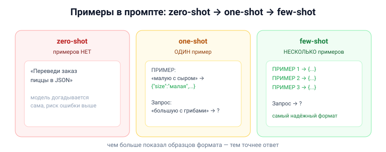

# Вопрос 14. Использование современных языковых моделей ИИ. Базовые принципы промпт-инжиниринга.

## 🎯 Коротко для запоминания (прочитал → повторил → вспомнил)
- **Промпт** = запрос к языковой модели. **Промпт-инжиниринг** = искусство их составлять.
- **Хороший промпт:** конкретный, с **ролью** ИИ («Ты — опытный…»), заданным **форматом/объёмом/стилем**, чёткий контекст.
- **Против «галлюцинаций»:** «руководствуйся только источником, ничего не придумывай».
- **Примеры в промпте:** **zero-shot** (без примеров) → **one-shot** (1) → **few-shot** (несколько).
- **Итеративность:** модель помнит контекст → можно пошагово уточнять: «перепиши, убери…, добавь…».
- **Тренд:** промпт-инжиниринг → **контекст-инжиниринг** (набор инструкций, примеров, документации для команды ИИ-агентов).

## В двух словах (для начала ответа)
Современные языковые модели (ChatGPT, Claude, GigaChat) делают то, что им скажешь на обычном языке —
но качество ответа сильно зависит от того, **как ты сформулировал запрос (промпт)**. Промпт-инжиниринг
— это набор приёмов, как составить запрос так, чтобы получить хороший результат: быть конкретным,
задать роль и формат, привести примеры и запретить выдумывать.

## Тезисы (для пересказа вслух)

**Что это и зачем** [Тюгашев, «Введение в промпт-инжиниринг», ~стр. 159–160]:
- В сети — масса моделей (ChatGPT, DeepSeek, Midjourney, GigaChat, YandexGPT, Кандинский).
- Чтобы пользоваться эффективно, надо освоить **составление запросов (промптов)**. Быть инженером по
  ML для этого не нужно — **написать промпт может каждый**.
- «Промпт-инжиниринг», по громким заявлениям, скоро станет востребованной профессией.

**Качества хорошего промпта** [Тюгашев, ~стр. 160]:
1. **Конкретность и однозначность.**
2. **Роль ИИ** — «от кого» текст («Ты — опытный преподаватель…», «Ты — маркетолог…»).
3. **Структура и границы** — задать длину (в словах/предложениях/страницах).
4. **Контекст и аудитория** — для кого (широкая публика / официальные органы / учёные); можно дать
   свой источник.
5. **Формат и стиль** ответа.
- Промпт должен быть **лаконичным, но ёмким** (ещё и потому, что запросы ограничены/платны).
- **Понятным** и тебе, и модели: «если что-то сбивает с толку тебя — собьёт и модель».
- Полезны **глаголы-команды**: «Проанализируй, Сравни, Создай, Опиши, Обобщи, Переведи…».

**Борьба с «галлюцинациями» (выдумками ИИ)** [Тюгашев, ~стр. 161]:
- Прямо указывать: «руководствуйся **только** официальными документами / приложенным источником»,
  «**ничего не добавляй от себя и не придумывай**».

**Примеры в промпте — zero/one/few-shot** [Тюгашев, ~стр. 162]:
- **zero-shot** — без примеров; **one-shot** — один пример; **few-shot** — несколько примеров
  (показываем формат ответа, например «преврати заказ пиццы в JSON»). Полезны и **негативные** примеры.

**Итеративное уточнение** [Тюгашев, ~стр. 163]:
- Чат-боты **помнят контекст** переписки → можно дорабатывать: «Неплохо, но перепиши: убери пункт о…,
  усиль акцент на…, добавь…». Повторять, пока результат не устроит.
- Можно попросить **саму модель улучшить промпт**.

**Куда всё движется** [Тюгашев, ~стр. 163]:
- Промпт-инжиниринг эволюционирует в **контекст-инжиниринг** — не одиночный запрос, а целый набор
  инструкций, примеров и документации, задающий **команде ИИ-агентов** экосистему (например, для
  разработки ПО).

**Для генерации изображений (Midjourney, DALL-E, Кандинский)** [Тюгашев, ~стр. 163]:
- Начать с **главного объекта**, потом фон; задать цвет/тональность, стиль (художник/жанр); для
  фотореализма — камеру/объектив/дистанцию; в конце — качество и размер («8K», «гиперреалистично»).

## Иллюстрация

## Структура хорошего промпта (чек-лист для листочка)

| Элемент | Зачем | Пример |
|---|---|---|
| **Роль** | задать «от кого» | «Ты — опытный преподаватель…» |
| **Задача** (глагол) | что сделать | «Объясни…», «Сравни…», «Переведи…» |
| **Контекст / источник** | на чём основываться | «по приложенному тексту», «для школьников» |
| **Формат и объём** | как оформить | «списком», «не более 500 слов», «в виде JSON» |
| **Стиль** | каким языком | «академический», «просто, короткими фразами» |
| **Запрет выдумок** | против галлюцинаций | «ничего не добавляй от себя» |
| **Примеры** (few-shot) | показать образец | «ПРИМЕР: … → JSON: …» |

## Аналогия / пример на пальцах
Языковая модель — как **очень способный, но буквальный исполнитель-фрилансер**: чем расплывчатее
ТЗ, тем случайнее результат. Хороший промпт — это **чёткое техзадание**: кто ты («опытный юрист»),
что нужно («составь претензию»), на чём основано («по этому договору»), в каком виде («одна страница,
официальный стиль») и чего не делать («не выдумывай фактов»). few-shot — это «вот образец, сделай так же».

---

## ⚠️ Чего нет в источниках / вне источников
- Все принципы — из учебника (раздел «Введение в промпт-инжиниринг и контекст-инжиниринг») и
  `История GPT.doc` (few-shot, instruct, RAG).
- *Вне источников (общеизвестное):* приём **«цепочка рассуждений» (chain-of-thought)** — «думай
  пошагово» — заметно улучшает ответы на логических задачах; в этом разделе учебника он не описан
  (хотя «reasoning» у DeepSeek R1 упомянут отдельно).
