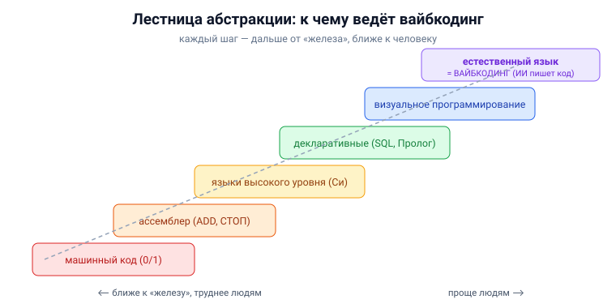

# Вопрос 15. Вайбкодинг и будущее ИТ. Ваше мнение.

## 🎯 Коротко для запоминания (прочитал → повторил → вспомнил)
- **Вайбкодинг** (термина в учебнике НЕТ) = писать программы, описывая задачу ИИ на **обычном языке**, а не кодом.
- **Основа:** LLM (ChatGPT, Claude, GigaChat) генерируют код по запросу; инструменты **Copilot, Cursor**.
- **Тренд абстракции:** машинный код → ассемблер → языки высокого уровня → декларативные → **естественный язык**.
- **Хуанг (Nvidia):** «языком программирования станет человеческий, каждый станет программистом».
- **«Программирование без программистов»** — лозунг ещё 1982 г. (Мартин).
- **Риск:** код ИИ часто требует доработки; «ПО критической важности» — ошибки опасны.

## В двух словах (для начала ответа)
Вайбкодинг — это новый способ создавать программы: ты **на обычном языке** говоришь ИИ, что нужно, а
он пишет код. В учебнике самого слова нет, но подробно описано само явление: большие языковые модели
уже генерируют программы по запросу, есть инструменты Copilot и Cursor, и звучат прогнозы, что
профессия программиста сильно изменится. Моё мнение — это **закономерный шаг в давней тенденции
повышения уровня абстракции**, который не отменит инженеров, а изменит их роль.

## Тезисы (для пересказа вслух)

**Что говорит учебник (фактическая опора)** [Тюгашев, «Нейросотрудники», ~стр. 155–158]:
- Большие языковые модели (ChatGPT, Claude, ГигаЧат) **генерируют код по запросу на естественном
  языке** — можно сказать на русском/английском, что нужно, без знания Python/C#/SQL.
- Уже можно сгенерировать рабочий **сайт по карандашному наброску**.
- Инструменты: **Copilot** (встроен в GitHub), расширения для **VS Code**, **Cursor** (анализирует
  не один файл, а целый проект).
- Глава Nvidia **Дженсен Хуанг**: «языком программирования станет человеческий, каждый станет
  программистом… детей можно прекращать учить программированию».
- Это **давняя тенденция роста абстракции:** машинный код → ассемблер (ADD, СТОП) → языки высокого
  уровня (Фортран, Си) → декларативные (SQL, Пролог) → визуальное программирование → теперь
  естественный язык.
- Лозунг **«программирование без программистов»** выдвинут ещё в **1982 г. (Мартин)**: люди
  ошибаются, а от надёжности ПО зависят жизни (атомные станции, медицина, космос).

**Важная оговорка из учебника (это не «серебряная пуля»)** [Тюгашев, ~стр. 156]:
- К качеству автогенерируемого кода **много претензий**: программа может сразу не запуститься,
  работать не так и требовать доработки. Хотя несложные задачи всё чаще решаются правильно сразу.

**Социальный сдвиг** [Тюгашев, ~стр. 157–158]:
- Под ударом — «креативный класс» (журналисты, копирайтеры, программисты), а не ручной труд.
- Ирония: «думали, роботы будут чистить снег, а человек — творить; вышло наоборот — роботы творят,
  человек чистит снег».

**Моё мнение (как требует вопрос) — сбалансированно:**
- **За:** вайбкодинг резко **снижает порог входа** и ускоряет рутину (скелет приложения, перевод с
  одного языка на другой, рефакторинг). Это логичное продолжение тренда абстракции — как когда-то
  ассемблер избавил от двоичных кодов.
- **Против/осторожно:** ИИ-код требует **проверки и понимания** — без базовых знаний нельзя оценить
  корректность и безопасность, особенно в «ПО критической важности». Растёт риск незаметных ошибок
  и зависимости от «чёрного ящика».
- **Вывод:** профессия не исчезнет, а **сместится** — от написания строк кода к постановке задач,
  проектированию, проверке и ответственности за результат. Знать основы по-прежнему нужно, чтобы
  быть «архитектором и контролёром», а не слепым исполнителем подсказок ИИ.

## Иллюстрация

## Аналогия / пример на пальцах
Вайбкодинг — как переход **от ручной коробки передач к автомату и автопилоту**. Машину всё ещё нужно
понимать: куда едешь, безопасно ли, что делать при сбое. Автопилот (ИИ) берёт рутину руления, но
**ответственность и маршрут — на водителе**. Так и программист становится не «набирателем кода», а
«штурманом», который ставит задачу и проверяет результат.

---

## ⚠️ Чего нет в источниках / вне источников
- ⚠️ **Слова «вайбкодинг» в материалах НЕТ.** Само явление (генерация кода по естественному языку,
  Copilot/Cursor, прогнозы о профессии) подробно описано в разделе «Нейросотрудники» — на него и
  опираюсь.
- **Вне источников (общеизвестное) — определение термина:** *вайбкодинг (vibe coding)* — популярный
  с 2025 года стиль разработки, когда человек описывает желаемое поведение программы на естественном
  языке, а ИИ генерирует код; разработчик в основном направляет и проверяет, мало вникая в детали
  реализации.
- Раздел «Моё мнение» — это **рассуждение** (как и требует вопрос), а не цитата; фактическая база
  под ним — из учебника, оценки и выводы мои.
