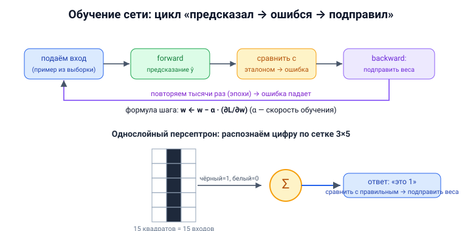

# Вопрос 16. Методы обучения искусственных нейронных сетей. Обучение однослойной сети.

## 🎯 Коротко для запоминания (прочитал → повторил → вспомнил)
- **Обучение = настройка весов** (сеть не программируют). 2 этапа: случайные веса → итеративная корректировка.
- **Эпоха** = один полный проход по обучающей выборке.
- **С учителем:** есть «правильные ответы» (нужен эксперт/разметчик); данные делят на **обучающие + тестовые**.
- **Методы:** градиентный спуск (наискорейший), Ньютон, Левенберга–Маркардта, стохастические; на практике — **обратное распространение ошибки**.
- **Однослойный персептрон** учат на примерах: показали вход → сравнили выход с эталоном → **подправили веса**.
- **Один нейрон на пальцах:** forward (предсказание) → ошибка → подстройка веса `w = w − α·градиент`.

## В двух словах (для начала ответа)
Обучить нейросеть — значит **подобрать веса** так, чтобы она давала правильные ответы. Сеть не
программируют пошагово: ей показывают примеры, она ошибается, и веса **постепенно подкручивают**,
уменьшая ошибку. Простейший случай — однослойный персептрон: показываем ему входы с известными
ответами и правим веса, пока он не научится.

## Тезисы (для пересказа вслух)

**Что такое обучение** [Тюгашев, «Обучение нейронной сети», ~стр. 37–38]:
- Нейросеть **не программируют** явными инструкциями. Результат зависит от **весов**, а веса
  получают значения в ходе **обучения**.
- Два этапа: **(1)** весам дают начальные **случайные** малые значения; **(2)** идёт **итеративная
  подстройка** весов, улучшающая качество.
- Один полный проход по обучающей выборке — **эпоха** (их обычно тысячи и десятки тысяч).

**Обучение с учителем** [Тюгашев, ~стр. 38–39]:
- Есть **«учитель»** — эксперт, дающий правильные ответы (новая профессия — **разметчик данных**).
- Данные делят на **обучающую выборку** и **тестовые** (проверочные не участвуют в обучении).
- Обучение прекращают, когда ошибка на тесте **приемлемо мала**.
- ⚠️ Если ошибка на обучении падает, а на тесте растёт — **переобучение** (сеть «зазубривает»).
  Пример-курьёз: сеть «распознавала танки», а на деле выучила **одинаковый фон** на всех фото.

**Методы обучения с учителем** [Тюгашев, ~стр. 40–41]:
- **Локальная оптимизация по производным 1-го порядка:** **градиентный метод (наискорейшего
  спуска)**, антиградиент, сопряжённые градиенты.
- **С производными 1-го и 2-го порядка:** метод Ньютона, Гаусса–Ньютона, **Левенберга–Маркардта**.
- **Стохастические:** случайный поиск, Монте-Карло, «имитация отжига».
- **Недостатки:** локальные методы находят лишь **локальные минимумы**; стохастические/глобальные —
  слишком много вычислений.
- **Практичный выбор — метод обратного распространения ошибки**: итеративный **градиентный** алгоритм,
  минимизирующий среднеквадратичную ошибку (см. вопрос 17).

**Обучение без учителя (кратко, для полноты)** [Тюгашев, ~стр. 43–44]:
- Без «правильных ответов», сеть сама находит структуру. Методы: **Хебба** (усиливаются связи между
  совозбуждёнными нейронами) и **Кохонена** (самоорганизующиеся карты).

**Обучение однослойной сети (персептрона)** [Тюгашев, «Пример создания нейросети», ~стр. 45–46]:
- **Однослойный персептрон** — простейшая сеть, но уже решает задачи классификации.
- Пример из учебника: учим распознавать **чёрно-белые цифры 0–9**, вписанные в таблицу **3×5**
  квадратика → нужно **15 входов (S-элементов)**, по одному на квадрат (чёрный = возбуждён, белый =
  покой).
- Принцип «как учат детей»: показываем картинку → говорим, какая это цифра → персептрон
  **сравнивает свой ответ с правильным** и **подправляет веса**. Повторяем на всех примерах.

**Как правится вес — на одном нейроне «на пальцах»** [backprop-PDF, стр. 1–6]:
- Аналогия: бросаем мяч в корзину с закрытыми глазами; промахнулись на 2 м вправо → в следующий раз
  корректируем бросок. Чем сильнее промах — тем сильнее правка.
- Шаги: **forward** (нейрон считает предсказание) → считаем **ошибку** → **backward** (находим, как
  ошибка зависит от веса = градиент) → **обновляем вес**: `w ← w − α·(∂L/∂w)`, где **α** —
  скорость обучения. Повторяем тысячи раз — ошибка падает.

## Иллюстрация



## Пример кода (одна итерация обучения нейрона, Python — по числам из backprop-PDF)
[backprop-PDF, стр. 2–6]
```python
# Один нейрон: вход x=2, цель y=1, начальный вес w=0.5, смещение b=0.1
import math
x, y, w, b, alpha = 2, 1, 0.5, 0.1, 0.1

def sigmoid(z): return 1 / (1 + math.exp(-z))

# 1) FORWARD — предсказание
s  = x * w + b           # s = 1.1
yp = sigmoid(s)          # ŷ ≈ 0.7503
L  = (y - yp) ** 2       # ошибка ≈ 0.0624

# 2) BACKWARD — градиент по цепному правилу (∂L/∂w)
dL_dyp = -2 * (y - yp)           # ≈ -0.4994
dyp_ds = yp * (1 - yp)           # производная сигмоиды ≈ 0.1874
ds_dw  = x                       # = 2
grad_w = dL_dyp * dyp_ds * ds_dw # ≈ -0.1872

# 3) UPDATE — подправляем вес в сторону уменьшения ошибки
w = w - alpha * grad_w           # w ≈ 0.5187  → ошибка на след. шаге упадёт
```

## Аналогия / пример на пальцах
Обучение — как **пристрелка**: выстрелил (предсказание), посмотрел, куда попал (ошибка), подкрутил
прицел (веса) — и так много раз, пока не начнёшь попадать. «Скорость обучения» α — это насколько
сильно крутить прицел за раз: много — будешь перелетать туда-сюда, мало — пристреливаешься вечно.

---

## ⚠️ Чего нет в источниках / вне источников
- Всё — из учебника (раздел «Обучение нейронной сети») и **backprop-PDF** (числовой пример с одним
  нейроном). Формулы backprop в учебнике даны, но частично «на рисунках» (в извлечённом тексте
  недоступны) — поэтому пошаговый числовой пример взят из backprop-PDF.
- *Вне источников (уточнение):* классическое **правило обучения персептрона** (дельта-правило
  Розенблатта): `wᵢ ← wᵢ + α·(d − y)·xᵢ`, где d — правильный ответ. В разобранных разделах учебника
  оно явной формулой не приведено — там показан принцип «сравни выход с эталоном и подправь веса».
