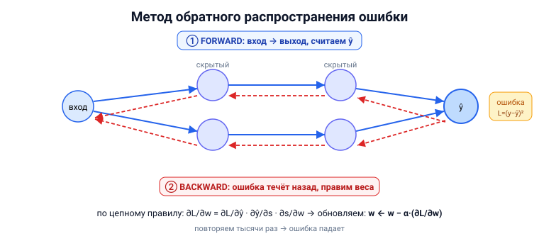

# Вопрос 17. Методы обучения искусственных нейронных сетей. Проблемы глубокого обучения. Метод обратного распространения ошибки.

## 🎯 Коротко для запоминания (прочитал → повторил → вспомнил)
- **Обучение = подстройка весов** по примерам (методы: градиентный спуск, Ньютон, стохастические).
- **Глубокую сеть нельзя обучить «в лоб»** — известны только ошибки на выходе, а не на скрытых слоях.
- **Решение — обратное распространение ошибки (backprop):** прогнали вперёд → посчитали ошибку →
  пустили её **назад** по слоям → подправили веса.
- **Backprop = градиентный спуск + цепное правило** (∂L/∂w как произведение производных по цепочке).
- **Проблемы глубокого обучения:** переобучение, локальные минимумы, «паралич», затухание/взрыв градиента.

## В двух словах (для начала ответа)
Чтобы обучить сеть, нужно подправлять веса так, чтобы ошибка уменьшалась. В глубокой (многослойной)
сети есть загвоздка: мы знаем ошибку только на **выходе**, а как «виноваты» скрытые слои — неизвестно.
Эту проблему решает **метод обратного распространения ошибки**: ошибку «прогоняют назад» по сети и
для каждого веса вычисляют, насколько он повлиял на ошибку.

## Тезисы (для пересказа вслух)

**Методы обучения (с учителем)** [Тюгашев, «Обучение нейронной сети», ~стр. 40–41]:
- **Локальная оптимизация по производным:** градиентный спуск (наискорейший), сопряжённые градиенты;
  методы 2-го порядка — Ньютона, **Левенберга–Маркардта**.
- **Стохастические:** случайный поиск, Монте-Карло, «имитация отжига».
- **Недостатки:** локальные методы застревают в **локальных минимумах**; глобальные — слишком
  затратны. Поэтому на практике главный рабочий метод — **обратное распространение ошибки**.

**Почему глубокую сеть трудно обучить** [Тюгашев, ~стр. 39]:
- В многослойной сети **правильные выходы скрытых слоёв неизвестны** — трёхслойный персептрон уже
  нельзя обучить, зная только ошибки на выходе.
- Подбирать «правильные» выходы для каждого слоя вручную — нереально. Нужен умный способ
  распределить «вину» за ошибку по всем весам.

**Метод обратного распространения ошибки (backpropagation)** [Тюгашев, ~стр. 41–42; backprop-PDF, стр. 1–8]:
- Идея: пустить **сигнал ошибки от выходов к входам** — в обратном направлении к обычному потоку данных.
- Это **итеративный градиентный** алгоритм, минимизирующий среднеквадратичную ошибку.
- **Два прохода (на пальцах)** [backprop-PDF]:
  - **ЭТАП 1 — forward (вперёд):** подаём вход → считаем выход слой за слоем → получаем предсказание
    ŷ → считаем **ошибку** L = (y − ŷ)².
  - **ЭТАП 2 — backward (назад):** по **цепному правилу** находим ∂L/∂w для каждого веса (как ошибка
    зависит от веса = произведение производных по цепочке), двигаясь **от выхода ко входу**.
  - **Обновляем веса:** `w ← w − α·(∂L/∂w)`, α — скорость обучения. Повторяем тысячи раз.
- **Почему именно «обратное»?** Цепное правило позволяет **переиспользовать вычисления**: градиент
  последнего слоя помогает посчитать градиент предпоследнего и т.д. — огромная экономия. [backprop-PDF, стр. 7]

**Алгоритм по шагам** [Тюгашев, ~стр. 41–42]:
1. Инициализировать веса случайными значениями.
2. Подать образ, посчитать выход (прямой проход).
3. Посчитать ошибку выходного слоя.
4. По цепочке посчитать ошибки и коррекции весов для всех остальных слоёв (обратный проход).
5. Подстроить все веса; если ошибка велика — вернуться к шагу 2.

**Проблемы глубокого обучения** [Тюгашев, ~стр. 39, 67–68]:
- **Переобучение** — сеть «зазубривает» обучающие данные, теряя обобщение.
- **Локальные минимумы** и **«паралич»** сети (застревание).
- **Затухающий / взрывной градиент** в глубоких/рекуррентных сетях (подробно — вопрос 18).
- **Скорость обучения α:** слишком большая — «перепрыгиваем» минимум; слишком малая — учимся вечно.
  [backprop-PDF, стр. 8]

## Иллюстрация



## Пример кода (обратный проход для одного нейрона — по backprop-PDF)
[backprop-PDF, стр. 3–6]
```python
import math
x, y, w, b, alpha = 2, 1, 0.5, 0.1, 0.1
def sigmoid(z): return 1 / (1 + math.exp(-z))

# FORWARD: вход → выход → ошибка
s  = x * w + b           # 1.1
yp = sigmoid(s)          # ŷ ≈ 0.7503
L  = (y - yp) ** 2       # ошибка ≈ 0.0624

# BACKWARD: цепное правило ∂L/∂w = ∂L/∂ŷ · ∂ŷ/∂s · ∂s/∂w
grad = (-2 * (y - yp)) * (yp * (1 - yp)) * x   # ≈ -0.1872

# UPDATE: шаг против градиента
w -= alpha * grad        # w ≈ 0.5187 → на следующем шаге ошибка упадёт до ≈0.0581
```

## Аналогия / пример на пальцах
Backprop — как **разбор полёта в команде поваров** (образ из backprop-PDF). Клиент сказал
«пересолено!» (ошибка на выходе). Шеф идёт по цепочке назад и выясняет: кто пересолил — тот, кто
подавал, кто жарил или кто резал овощи? Каждый повар правит свои действия **пропорционально своей
вине**. В следующий раз блюдо будет вкуснее.

---

## ⚠️ Чего нет в источниках / вне источников
- Всё — из учебника (раздел «Обучение нейронной сети») и **backprop-PDF** (пошаговый числовой
  пример, аналогии «бросок мяча» и «команда поваров»). Точные формулы backprop в учебнике частично
  даны «на рисунках» (в извлечённом тексте недоступны) — поэтому числа взяты из backprop-PDF.
