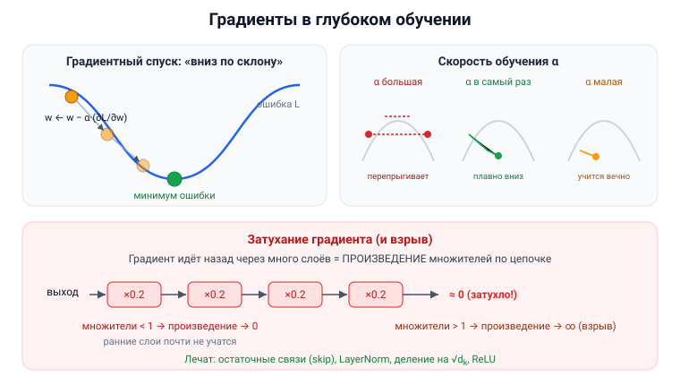

# Вопрос 18. Использование градиентов в глубоком обучении. Проиллюстрируйте, расскажите о проблемах метода, включая затухание градиентов.

## 🎯 Коротко для запоминания (прочитал → повторил → вспомнил)
- **Градиент = наклон поверхности ошибки**; показывает, куда и насколько менять веса.
- **Градиентный спуск:** идём «вниз по склону» к минимуму ошибки: `w ← w − α·(∂L/∂w)`.
- **α (скорость обучения):** большая → перепрыгиваем минимум; малая → учимся вечно.
- **Backprop = цепное правило:** градиент = **произведение производных** по всей цепочке слоёв.
- **Затухание градиента:** в длинной цепочке множители <1 перемножаются → результат **экспоненциально → 0** → ранние слои почти не учатся.
- **Взрыв градиента:** множители >1 → результат **экспоненциально → ∞**. Лечат: остаточные связи, нормализация, деление на √dₖ.

## В двух словах (для начала ответа)
Сеть учится **градиентным спуском**: градиент — это «наклон» функции ошибки, и мы шагаем в сторону
её уменьшения. Но в глубоких сетях градиент считается как **произведение многих чисел по цепочке
слоёв**, и если эти числа маленькие — произведение стремительно **затухает до нуля** (ранние слои
перестают учиться), а если большие — **взрывается**. Это главная проблема глубокого обучения.

## Тезисы (для пересказа вслух)

**Что такое градиент и зачем он** [backprop-PDF, стр. 3]:
- **Производная (градиент) — это «наклон поверхности» ошибки.** Она показывает, **в какую сторону и
  насколько сильно** менять вес, чтобы ошибка уменьшилась.
- Аналогия: стоишь на холме в тумане и хочешь спуститься — щупаешь землю и идёшь туда, где склон
  вниз самый крутой.

**Градиентный спуск** [Тюгашев, «Обучение нейронной сети», ~стр. 41; backprop-PDF, стр. 6]:
- Считаем градиент ошибки по каждому весу и делаем шаг **против** градиента (вниз по склону):
  **w ← w − α·(∂L/∂w)**.
- В свёрточных/глубоких сетях используют **стохастический градиентный спуск (SGD)** — главная задача
  «движения назад»: вычислить градиенты и обновить веса. [Тюгашев, «Сверточные сети», ~стр. 59]

**Как градиент считается в глубокой сети — цепное правило** [backprop-PDF, стр. 4]:
- Сеть — это **цепочка функций**: x → [s = x·w+b] → [ŷ = σ(s)] → [L = (y−ŷ)²].
- Градиент по весу = **произведение производных** по всей цепочке:
  ∂L/∂w = ∂L/∂ŷ · ∂ŷ/∂s · ∂s/∂w.
- В глубокой сети цепочка длиннее → **множителей больше**: ∂L/∂w₁ = ∂L/∂ŷ · ∂ŷ/∂h₃ · ∂h₃/∂h₂ · … —
  именно отсюда растут проблемы. [backprop-PDF, стр. 7]

**Проблема 1 — скорость обучения α** [backprop-PDF, стр. 8]:
- **α слишком большая** → «перепрыгиваем» минимум, сеть не учится (скачет туда-сюда).
- **α слишком малая** → учимся очень долго.
- **α в самый раз** → плавно спускаемся к минимуму ошибки.

**Проблема 2 — затухание и взрыв градиента** [Тюгашев, «Рекуррентные…», ~стр. 67–68]:
- Из-за большого числа слоёв возникает **многократное перемножение весов**.
- **Затухающий градиент** (веса < 1): перемножая много чисел **меньше 1**, получаем
  **экспоненциально убывающий** результат → к ранним слоям градиент приходит почти **нулевым** →
  **первые слои почти не обучаются**.
- **Взрывной градиент** (веса > 1): перемножая числа **больше 1**, получаем **экспоненциальный
  рост** → обучение «разносит».
- *Почему именно сигмоида усугубляет затухание (связка):* её производная всегда меньше 1
  (максимум ≈0.25), и в длинной цепочке произведение таких малых множителей быстро гаснет.

**Как с этим борются** [GPT-DS.pdf, ч.I §4–5]:
- **Остаточные связи (skip connections):** `x = x + слой(x)` — «помогают градиентам **не затухать**»
  (дают короткий путь градиенту в обход слоёв).
- **Нормализация (LayerNorm)** — стабилизирует обучение.
- В механизме внимания **делят на √dₖ** — «чтобы градиенты **не взрывались**».
- *Вне источников:* также помогают функции активации **ReLU** (производная 1 для x>0, не затухает) и
  аккуратная инициализация весов.

## Иллюстрация

## Аналогия / пример на пальцах
**Градиентный спуск** — спускаешься с горы в тумане: щупаешь, где круче вниз, и делаешь шаг (размер
шага = α). **Затухание градиента** — как **испорченный телефон** через 20 человек: сигнал (ошибка),
проходя назад через много слоёв и умножаясь на дроби (0.2 × 0.2 × 0.2 …), к началу цепочки почти
**исчезает** — первые «слушатели» (ранние слои) уже ничего не разбирают и не учатся.

---

## ⚠️ Чего нет в источниках / вне источников
- Механизм затухания/взрыва градиента (перемножение весов → экспоненциальное убывание/рост) — **прямо
  из учебника** (раздел «Рекуррентные сети», стр. 67–68). Градиентный спуск, цепное правило и
  проблема α — из **backprop-PDF**. Способы борьбы (остаточные связи, √dₖ) — из **GPT-DS.pdf**.
- *Вне источников (связка):* конкретно про «производную сигмоиды < 0.25» и про **ReLU/инициализацию**
  как лекарство — это общеизвестное дополнение; в явном виде в разобранных местах учебника не
  расписано (учебник говорит про «веса < 1», а не про производные активации).
