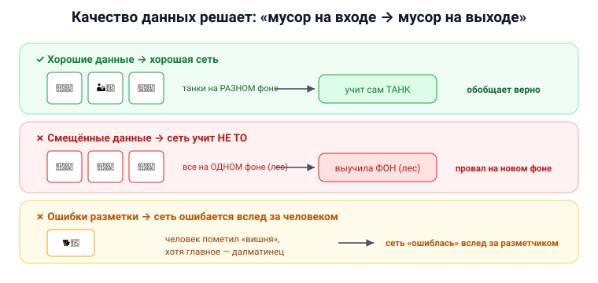

# Вопрос 19. Как качество данных, используемых при обучении, влияет на качество решения нейросетями поставленных задач? Приведите примеры.

## 🎯 Коротко для запоминания (прочитал → повторил → вспомнил)
- **«Мусор на входе → мусор на выходе»:** сеть учится по данным, плохие данные → бесполезная сеть.
- **Пример «танки»:** все фото на одном фоне → сеть выучила **фон**, а не танки.
- **Ошибки разметки:** размечают люди, люди ошибаются (далматинец/вишня) → сеть «ошибается вслед за человеком».
- **Нерепрезентативные данные** → сеть не обобщает на новые случаи.
- **Мало данных** → переобучение (зазубривает). Нужны тысячи примеров + отдельная тестовая выборка.

## В двух словах (для начала ответа)
Нейросеть **не программируют — её учат на данных**, поэтому она настолько хороша, насколько хороши
данные. Если данные неполные, смещённые или с ошибками в разметке, сеть выучит **не то**, что нужно,
и будет уверенно ошибаться. Качество данных — едва ли не важнее самой архитектуры.

## Тезисы (для пересказа вслух)

**Главный принцип** [Тюгашев, «Обучение нейронной сети», ~стр. 38]:
- Результат сети целиком зависит от обучения, а обучение — от данных. При обучении **на неадекватных
  примерах** сеть становится **бесполезной/неприменимой** для задачи.

**Пример 1 — «танки» (скрытое смещение данных)** [Тюгашев, ~стр. 39]:
- Сеть учили распознавать **танки** по фотографиям. Позже выяснилось, что все снимки сделаны на
  **одинаковом фоне**. В итоге сеть «научилась» распознавать **этот ландшафт**, а не танки —
  «поняла» не то, что нужно, а то, что **проще обобщить**.

**Пример 2 — ошибки разметки (далматинец и вишня)** [Тюгашев, «Сверточные сети», ~стр. 62–63]:
- На фото далматинец и на переднем плане вишня. Человек-разметчик пометил картинку как **«вишня»**.
  Сеть уверенно ответила **«далматинец»** (что логично) — и формально «ошиблась» **вслед за
  человеком**. Вывод учебника: **размечают люди, а люди ошибаются — это особая проблема**.
- Новая профессия эпохи ИИ — **разметчик данных**; от его аккуратности зависит качество. [Тюгашев, ~стр. 38]

**Пример 3 — переобучение из-за нехватки данных** [Тюгашев, ~стр. 39]:
- Если данных мало, сеть начинает **«запоминать» обучающие примеры** вместо обобщения
  (**переобучение**): на обучении ошибка падает, а на новых данных — растёт.
- Поэтому нужны **тысячи–десятки тысяч** примеров и отдельная **тестовая выборка** для честной проверки.

**Пример 4 — эталонные данные MNIST/NIST** [Тюгашев, «Применение Keras», ~стр. 103]:
- Качество моделей проверяют на стандартных наборах. **MNIST** (Ян Лекун) — рукописные цифры,
  отсканированные из документов **Национального института стандартов NIST**. Хорошие, чистые,
  размеченные данные — основа честного сравнения алгоритмов.

**Вывод (что влияет):**
- **Репрезентативность** (данные должны покрывать реальные случаи, а не один фон).
- **Корректность разметки** (ошибки людей передаются сети).
- **Достаточный объём** (мало данных → переобучение).
- **Чистота** (шум, лишние объекты на фото сбивают сеть).

## Иллюстрация

## Аналогия / пример на пальцах
Сеть — как **ученик, который учится только по тем примерам, что ему дали**. Если все задачи в
учебнике были с ответом «5», он будет везде писать «5». Если в примерах танки всегда на фоне леса —
он «выучит лес». А если учитель сам ошибся в ответах (плохая разметка) — ученик заучит ошибку. **Чему
научишь — то и получишь.**

---

## ⚠️ Чего нет в источниках / вне источников
- Все примеры (танки, далматинец/вишня, MNIST/NIST, переобучение, разметчик) — **прямо из учебника**.
- Отдельного цельного раздела «качество данных» в учебнике нет — ответ собран из разных мест (главы
  «Обучение» и «Сверточные сети»).
- *Вне источников (формулировка):* классический принцип звучит как **«Garbage In — Garbage Out»**
  (мусор на входе — мусор на выходе); самого этого выражения в учебнике нет, но идея описана.
