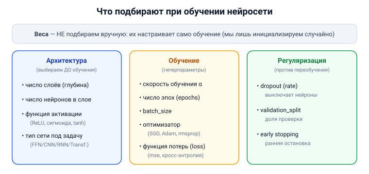

# Вопрос 20. Каковы основные параметры, которые необходимо подбирать при обучении и использовании искусственных нейронных сетей?

## 🎯 Коротко для запоминания (прочитал → повторил → вспомнил)
- **Веса** — НЕ подбирают вручную, их **настраивает обучение** (но инициализируют случайно).
- **Гиперпараметры обучения:** скорость обучения α, число **эпох**, размер пакета **batch_size**, **оптимизатор**.
- **Архитектура:** число **слоёв**, число **нейронов** в слоях, **функция активации**.
- **Функция потерь** (loss) — что минимизируем (mse, кросс-энтропия).
- **Регуляризация:** **dropout** (против переобучения).
- **При использовании:** длина входа, для генерации — «температура»/число токенов (вне источников).

## В двух словах (для начала ответа)
Сами **веса** сеть подбирает себе сама в ходе обучения. А вот человек должен задать **гиперпараметры**
— настройки «вокруг» обучения: насколько большие шаги делать (скорость обучения), сколько раз пройти
данные (эпохи), сколько слоёв и нейронов взять, какую функцию ошибки минимизировать и как бороться с
переобучением (dropout).

## Тезисы (для пересказа вслух)

**Что сеть настраивает сама** [Тюгашев, «Обучение нейронной сети», ~стр. 38]:
- **Веса синапсов** — НЕ задаются вручную, а **настраиваются обучением** (сначала случайные малые
  значения → итеративная подстройка). Это не «подбираемый» параметр, а результат обучения.

**Параметры обучения (гиперпараметры)** [Тюгашев, «Применение Keras», ~стр. 99–101]:
- **Скорость обучения α (learning rate)** — размер шага при подстройке весов. Слишком большая —
  «перепрыгиваем» минимум; слишком малая — учимся вечно. [backprop-PDF, стр. 8]
- **Число эпох (epochs)** — сколько раз пройти всю обучающую выборку (обычно тысячи).
- **Размер пакета (batch_size)** — сколько примеров обрабатывать за один шаг обновления градиента.
- **Оптимизатор** — алгоритм спуска: SGD, **rmsprop**, **adagrad**, **Adam** (часто хорош «из коробки»).

**Параметры архитектуры (что выбрать до обучения)** [Тюгашев, «Архитектуры…», ~стр. 33; «Теоремы…», ~стр. 37]:
- **Число слоёв** (глубина) и **число нейронов** в каждом слое.
- **Функция активации** нейронов (сигмоида, ReLU, tanh…).
- **Тип архитектуры** под задачу (полносвязная / свёрточная / рекуррентная / трансформер).

**Функция потерь и метрики** [Тюгашев, ~стр. 100–101]:
- **Функция потерь (loss)** — то, что сеть минимизирует: **mse** (для регрессии),
  **categorical_crossentropy** / **binary_crossentropy** (для классификации).
- **Метрики** — чем измеряем качество (например, **accuracy** — точность).

**Регуляризация (борьба с переобучением)** [Тюгашев, ~стр. 100]:
- **Dropout(rate)** — случайно «выключает» часть нейронов при обучении (напр., rate=0.5), чтобы сеть
  не зазубривала данные.
- **Доля валидации (validation_split)** — какая часть данных идёт на проверку, а не на обучение;
  ранняя остановка (early stopping), когда ошибка на тесте перестаёт падать.

**Параметры при использовании (инференсе):**
- Длина/формат входа; для генеративных языковых моделей — настройки генерации (см. «вне источников»).

## Иллюстрация

## Сводка параметров (таблица для листочка)

| Группа | Параметр | За что отвечает |
|---|---|---|
| **Настраивает обучение** | веса синапсов | результат обучения (не подбираем вручную) |
| **Архитектура** | число слоёв, число нейронов | ёмкость/глубина сети |
| | функция активации | нелинейность (ReLU, сигмоида…) |
| **Обучение** | скорость обучения α | размер шага |
| | число эпох | сколько раз пройти данные |
| | batch_size | примеров за шаг обновления |
| | оптимизатор | SGD, Adam, rmsprop… |
| | функция потерь (loss) | что минимизируем (mse, кросс-энтропия) |
| **Регуляризация** | dropout | против переобучения |
| | validation_split / early stopping | контроль переобучения |

## Аналогия / пример на пальцах
Представь, что **печёшь торт**. Сами «веса» — это как тесто, которое доходит само в духовке. А вот
**настройки печёшь ты**: температура (скорость обучения), сколько раз перемешать и сколько слоёв
коржей (эпохи, слои), размер порции замеса (batch), рецепт-цель (функция потерь) и «не класть всё
сразу», чтобы не приторно (dropout). Тесто доходит само — но если настройки кривые, торт не выйдет.

---

## ⚠️ Чего нет в источниках / вне источников
- Все параметры — из учебника (разделы «Обучение нейронной сети», «Применение библиотеки Keras»:
  optimizer, loss, batch_size, epochs, Dropout, validation_split) и backprop-PDF (скорость обучения).
  Отдельного списка «какие параметры подбирать» в учебнике нет — собран из этих мест.
- *Вне источников (общеизвестное):* при **использовании** генеративных моделей подбирают ещё
  **«температуру»** (степень случайности ответа), **top-k/top-p** и **число генерируемых токенов** —
  в разобранных разделах учебника эти параметры не описаны.
