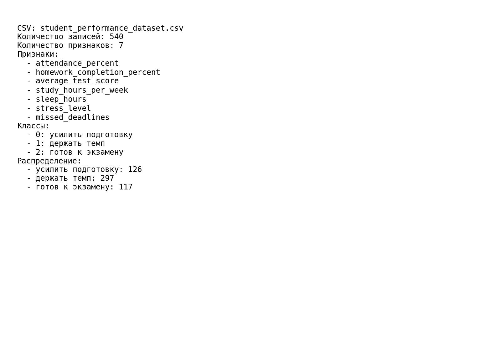
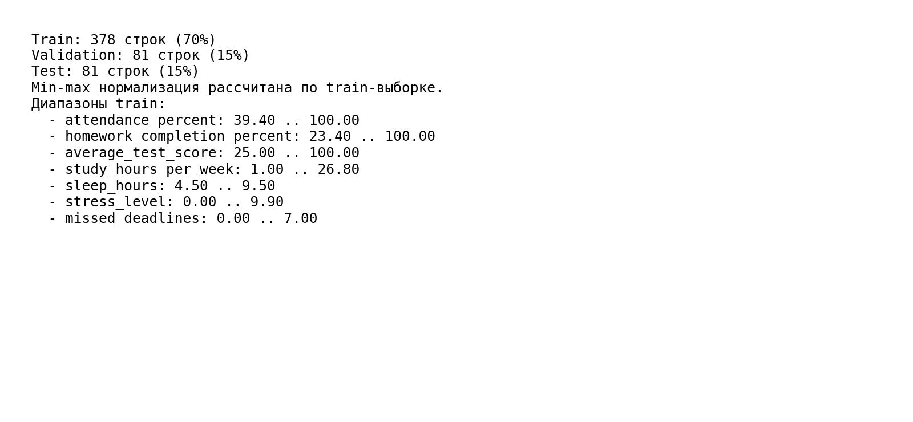
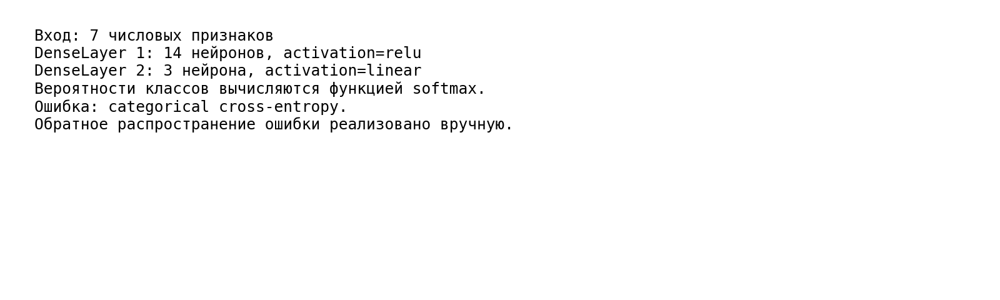
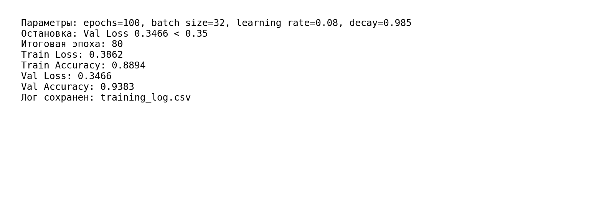
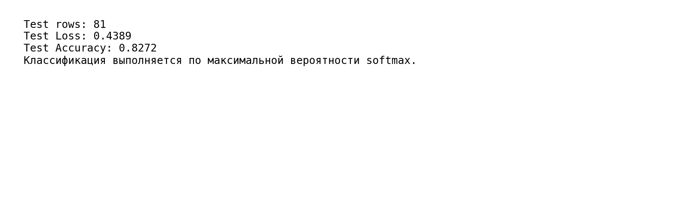
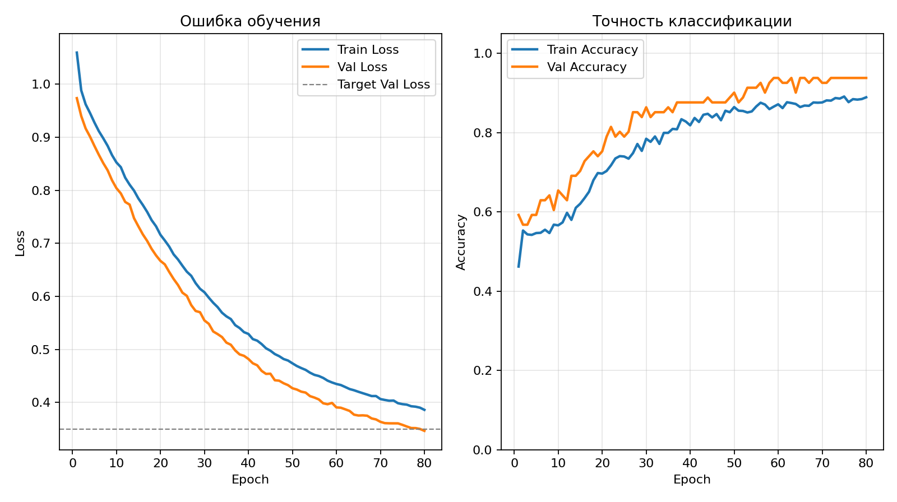
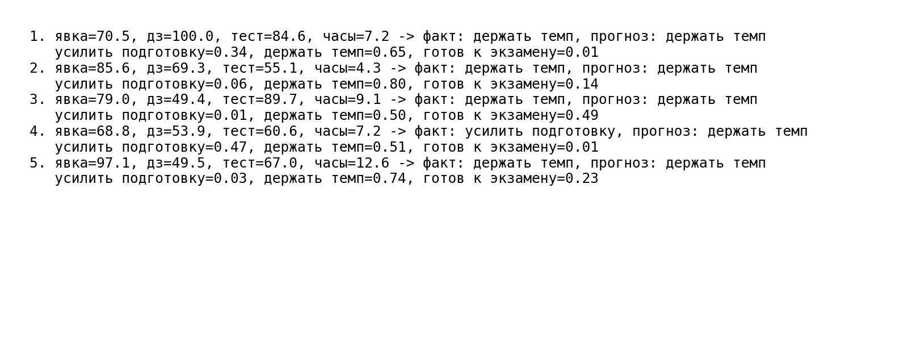

# ФЕДЕРАЛЬНОЕ ГОСУДАРСТВЕННОЕ АВТОНОМНОЕ ОБРАЗОВАТЕЛЬНОЕ УЧРЕЖДЕНИЕ ВЫСШЕГО ОБРАЗОВАНИЯ

## «САМАРСКИЙ НАЦИОНАЛЬНЫЙ ИССЛЕДОВАТЕЛЬСКИЙ УНИВЕРСИТЕТ ИМЕНИ АКАДЕМИКА С.П. КОРОЛЕВА»

## ИНСТИТУТ ИНФОРМАТИКИ И КИБЕРНЕТИКИ

## Кафедра программных систем

 

## ОТЧЕТ

по лабораторной работе №1  
по дисциплине «Нейронные сети»

**«Нейросеть своими руками»**

 

**Студент:** Фокин Евгений Андреевич  
**Группа:** 6303-020302D  
**Проверил:** профессор Тюгашев А.А.  
**Дата:** **\*\*\*\***\_\_**\*\*\*\***

 

**Самара 2026**

---

## Содержание

1. [Постановка задачи](#постановка-задачи)
2. [Исходный текст программы](#исходный-текст-программы)
3. [Протокол исполнения](#протокол-исполнения)
4. [Заключение](#заключение)
5. [Список использованных источников](#список-использованных-источников)

## Постановка задачи

Целью данной работы является изучение основных принципов работы искусственных нейронных сетей на примере реализации формального нейрона и создания простейшей нейронной сети на его основе. В рамках поставленной задачи необходимо:

- изучить основы языка Python;
- выбрать задачу классификации и сформировать обучающую выборку;
- написать функцию на Python, имитирующую одиночный формальный нейрон;
- создать класс «формальный нейрон» на Python;
- на основе формальных нейронов создать простейшую нейронную сеть;
- провести обучение сети и остановить его, когда ошибка на проверочной части данных станет меньше заданного предела.

В качестве прикладной задачи выбрана классификация рекомендации по подготовке студента к экзамену.

## Исходный текст программы

TODO: добавить исходный текст программы вручную.

## Протокол исполнения

**Рисунок 1 - Загрузка и генерация данных.**

**Рисунок 2 - Разделение на обучающую, валидационную и тестовую выборки.**

**Рисунок 3 - Создание нейронной сети.**

**Рисунок 4 - Обучение сети с остановкой при `Val Loss < 0.35`.**

**Рисунок 5 - Оценка на тестовых данных.**

**Рисунок 6 - Визуализация процесса обучения.**

**Рисунок 7 - Примеры предсказаний.**

## Заключение

В процессе выполнения работы были рассмотрены основы языка Python, а затем был разработан программный модуль, имитирующий работу формального нейрона, и создан класс нейронной сети для классификации рекомендации по подготовке студента к экзамену.

## Список использованных источников

1. Тюгашев А.А. Нейронные сети: учеб. пособие. - 179 с.
2. Kaggle [Электронный ресурс] // Smartphone Battery Health Prediction Dataset. URL: https://www.kaggle.com/datasets/vishardmehta/smartphone-battery-health-prediction-dataset (дата обращения 21.04.2026).
