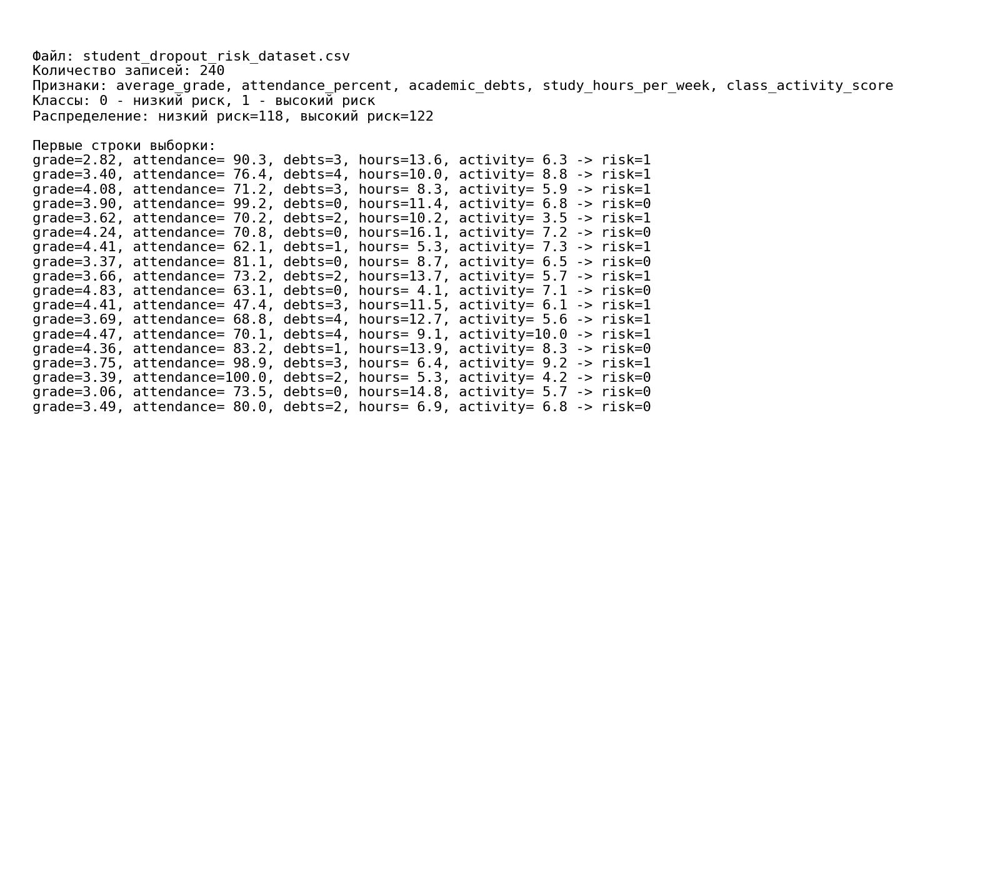
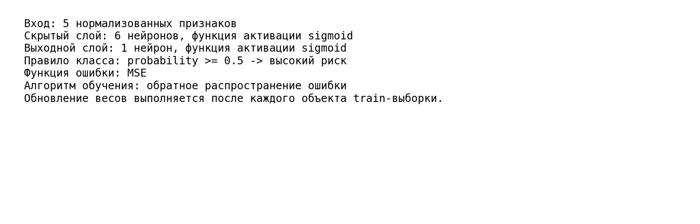
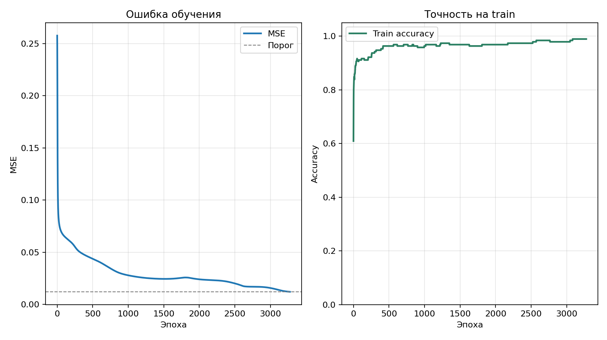
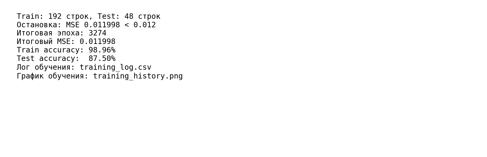
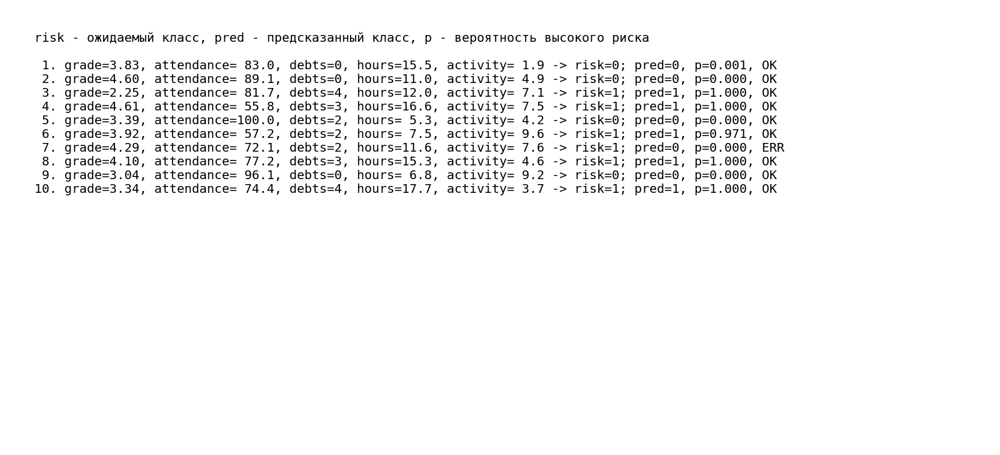

# ФЕДЕРАЛЬНОЕ ГОСУДАРСТВЕННОЕ АВТОНОМНОЕ ОБРАЗОВАТЕЛЬНОЕ УЧРЕЖДЕНИЕ ВЫСШЕГО ОБРАЗОВАНИЯ

## «САМАРСКИЙ НАЦИОНАЛЬНЫЙ ИССЛЕДОВАТЕЛЬСКИЙ УНИВЕРСИТЕТ ИМЕНИ АКАДЕМИКА С.П. КОРОЛЕВА»

## ИНСТИТУТ ИНФОРМАТИКИ И КИБЕРНЕТИКИ

## Кафедра программных систем

<br>

## ОТЧЕТ

по лабораторной работе №2  
по дисциплине «Нейронные сети»

**«Глубокое обучение самостоятельно запрограммированной нейросети»**

<br>

**Студент:** Фокин Евгений Андреевич  
**Группа:** 6303-020302D  
**Проверил:** профессор Тюгашев А.А.  
**Дата:** **\*\*\*\***\_\_**\*\*\*\***

<br>

**Самара 2026**

---

## Содержание

1. [Постановка задачи](#постановка-задачи)
2. [Исходный текст программы](#исходный-текст-программы)
3. [Протокол исполнения](#протокол-исполнения)
4. [Заключение](#заключение)
5. [Список использованных источников](#список-использованных-источников)

## Постановка задачи

Целью данной работы является изучение принципов работы многослойных нейронных сетей и алгоритма обратного распространения ошибки на примере реализации двухслойной нейронной сети для задачи бинарной классификации. Задача классификации - предсказание высокого риска отчисления студента по пяти признакам: средний балл, посещаемость, количество академических задолженностей, часы самостоятельной учебы в неделю и активность на занятиях. В рамках поставленной задачи необходимо:

- изучить теоретические основы алгоритма обратного распространения ошибки;
- реализовать на Python классы «формальный нейрон» и «слой нейронной сети», на их основе создать многослойную нейронную сеть с использованием библиотеки NumPy;
- обучить сеть на наборе данных и оценить точность классификации на обучающей и тестовой выборках.

## Исходный текст программы

Исходный текст программы находится в файле [`main.py`](main.py). В программе реализованы:

- генерация CSV-файла `student_dropout_risk_dataset.csv` на 240 записей;
- нормализация признаков;
- разделение выборки на train/test в отношении 80/20;
- классы `Neuron`, `Layer`, `NeuralNetwork`;
- архитектура сети `5 -> 6 -> 1`;
- функция активации sigmoid для скрытого и выходного слоев;
- функция ошибки MSE;
- обучение методом обратного распространения ошибки;
- расчет точности и сохранение протокольных изображений.

Ключевой фрагмент создания и обучения сети:

```python
network = NeuralNetwork(
    input_count=len(FEATURE_COLUMNS),
    layer_sizes=[6, 1],
    learning_rate=0.45,
)

history = network.fit(
    X_train,
    y_train,
    max_epochs=5000,
    error_threshold=0.012,
)

train_accuracy = network.accuracy(X_train, y_train)
test_accuracy = network.accuracy(X_test, y_test)
```

## Протокол исполнения

**Рисунок 1 - Входные данные и распределение классов.**



**Рисунок 2 - Архитектура двухслойной нейронной сети.**



**Рисунок 3 - График изменения ошибки MSE и точности на обучающей выборке.**



**Рисунок 4 - Результаты обучения и проверки.**



**Рисунок 5 - Примеры предсказаний на тестовой выборке.**



## Заключение

В процессе выполнения работы были изучены теоретические основы алгоритма обратного распространения ошибки, а затем с помощью языка Python реализованы классы «формальный нейрон» и «слой нейронной сети», на основе которых создана двухслойная нейронная сеть с использованием библиотеки NumPy. Для проверки работоспособности сети был сформирован набор из 240 записей о студентах с пятью признаками: средний балл, посещаемость, количество академических задолженностей, часы самостоятельной учебы в неделю и активность на занятиях. На основе этих данных сеть решала задачу предсказания высокого риска отчисления и достигла 87.50% точности на тестовой выборке.

## Список использованных источников

1. Тюгашев А.А. Нейронные сети: учеб. пособие. - 179 с.
2. NumPy documentation [Электронный ресурс]. URL: https://numpy.org/doc/ (дата обращения 02.05.2026).
3. Matplotlib documentation [Электронный ресурс]. URL: https://matplotlib.org/stable/ (дата обращения 02.05.2026).
