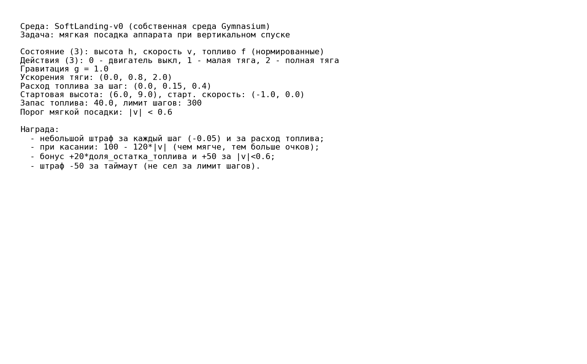
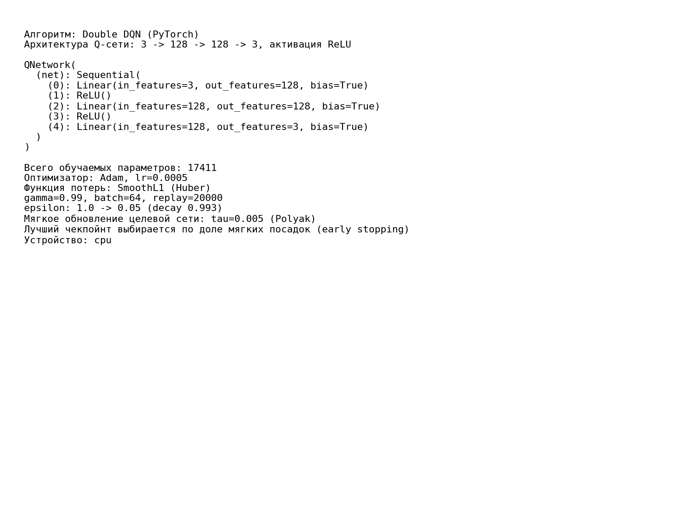
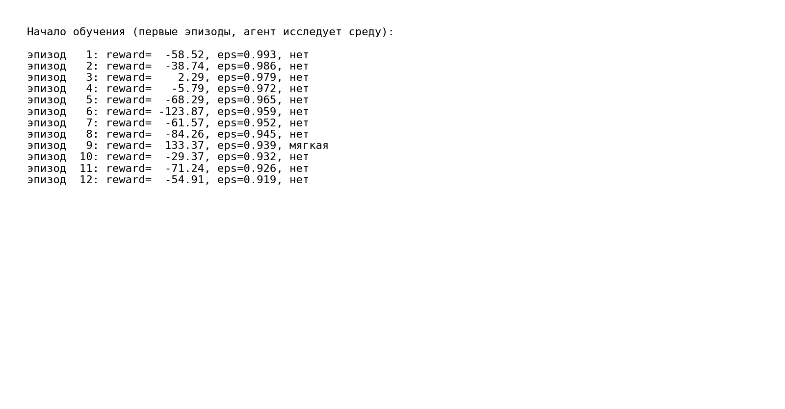
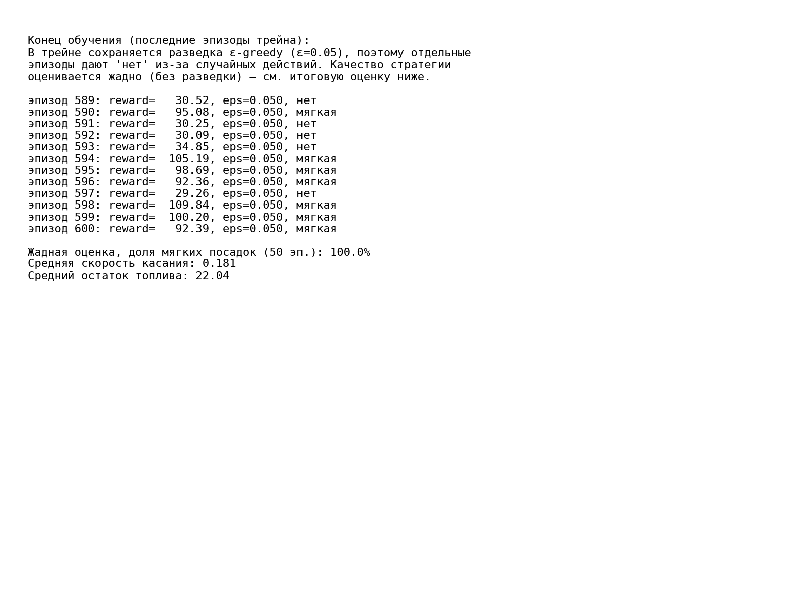
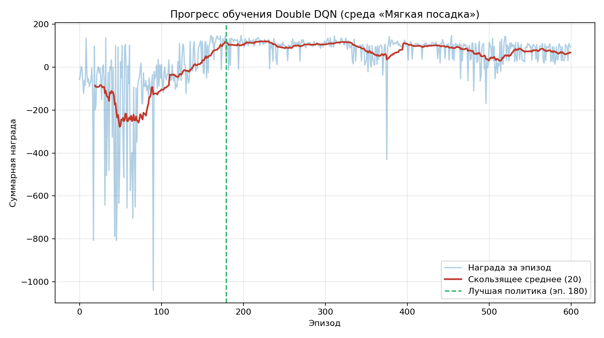
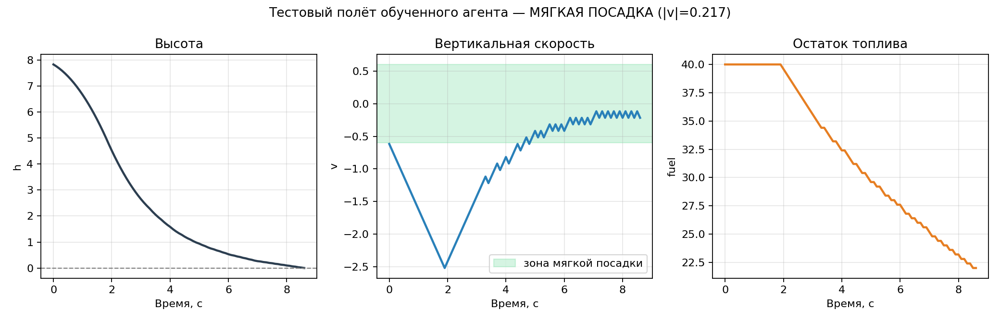
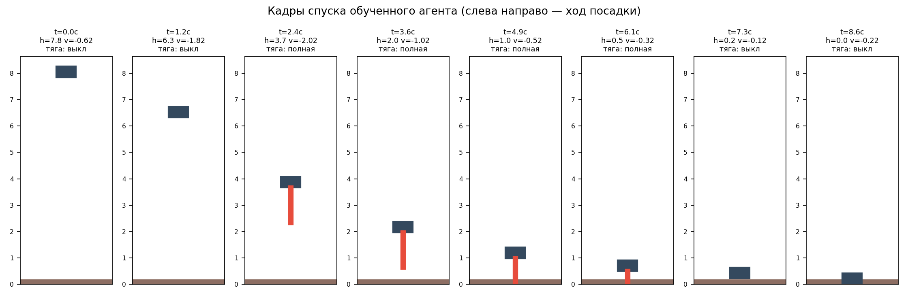

# ФЕДЕРАЛЬНОЕ ГОСУДАРСТВЕННОЕ АВТОНОМНОЕ ОБРАЗОВАТЕЛЬНОЕ УЧРЕЖДЕНИЕ ВЫСШЕГО ОБРАЗОВАНИЯ

## «САМАРСКИЙ НАЦИОНАЛЬНЫЙ ИССЛЕДОВАТЕЛЬСКИЙ УНИВЕРСИТЕТ ИМЕНИ АКАДЕМИКА С.П. КОРОЛЕВА»

## ИНСТИТУТ ИНФОРМАТИКИ И КИБЕРНЕТИКИ

## Кафедра программных систем

<br>

## ОТЧЕТ

по лабораторной работе №5  
по дисциплине «Нейронные сети»

**«Обучение с подкреплением»**

<br>

**Студент:** Фокин Евгений Андреевич  
**Группа:** 6303-020302D  
**Проверил:** профессор Тюгашев А.А.  
**Дата:** **\*\*\*\***\_\_**\*\*\*\***

<br>

**Самара 2026**

---

## Содержание

1. [Постановка задачи](#постановка-задачи)
2. [Исходный текст программы](#исходный-текст-программы)
3. [Протокол исполнения](#протокол-исполнения)
4. [Заключение](#заключение)
5. [Список использованных источников](#список-использованных-источников)

## Постановка задачи

Целью данной работы является изучение принципов обучения с подкреплением (Reinforcement Learning) и разработка модели, содержащей нейронную сеть, способной управлять динамической системой. Выбран вариант с собственной средой (вариант Б).

В качестве задачи рассматривается **мягкая посадка аппарата** — собственная среда `SoftLanding-v0`, реализованная на интерфейсе библиотеки Gymnasium. Аппарат снижается под действием гравитации, а агент на каждом шаге выбирает режим работы двигателя (выключен / малая тяга / полная тяга), стремясь коснуться поверхности с малой вертикальной скоростью и при этом экономно расходовать топливо. Задача относится к классу задач управления с дискретным множеством действий.

Для решения задачи применяется алгоритм глубокого Q-обучения **Double DQN**, в котором нейронная сеть аппроксимирует функцию ценности действий Q(s, a). В рамках работы необходимо:

- изучить основные принципы обучения с подкреплением и алгоритма DQN;
- спроектировать собственную среду: пространство состояний, множество действий, физику и функцию награды;
- реализовать нейронную сеть для аппроксимации Q-функции;
- реализовать механизм хранения опыта (Replay Buffer) и целевую сеть (target network) с мягким обновлением;
- настроить стратегию выбора действий ε-greedy;
- обучить агента, проанализировать процесс обучения по графику награды и оценить поведение обученного агента в среде.

Результатом работы является обученный агент, стабильно совершающий мягкую посадку аппарата.

## Исходный текст программы

Исходный текст программы находится в файле [`main.py`](main.py), список зависимостей — в [`requirements.txt`](requirements.txt). В программе реализованы:

- собственная среда `SoftLandingEnv` (наследник `gymnasium.Env`): состояние `[высота, скорость, топливо]` (нормированное), 3 дискретных действия, физика спуска и функция награды;
- нейронная сеть `QNetwork` (PyTorch) архитектуры `3 → 128 → 128 → 3` с активацией ReLU (17 411 обучаемых параметров);
- буфер воспроизведения опыта `ReplayBuffer`;
- агент `DoubleDQNAgent`: ε-greedy выбор действия, шаг обучения по схеме Double DQN, мягкое (Polyak) обновление целевой сети;
- цикл обучения с периодической жадной оценкой и сохранением лучшего чекпойнта (early stopping);
- оценка обученного агента, построение графиков и протокольных изображений.

**Среда.** Состояние — высота `h`, вертикальная скорость `v` (отрицательная — вниз) и остаток топлива `f`. Действия: `0` — двигатель выключен, `1` — малая тяга, `2` — полная тяга; тяга расходует топливо. Динамика на каждом шаге:

```python
self.fuel = max(0.0, self.fuel - cost)
self.v += (thrust - self.GRAVITY) * self.DT
self.h += self.v * self.DT
```

Эпизод завершается при касании поверхности (`h ≤ 0`) или по таймауту. Награда сделана гладкой по скорости касания, чтобы у агента был непрерывный градиент к более мягкой посадке:

```python
reward = -0.05 - 0.02 * cost              # штраф за время и расход топлива
if self.h <= 0.0:                          # касание поверхности
    impact = abs(self.v)
    reward += 100.0 - 120.0 * impact       # чем мягче, тем больше очков
    reward += 20.0 * (self.fuel / self.FUEL_START)
    if impact < self.V_SAFE:
        reward += 50.0                     # бонус за мягкую посадку
elif self.steps >= self.MAX_STEPS:
    reward += -50.0                        # не сел за лимит шагов
```

**Шаг обучения Double DQN.** Действие для следующего состояния выбирает обучаемая сеть, а оценивает — целевая, что снижает переоценку Q-значений:

```python
q_values = self.policy_net(states).gather(1, actions)
with torch.no_grad():
    next_actions = self.policy_net(next_states).argmax(dim=1, keepdim=True)
    next_q = self.target_net(next_states).gather(1, next_actions)
    target_q = rewards + GAMMA * next_q * (1.0 - dones)
loss = nn.SmoothL1Loss()(q_values, target_q)
```

Целевая сеть обновляется мягко на каждом шаге (`tau = 0.005`), что стабилизирует обучение. По ходу обучения каждые 20 эпизодов выполняется жадная оценка, и сохраняется лучшая по доле мягких посадок политика — она и используется как итоговая.

## Протокол исполнения

**Рисунок 1 - Описание среды, пространства состояний/действий и функции награды.**



**Рисунок 2 - Структура нейронной сети и гиперпараметры обучения.**



**Рисунок 3 - Начало обучения: агент исследует среду, посадки жёсткие.**



**Рисунок 4 - Конец обучения: стратегия сошлась; отдельные «нет» в трейне вызваны разведкой ε-greedy, жадная оценка даёт 100% мягких посадок.**



**Рисунок 5 - График суммарной награды по эпизодам (с отметкой лучшей политики).**



**Рисунок 6 - Тестовый полёт обученного агента: высота, скорость и топливо во времени.**



**Рисунок 7 - Кадры спуска обученного агента (слева направо — ход посадки).**



## Заключение

В ходе выполнения работы была изучена концепция обучения с подкреплением и реализована модель на основе алгоритма Double DQN, в которой нейронная сеть аппроксимирует функцию ценности действий. Для решения задачи была спроектирована собственная среда `SoftLanding-v0` (мягкая посадка аппарата) на интерфейсе Gymnasium, а агент реализован на PyTorch с буфером воспроизведения опыта, целевой сетью с мягким обновлением и ε-жадной стратегией.

В процессе обучения (600 эпизодов) суммарная награда выросла с резко отрицательных значений до устойчивого плато, что соответствует переходу от случайных жёстких касаний к управляемой мягкой посадке. Из-за характерной для DQN нестабильности на поздних эпизодах применялось сохранение лучшего чекпойнта (early stopping): итоговой выбрана политика, показавшая наилучшую долю мягких посадок (эпизод 180).

При финальной оценке на 50 независимых эпизодах обученный агент показал **100% мягких посадок** при средней скорости касания **|v| ≈ 0.18** (порог мягкости 0.6) и среднем остатке топлива **22 из 40**. Агент выработал экономную стратегию: сначала свободное падение без расхода топлива, затем тормозной импульс полной тягой, гасящий скорость у самой поверхности.

Полученные результаты подтверждают корректность реализации алгоритма и применимость методов обучения с подкреплением для задач управления динамическими системами.

## Список использованных источников

1. Тюгашев А.А. Нейронные сети: учеб. пособие. - 179 с.
2. PyTorch documentation [Электронный ресурс]. URL: https://pytorch.org/docs/ (дата обращения 29.05.2026).
3. Gymnasium documentation [Электронный ресурс]. URL: https://gymnasium.farama.org/ (дата обращения 29.05.2026).
4. Mnih V. et al. Human-level control through deep reinforcement learning // Nature. 2015. Vol. 518. P. 529-533.
5. van Hasselt H., Guez A., Silver D. Deep Reinforcement Learning with Double Q-learning // AAAI. 2016.
