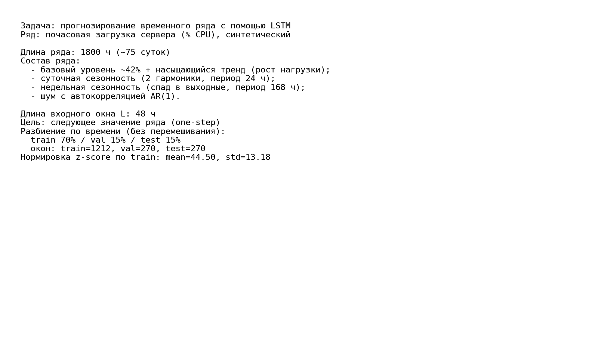
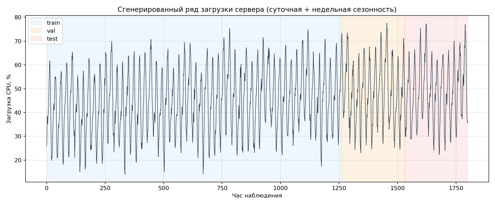
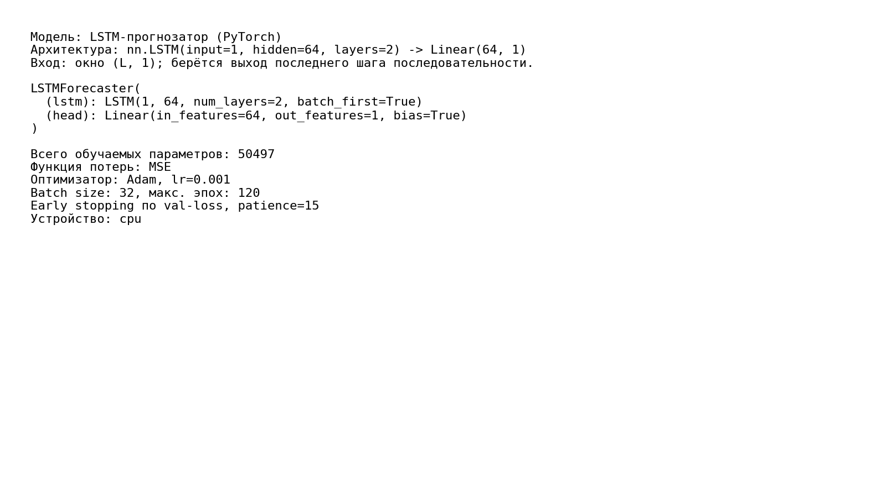
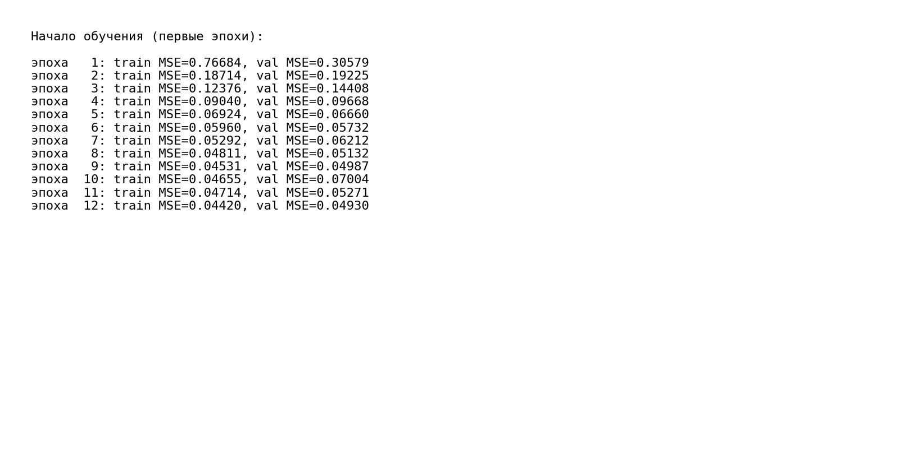
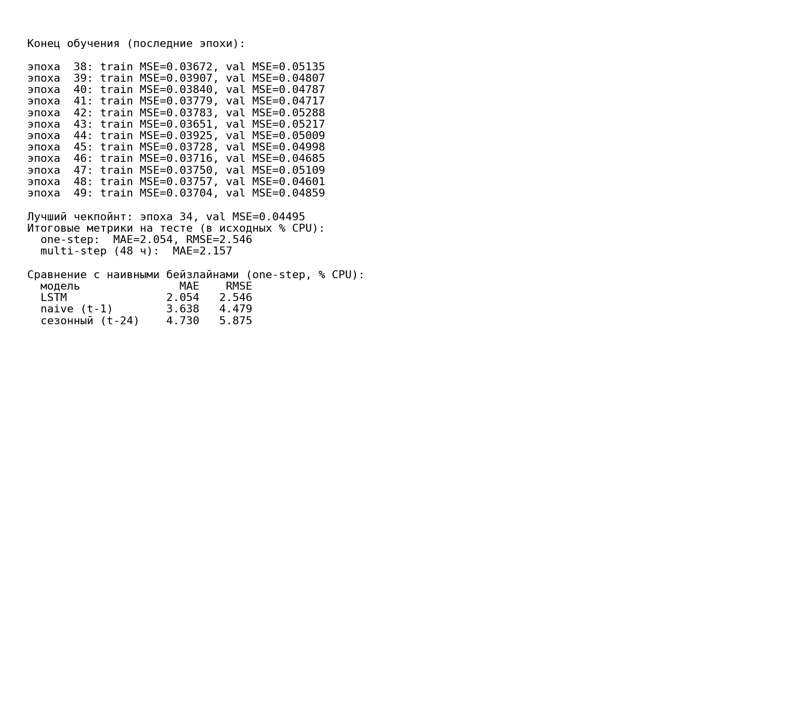
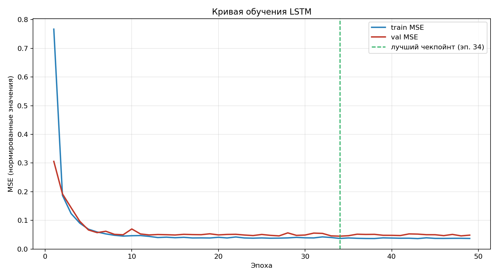
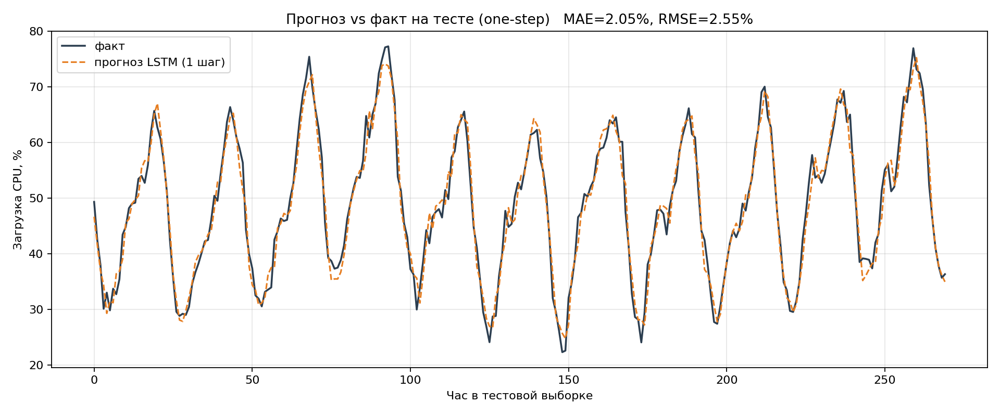
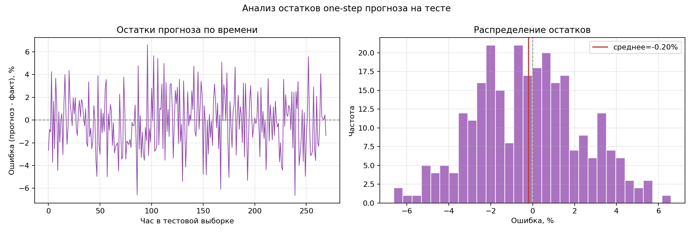
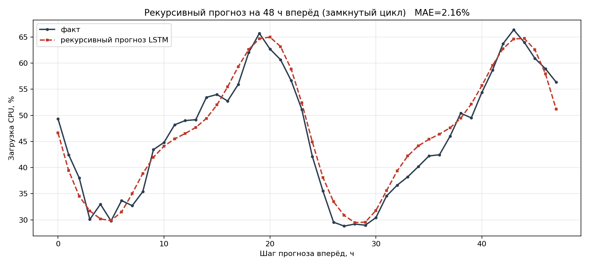
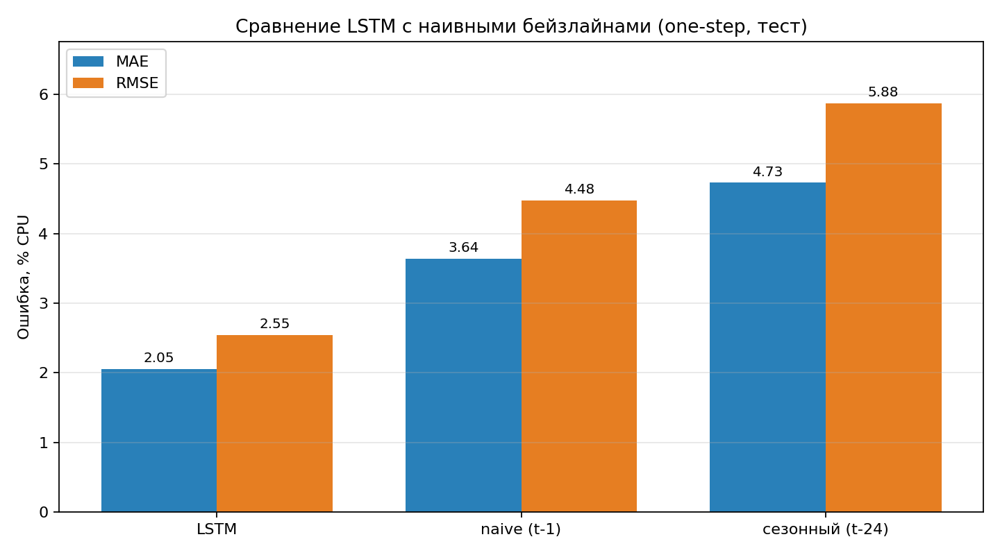

# ФЕДЕРАЛЬНОЕ ГОСУДАРСТВЕННОЕ АВТОНОМНОЕ ОБРАЗОВАТЕЛЬНОЕ УЧРЕЖДЕНИЕ ВЫСШЕГО ОБРАЗОВАНИЯ

## «САМАРСКИЙ НАЦИОНАЛЬНЫЙ ИССЛЕДОВАТЕЛЬСКИЙ УНИВЕРСИТЕТ ИМЕНИ АКАДЕМИКА С.П. КОРОЛЕВА»

## ИНСТИТУТ ИНФОРМАТИКИ И КИБЕРНЕТИКИ

## Кафедра программных систем

<br>

## ОТЧЕТ

по лабораторной работе №6  
по дисциплине «Нейронные сети»

**«Прогнозирование временного ряда с помощью рекуррентной нейронной сети (LSTM)»**

<br>

**Студент:** Фокин Евгений Андреевич  
**Группа:** 6303-020302D  
**Проверил:** профессор Тюгашев А.А.  
**Дата:** **\*\*\*\***\_\_**\*\*\*\***

<br>

**Самара 2026**

---

## Содержание

1. [Постановка задачи](#постановка-задачи)
2. [Исходный текст программы](#исходный-текст-программы)
3. [Протокол исполнения](#протокол-исполнения)
4. [Заключение](#заключение)
5. [Список использованных источников](#список-использованных-источников)

## Постановка задачи

Целью данной работы является изучение рекуррентных нейронных сетей и применение слоя долгой краткосрочной памяти (Long Short-Term Memory, **LSTM**) для задачи прогнозирования временного ряда. Выбран вариант с собственной задачей (вариант Б).

Рекуррентная нейронная сеть (RNN) обрабатывает последовательность шаг за шагом, передавая между шагами скрытое состояние, и тем самым способна учитывать предысторию. Классические RNN плохо обучаются на длинных зависимостях из-за затухания и взрыва градиентов. Слой **LSTM** решает эту проблему: он хранит «ячейку памяти» и управляет ею тремя гейтами (входной, забывания и выходной), что позволяет сохранять информацию на много шагов и устойчиво обучаться на длинных последовательностях.

В качестве задачи рассматривается **прогнозирование почасовой загрузки сервера (% CPU)**. Ряд синтетический и порождается детерминированно; он сочетает характерные для реальной телеметрии компоненты:

- базовый уровень загрузки и плавно насыщающийся тренд (постепенный рост нагрузки);
- суточную сезонность из двух гармоник (несимметричный «рабочий день», период 24 ч);
- недельную сезонность со спадом нагрузки в выходные дни (период 168 ч);
- шум с автокорреляцией (модель AR(1)) — всплески нагрузки «тянутся» во времени.

По окну из `L = 48` прошлых почасовых значений сеть прогнозирует загрузку на следующий час. В рамках работы необходимо:

- изучить устройство рекуррентных сетей и слоя LSTM;
- сгенерировать собственный временной ряд и сформировать обучающие последовательности скользящим окном;
- разделить данные по времени (без перемешивания) и нормировать их по статистикам только обучающей выборки (без утечки из теста);
- реализовать и обучить модель на основе `nn.LSTM`, применив раннюю остановку по валидации;
- оценить качество прогноза на тесте в исходных единицах ряда (MAE и RMSE), а также продемонстрировать рекурсивный прогноз на горизонт вперёд.

## Исходный текст программы

Исходный текст программы находится в файле [`main.py`](main.py), список зависимостей — в [`requirements.txt`](requirements.txt). Сгенерированный ряд сохраняется в [`data/cpu_load.csv`](data/cpu_load.csv). В программе реализованы:

- детерминированная генерация ряда загрузки сервера (`generate_series`): тренд, суточная и недельная сезонность, AR(1)-шум;
- формирование обучающих последовательностей скользящим окном (`make_windows`);
- разделение ряда по времени на train / val / test (70% / 15% / 15%) и z-score-нормировка по статистикам только train (`prepare_data`);
- модель `LSTMForecaster` (PyTorch): `nn.LSTM(input=1, hidden=64, layers=2)` с линейной головой `Linear(64, 1)` (50 497 обучаемых параметров);
- цикл обучения с функцией потерь MSE, оптимизатором Adam и **ранней остановкой по val-loss** с сохранением лучшего чекпойнта;
- оценка на тесте: точечный (one-step) прогноз с метриками MAE/RMSE, замкнутый рекурсивный (multi-step) прогноз на 48 ч вперёд, анализ остатков;
- сравнение с наивными бейзлайнами (`evaluate_baselines`): persistence (прогноз = значение `t−1`) и сезонный наивный (прогноз = значение `t−24`) на тех же тестовых точках;
- построение всех графиков и протокольных изображений.

**Формирование окон.** Для каждой предсказываемой точки `target` входом служит окно из `WINDOW` предыдущих значений, целью — само значение `target`. Окна нарезаются уже из нормированного ряда:

```python
def make_windows(series, idx_start, idx_end):
    xs, ys = [], []
    for target in range(max(idx_start, WINDOW), idx_end):
        xs.append(series[target - WINDOW:target])
        ys.append(series[target])
    x = np.asarray(xs, dtype=np.float32)[:, :, None]   # (N, WINDOW, 1)
    y = np.asarray(ys, dtype=np.float32)[:, None]       # (N, 1)
    return torch.from_numpy(x), torch.from_numpy(y)
```

Нормировка считается по обучающей части ряда и применяется ко всему ряду — статистики теста в неё не попадают:

```python
train_raw = series[:train_end]
mean = float(train_raw.mean())
std = float(train_raw.std())
norm = (series - mean) / std
```

**Модель.** Используется двухслойный LSTM; для прогноза берётся скрытое состояние последнего шага последовательности, которое подаётся в линейный слой:

```python
class LSTMForecaster(nn.Module):
    def __init__(self, hidden_size=64, num_layers=2):
        super().__init__()
        self.lstm = nn.LSTM(input_size=1, hidden_size=hidden_size,
                            num_layers=num_layers, batch_first=True)
        self.head = nn.Linear(hidden_size, 1)

    def forward(self, x):
        out, _ = self.lstm(x)          # (B, WINDOW, hidden)
        last = out[:, -1, :]           # выход последнего шага последовательности
        return self.head(last)         # (B, 1)
```

**Обучение.** На каждой эпохе считается val-loss; при его улучшении сохраняется лучший чекпойнт, а при отсутствии улучшения в течение `patience` эпох обучение останавливается. Итоговой берётся модель лучшего чекпойнта:

```python
val_loss = criterion(model(x_val), y_val).item()
if val_loss < best_val - 1e-6:
    best_val = val_loss
    best_state = copy.deepcopy(model.state_dict())
    best_epoch = epoch
    epochs_no_improve = 0
else:
    epochs_no_improve += 1
if epochs_no_improve >= PATIENCE:
    break
```

## Протокол исполнения

**Рисунок 1 - Описание задачи и параметров датасета (состав ряда, окно, разбиение, нормировка).**



**Рисунок 2 - Сгенерированный ряд загрузки сервера с разметкой train / val / test.**



**Рисунок 3 - Структура модели LSTM, число параметров и гиперпараметры обучения.**



**Рисунок 4 - Начало обучения: ошибка на train и val быстро убывает.**



**Рисунок 5 - Конец обучения: лучший чекпойнт и итоговые метрики на тесте.**



**Рисунок 6 - Кривая обучения: MSE на train и val по эпохам с отметкой лучшего чекпойнта.**



**Рисунок 7 - Прогноз vs фактический ряд на тесте (точечный прогноз на 1 шаг) — главная иллюстрация.**



**Рисунок 8 - Анализ остатков one-step прогноза на тесте (по времени и распределение).**



**Рисунок 9 - Замкнутый рекурсивный прогноз на 48 ч вперёд (модель кормит свои прогнозы себе на вход).**



**Рисунок 10 - Сравнение LSTM с наивными бейзлайнами (persistence и сезонный) по MAE и RMSE на тесте.**



## Заключение

В ходе выполнения работы была изучена концепция рекуррентных нейронных сетей и слоя LSTM, после чего на PyTorch была реализована модель прогнозирования временного ряда. В качестве собственной задачи выбран прогноз почасовой загрузки сервера (% CPU): детерминированно сгенерирован ряд из **1800 точек** (~75 суток) с трендом, суточной и недельной сезонностью и автокоррелированным шумом. Скользящим окном длины **48 ч** сформированы обучающие последовательности, данные разделены по времени на train/val/test (1212 / 270 / 270 окон) и нормированы по статистикам только обучающей выборки.

Модель `nn.LSTM(1 → 64, 2 слоя)` с линейной головой (**50 497 параметров**) обучалась с функцией потерь MSE и оптимизатором Adam. Применялась ранняя остановка по валидации: ошибка на train и val монотонно убывала, лучший чекпойнт зафиксирован на **эпохе 34** (val MSE = 0.04495), после чего обучение остановилось на эпохе 49 из-за отсутствия улучшений. Кривая обучения и близость train/val-кривых подтверждают сходимость без переобучения.

На независимой тестовой выборке (270 точек) обученная модель показала качество точечного прогноза **MAE = 2.05 % CPU** и **RMSE = 2.55 % CPU** при среднем остатке −0.20 % (то есть прогноз практически несмещённый); это около 3% (MAE) и 4% (RMSE) от размаха ряда (14–78 % CPU). Анализ остатков показал их центрированность относительно нуля без выраженного систематического смещения. Замкнутый рекурсивный прогноз на 48 ч вперёд, когда модель подаёт собственные прогнозы себе на вход, дал **MAE = 2.16 % CPU**: сеть устойчиво воспроизводит суточный цикл даже без доступа к реальным наблюдениям, и ошибка накапливается медленно.

Чтобы оценить, насколько модель полезна, она сравнена с наивными бейзлайнами на тех же тестовых точках: persistence (прогноз = предыдущее значение) дал MAE = 3.64 % / RMSE = 4.48 %, сезонный наивный (значение сутки назад) — MAE = 4.73 % / RMSE = 5.88 %. LSTM (MAE = 2.05 %) снижает ошибку **в 1.8 раза** относительно лучшего из бейзлайнов, что доказывает: сеть извлекает из истории закономерности, недоступные простым эвристикам, а не просто копирует недавние значения.

Полученные результаты подтверждают, что слой LSTM эффективно улавливает суточную и недельную периодичность временного ряда и обеспечивает качественный прогноз как на один шаг, так и на горизонт вперёд. Все результаты воспроизводимы: при фиксированном `SEED = 42` повторные запуски дают идентичные метрики.

## Список использованных источников

1. Тюгашев А.А. Нейронные сети: учеб. пособие. - 179 с.
2. PyTorch documentation [Электронный ресурс]. URL: https://pytorch.org/docs/ (дата обращения 29.05.2026).
3. Matplotlib documentation [Электронный ресурс]. URL: https://matplotlib.org/stable/ (дата обращения 29.05.2026).
4. Hochreiter S., Schmidhuber J. Long Short-Term Memory // Neural Computation. 1997. Vol. 9, № 8. P. 1735-1780.
