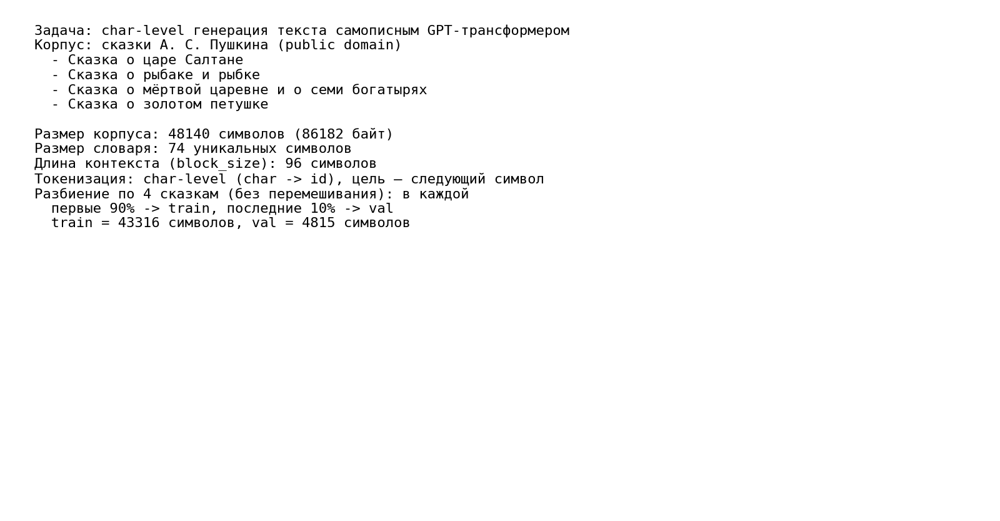
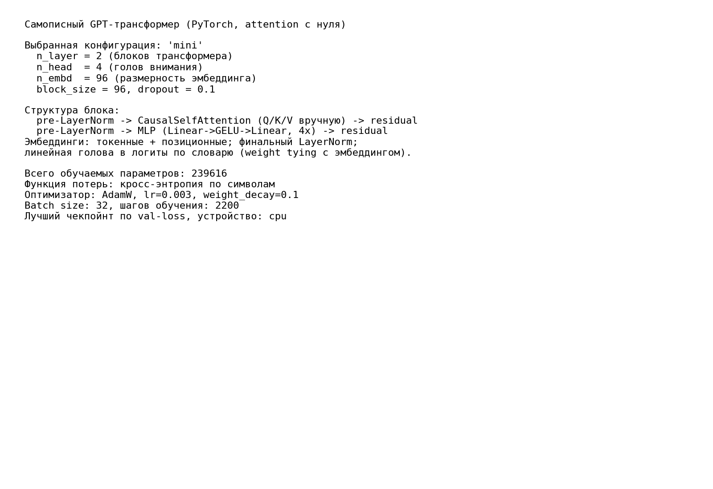
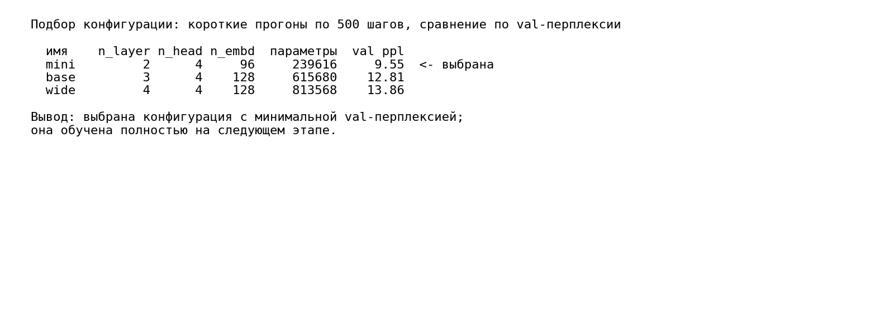
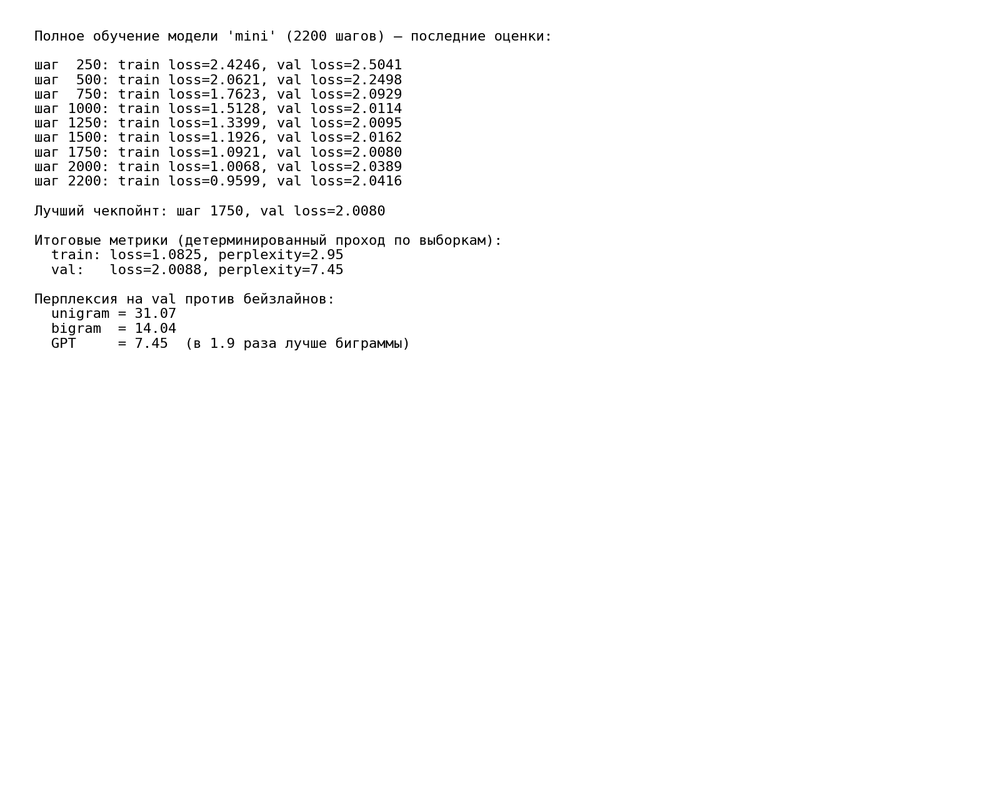
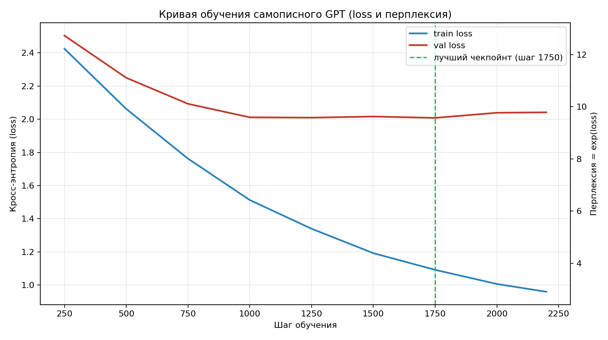
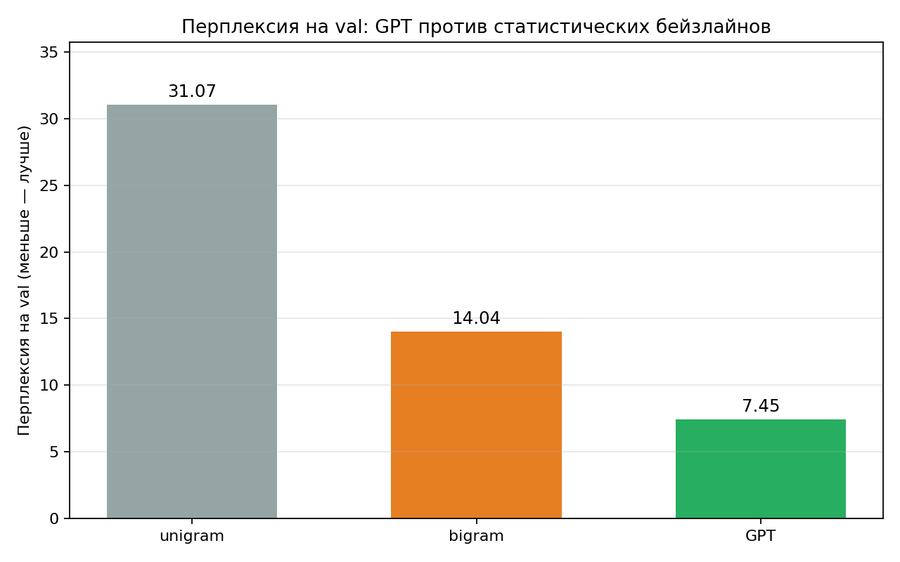
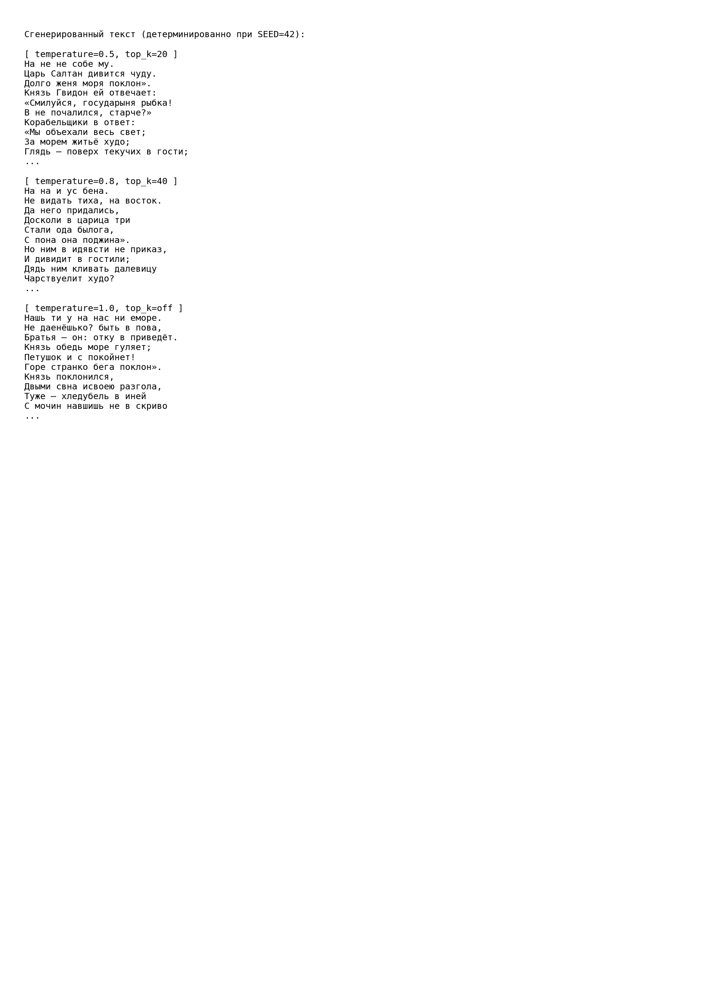
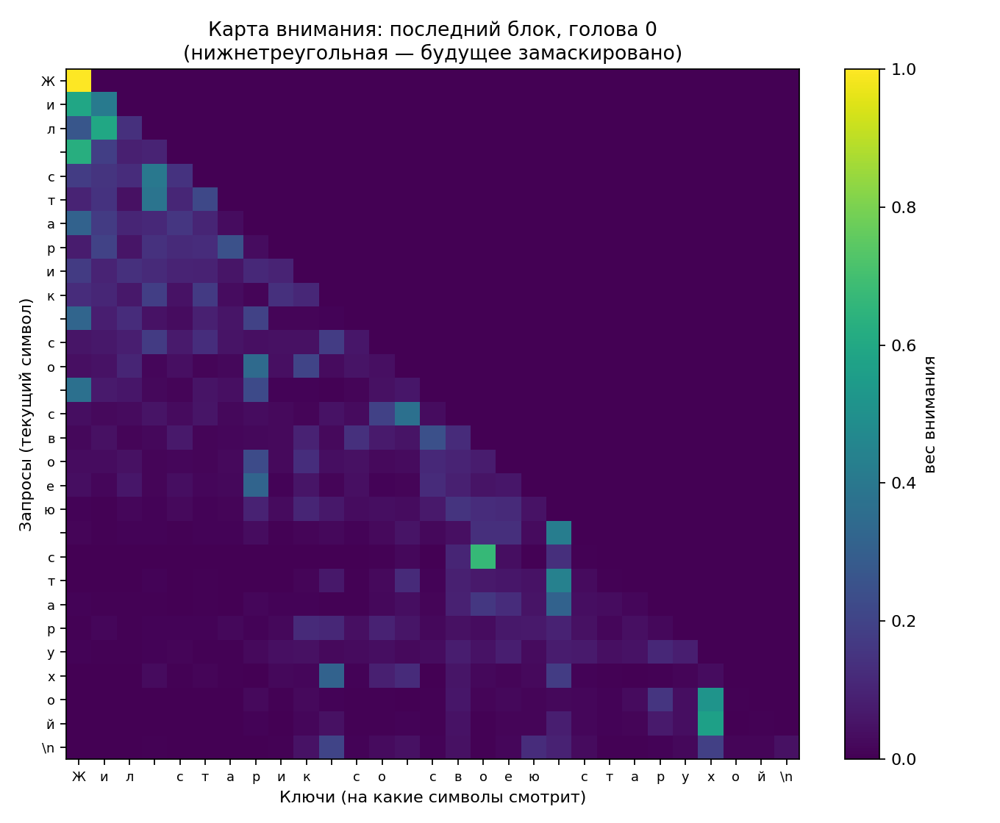

# ФЕДЕРАЛЬНОЕ ГОСУДАРСТВЕННОЕ АВТОНОМНОЕ ОБРАЗОВАТЕЛЬНОЕ УЧРЕЖДЕНИЕ ВЫСШЕГО ОБРАЗОВАНИЯ

## «САМАРСКИЙ НАЦИОНАЛЬНЫЙ ИССЛЕДОВАТЕЛЬСКИЙ УНИВЕРСИТЕТ ИМЕНИ АКАДЕМИКА С.П. КОРОЛЕВА»

## ИНСТИТУТ ИНФОРМАТИКИ И КИБЕРНЕТИКИ

## Кафедра программных систем

<br>

## ОТЧЕТ

по лабораторной работе №7  
по дисциплине «Нейронные сети»

**«Генерация текста с помощью самописного трансформера (GPT)»**

<br>

**Студент:** Фокин Евгений Андреевич  
**Группа:** 6303-020302D  
**Проверил:** профессор Тюгашев А.А.  
**Дата:** **\*\*\*\***\_\_**\*\*\*\***

<br>

**Самара 2026**

---

## Содержание

1. [Постановка задачи](#постановка-задачи)
2. [Исходный текст программы](#исходный-текст-программы)
3. [Протокол исполнения](#протокол-исполнения)
4. [Заключение](#заключение)
5. [Список использованных источников](#список-использованных-источников)

## Постановка задачи

Целью данной работы является изучение архитектуры **трансформера** и механизма **внимания (self-attention)** на примере самостоятельной реализации генеративной языковой модели типа **GPT** (Generative Pre-trained Transformer). Выбран вариант «Экстрим» (вариант Б): реализовать самописный трансформер и обучить его на собственной задаче.

В качестве задачи рассматривается **символьная (char-level) генерация текста**: модель предсказывает следующий символ по предшествующему контексту, и за счёт авторегрессионного применения порождает связный текст. Ключевое требование работы — реализовать механизм внимания **полностью с нуля** (вручную вычислить Q/K/V, причинную маску и softmax на базовых слоях `nn.Linear`), а не использовать готовые `nn.MultiheadAttention` или `nn.TransformerEncoder`.

Классические рекуррентные сети (RNN, LSTM из ЛР-6) обрабатывают последовательность строго по шагам, передавая скрытое состояние от символа к символу. Это порождает две проблемы: вычисления нельзя распараллелить по длине, а информация о далёких символах вынуждена «протискиваться» через цепочку состояний, что затрудняет обучение длинных зависимостей. **Трансформер** (Vaswani et al., 2017) отказывается от рекуррентности: каждый элемент последовательности напрямую «смотрит» на все остальные через механизм внимания, поэтому путь между любыми двумя позициями равен одному шагу, а вычисления параллельны.

**Self-attention** работает так. Для каждого входного вектора-токена линейными слоями вычисляются три проекции: запрос **Q** (query), ключ **K** (key) и значение **V** (value). Близость запроса позиции `i` к ключу позиции `j` оценивается скалярным произведением; матрица оценок масштабируется на `1/√d` (где `d` — размерность головы) — это удерживает значения softmax в рабочем диапазоне и стабилизирует градиенты. После softmax по строкам получаются веса внимания, которыми взвешенно суммируются значения V:

```
Attention(Q, K, V) = softmax( Q·Kᵀ / √d ) · V
```

Поскольку модель должна предсказывать **следующий** символ, ей нельзя «подсматривать» в будущее. Для этого вводится **причинная (causal) маска** — нижнетреугольная матрица: позиция `i` видит только позиции `j ≤ i`, а будущие оценки заполняются `−∞` перед softmax (и обнуляются в его выходе). **Multi-head**-внимание выполняет описанную операцию параллельно в нескольких подпространствах («головах»), что позволяет одновременно улавливать разные типы зависимостей (например, повтор буквы рядом и согласование окончаний на расстоянии), после чего результаты голов конкатенируются.

Полный блок GPT состоит из двух подслоёв с pre-LayerNorm и остаточными связями: `LayerNorm → multi-head self-attention → +residual` и `LayerNorm → MLP (Linear→GELU→Linear) → +residual`. К входу добавляются обучаемые **позиционные эмбеддинги** (внимание само по себе не знает порядок токенов). Стек таких блоков, финальный `LayerNorm` и линейная голова дают логиты вероятностей следующего символа по словарю.

Корпусом служат **сказки А. С. Пушкина** (public domain): «Сказка о царе Салтане», «Сказка о рыбаке и рыбке», «Сказка о мёртвой царевне и о семи богатырях», «Сказка о золотом петушке». Текст вложен в репозиторий ([`data/corpus.txt`](data/corpus.txt), UTF-8, **48 140 символов / 86 182 байт**) и в рантайме не скачивается. Словарь — **74 уникальных символа** (char-level). Данные разбиты по тексту без перемешивания: в каждой из 4 сказок первые 90% идут в train, последние 10% — в val (train = 43 316, val = 4 815 символов); такой раздел делает валидацию представительной для всех сказок, а не только для хвоста последней.

В рамках работы необходимо:

- изучить устройство трансформера и механизм self-attention (Q/K/V, причинная маска, multi-head);
- подготовить корпус, построить char-level словарь и нарезку контекстов длины `block_size`;
- реализовать **самописный** причинный multi-head self-attention и собрать из базовых слоёв модель GPT;
- обучить модель (кросс-энтропия, AdamW, ранняя остановка по val с сохранением лучшего чекпойнта);
- оценить качество перплексией на val и сравнить её с **статистическими бейзлайнами** (unigram, bigram);
- реализовать авторегрессионную генерацию с температурой и top-k и продемонстрировать сгенерированный текст;
- визуализировать карту внимания одной головы.

## Исходный текст программы

Исходный текст программы находится в файле [`main.py`](main.py), список зависимостей — в [`requirements.txt`](requirements.txt). Корпус хранится в [`data/corpus.txt`](data/corpus.txt). В программе реализованы:

- загрузка корпуса и char-level токенизация (построение словаря, отображения `char→id` и `id→char`);
- разбиение на train/val по каждой сказке (без перемешивания) и нарезка случайных батчей `(x, y)`, где `y` — вход, сдвинутый на один символ;
- **самописный причинный multi-head self-attention** (`CausalSelfAttention`): Q/K/V на `nn.Linear`, масштабирование `1/√d`, нижнетреугольная маска, softmax и взвешенная сумма — без `nn.MultiheadAttention`;
- блок трансформера (`Block`) с pre-LayerNorm, остаточными связями и MLP (Linear→GELU→Linear), и сама модель `GPT` (токенные + позиционные эмбеддинги, стек блоков, финальный LayerNorm, линейная голова с weight tying);
- этап **подбора конфигурации**: короткие прогоны нескольких вариантов модели и выбор лучшего по val-перплексии;
- полное обучение выбранной модели с функцией потерь — кросс-энтропией, оптимизатором AdamW и сохранением лучшего по val чекпойнта;
- детерминированный расчёт перплексии на train/val и **статистические бейзлайны** (unigram и bigram со сглаживанием +1);
- авторегрессионная **генерация** текста с температурой и top-k (детерминированная при фиксированном seed);
- построение всех графиков и протокольных изображений, включая **карту внимания**.

**Самописный self-attention.** Ядро работы — вычисление внимания вручную; причинность обеспечивается заранее зарегистрированной нижнетреугольной маской:

```python
def forward(self, x, return_attn=False):
    B, T, C = x.shape
    # (B, T, C) -> (B, n_head, T, head_dim)
    q = self.query(x).view(B, T, self.n_head, self.head_dim).transpose(1, 2)
    k = self.key(x).view(B, T, self.n_head, self.head_dim).transpose(1, 2)
    v = self.value(x).view(B, T, self.n_head, self.head_dim).transpose(1, 2)

    # масштабированное скалярное произведение: (B, n_head, T, T)
    att = (q @ k.transpose(-2, -1)) / math.sqrt(self.head_dim)
    # причинная маска: будущее заполняем -inf, чтобы softmax дал там 0
    att = att.masked_fill(self.tril[:T, :T] == 0, float("-inf"))
    att = F.softmax(att, dim=-1)
    att = self.attn_drop(att)

    y = att @ v                                   # (B, n_head, T, head_dim)
    y = y.transpose(1, 2).contiguous().view(B, T, C)
    y = self.resid_drop(self.proj(y))
    if return_attn:
        return y, att
    return y
```

**Авторегрессионная генерация.** Текст порождается по одному символу: контекст обрезается до `block_size`, логиты последней позиции делятся на температуру, при необходимости оставляются только top-k кандидатов, а следующий символ берётся сэмплированием из softmax (детерминированно — через сидированный генератор):

```python
@torch.no_grad()
def generate(self, idx, max_new_tokens, temperature, top_k, generator):
    self.eval()
    for _ in range(max_new_tokens):
        idx_cond = idx[:, -self.block_size:]
        logits, _ = self(idx_cond)
        logits = logits[:, -1, :] / max(temperature, 1e-6)
        if top_k and top_k > 0:
            v, _ = torch.topk(logits, min(top_k, logits.size(-1)))
            logits[logits < v[:, [-1]]] = float("-inf")
        probs = F.softmax(logits, dim=-1)
        idx_next = torch.multinomial(probs, num_samples=1, generator=generator)
        idx = torch.cat([idx, idx_next], dim=1)
    return idx
```

## Протокол исполнения

**Рисунок 1 - Описание задачи и параметров датасета (корпус, размер, словарь, block_size, разбиение).**



**Рисунок 2 - Структура самописного GPT, гиперпараметры и число параметров.**



**Рисунок 3 - Подбор конфигурации: короткие прогоны вариантов модели и выбор лучшего по val-перплексии.**



**Рисунок 4 - Конец обучения: последние оценки, лучший чекпойнт, итоговые метрики и сравнение с бейзлайнами.**



**Рисунок 5 - Кривая обучения: train/val loss по шагам с дополнительной осью перплексии и отметкой лучшего чекпойнта.**



**Рисунок 6 - Сравнение перплексии на val: GPT против статистических бейзлайнов (unigram, bigram) — главная иллюстрация ценности модели.**



**Рисунок 7 - Сгенерированный текст при разной температуре и top-k (детерминированно при SEED = 42).**



**Рисунок 8 - Карта внимания одной головы последнего блока: нижнетреугольная структура (причинная маска) и фокус на отдельных символах.**



## Заключение

В ходе работы были изучены архитектура трансформера и механизм self-attention, после чего на PyTorch **с нуля** реализована генеративная char-level модель GPT (вручную Q/K/V, причинная маска, multi-head, softmax — без использования готовых `nn.MultiheadAttention`/`nn.TransformerEncoder`). В качестве собственной задачи выбрана генерация текста в стиле сказок А. С. Пушкина: корпус из 4 сказок (**48 140 символов**, словарь **74 символа**) разбит по каждой сказке на train/val (43 316 / 4 815 символов) без перемешивания.

Перед полным обучением выполнен **подбор конфигурации**: три варианта модели обучались по 500 коротких шагов и сравнивались по val-перплексии. Лучшей оказалась самая компактная модель `mini` (n_layer = 2, n_head = 4, n_embd = 96, **239 616 параметров**, val ppl ≈ 9.55), опередившая более крупные `base` (615 680 параметров) и `wide` (813 568 параметров). Это закономерно: на небольшом корпусе крупные модели быстрее переобучаются, и меньшая модель обобщает лучше.

Выбранная модель обучалась **2200 шагов** (кросс-энтропия, оптимизатор AdamW, lr = 3·10⁻³, weight_decay = 0.1, batch = 32, dropout = 0.1, block_size = 96) с ранней остановкой по валидации. Train-loss монотонно убывал, val-loss достиг минимума и зафиксировал **лучший чекпойнт на шаге 1750** (val loss = 2.0080), после чего начал слегка расти — это видно на кривой обучения как умеренное переобучение, корректно отсечённое выбором лучшего чекпойнта. Итоговые метрики на лучшем чекпойнте (детерминированный проход): **train loss = 1.08, perplexity = 2.95**; **val loss = 2.01, perplexity = 7.45**.

Чтобы доказать ценность модели числами, её перплексия на val сопоставлена со статистическими бейзлайнами на той же выборке: **unigram = 31.07**, **bigram = 14.04**, **GPT = 7.45**. Трансформер снижает перплексию **в 1.9 раза** относительно биграммной модели и более чем **в 4 раза** относительно униграммной — то есть он улавливает зависимости длиннее одного символа, недоступные простым счётным моделям.

Качество генерации оценивалось при трёх режимах сэмплирования. При низкой температуре (`temperature = 0.5`, top-k = 20) модель выдаёт наиболее связный текст с фрагментами, дословно узнаваемыми по сказкам («Царь Салтан дивится чуду», «Князь Гвидон ей отвечает», «Корабельщики в ответ: „Мы объехали весь свет; За морем житьё худо“»); с ростом температуры текст становится разнообразнее, но менее аккуратным. Честная оценка качества: char-level модель на небольшом корпусе уверенно выучивает **орфографию, морфологию русского языка, пунктуацию и стихотворный ритм/стиль** Пушкина (правдоподобные слова, заглавные буквы после точки, кавычки-«ёлочки», разбиение на строки), но **не смысл** — длинные фразы остаются грамматически правдоподобными, но семантически бессвязными, что ожидаемо для модели такого масштаба и объёма данных.

Дополнительно построена **карта внимания** одной головы: она имеет чёткую нижнетреугольную форму (причинная маска не даёт смотреть в будущее) и демонстрирует осмысленные фокусы внимания на отдельных предшествующих символах. Все результаты воспроизводимы: при фиксированном `SEED = 42` повторные запуски дают идентичные метрики и идентичные сгенерированные сэмплы; полный прогон на CPU занимает около 3,5 минут.

## Список использованных источников

1. Тюгашев А.А. Нейронные сети: учеб. пособие. - 179 с.
2. Vaswani A. et al. Attention Is All You Need // Advances in Neural Information Processing Systems (NeurIPS). 2017. P. 5998-6008.
3. PyTorch documentation [Электронный ресурс]. URL: https://pytorch.org/docs/ (дата обращения 29.05.2026).
4. Matplotlib documentation [Электронный ресурс]. URL: https://matplotlib.org/stable/ (дата обращения 29.05.2026).
5. Пушкин А. С. Сказки [Электронный ресурс] // Русская Викитека. URL: https://ru.wikisource.org/wiki/Александр_Сергеевич_Пушкин (дата обращения 29.05.2026). Public domain.
