# ФЕДЕРАЛЬНОЕ ГОСУДАРСТВЕННОЕ АВТОНОМНОЕ ОБРАЗОВАТЕЛЬНОЕ УЧРЕЖДЕНИЕ ВЫСШЕГО ОБРАЗОВАНИЯ

## «САМАРСКИЙ НАЦИОНАЛЬНЫЙ ИССЛЕДОВАТЕЛЬСКИЙ УНИВЕРСИТЕТ ИМЕНИ АКАДЕМИКА С.П. КОРОЛЕВА»

## ИНСТИТУТ ИНФОРМАТИКИ И КИБЕРНЕТИКИ

## Кафедра программных систем

<br>

## ОТЧЕТ

по лабораторной работе №8  
по дисциплине «Нейронные сети»

**«Применение методов AutoML для подбора гиперпараметров нейросетевой модели»**

<br>

**Студент:** Фокин Евгений Андреевич  
**Группа:** 6303-020302D  
**Проверил:** профессор Тюгашев А.А.  
**Дата:** **\*\*\*\***\_\_**\*\*\*\***

<br>

**Самара 2026**

---

## Содержание

1. [Постановка задачи](#постановка-задачи)
2. [Исходный текст программы](#исходный-текст-программы)
3. [Протокол исполнения](#протокол-исполнения)
4. [Заключение](#заключение)
5. [Список использованных источников](#список-использованных-источников)

## Постановка задачи

Целью данной работы является изучение методов автоматического машинного обучения (**AutoML**) и их применение для автоматического подбора моделей и гиперпараметров на задаче, ранее решённой самостоятельно запрограммированной нейронной сетью.

**AutoML** — это автоматизация рутинных этапов построения модели: предобработки и отбора признаков, выбора семейства алгоритмов, подбора их гиперпараметров и построения ансамблей. Вместо ручного перебора инженер задаёт задачу и бюджет, а библиотека сама ищет качественное решение и ранжирует кандидатов. Это экономит время и часто даёт качество, сопоставимое с тщательно настроенной вручную моделью.

В работе используются две AutoML-библиотеки:

- **H2O AutoML** (основная) — обучает набор разнотипных моделей (GLM, GBM, Distributed Random Forest, XGBoost, Deep Learning), перебирает их гиперпараметры по сетке/случайному поиску, строит **стек-ансамбли** (Stacked Ensembles) и ранжирует все модели в **лидерборде** по выбранной метрике с кросс-валидацией;
- **FEDOT** (АutoML от ИТМО) — представляет решение в виде **графа-пайплайна** (узлы — предобработка и модели) и **эволюционным поиском** оптимизирует структуру пайплайна и его гиперпараметры.

Библиотека **AutoKeras** (надстройка над TensorFlow), фигурирующая в учебных материалах, в данной работе **сознательно не используется**: её установка на платформе arm64 (Apple Silicon) с Python 3.9 нестабильна из-за зависимости от TensorFlow. Это ограничение окружения, а не пропуск этапа.

В качестве базовой выбрана **лабораторная работа №2** — самостоятельно запрограммированная на NumPy (с нуля) нейронная сеть для **бинарной классификации риска отчисления студента**. Датасет содержит 240 записей с пятью числовыми признаками (`average_grade`, `attendance_percent`, `academic_debts`, `study_hours_per_week`, `class_activity_score`) и бинарной целью `high_dropout_risk` (классы почти сбалансированы: 118 / 122). Архитектура самописной сети — `5 → 6 → 1` с сигмоидной активацией, функцией ошибки MSE и обучением методом обратного распространения ошибки.

В рамках работы необходимо:

- изучить идею AutoML и принципы работы H2O AutoML и FEDOT;
- воспроизвести самописную нейросеть из ЛР-2 как **базовую модель** (бейзлайн) и оценить её полным набором метрик;
- выполнить **автоматический подбор гиперпараметров самой нейросети** (число нейронов скрытого слоя и скорость обучения) библиотекой **Optuna** и сравнить настроенную сеть с базовой;
- применить H2O AutoML и FEDOT к тому же датасету на **едином стратифицированном сплите** и тех же признаках;
- **честно сравнить** все решения по одинаковым метрикам (accuracy, ROC-AUC, F1, precision, recall) и оценить устойчивость сравнения кросс-валидацией.

Таким образом, «подбор гиперпараметров» реализован в двух смыслах: явно — для самой нейросети средствами Optuna, и неявно — внутри H2O AutoML и FEDOT, которые автоматически перебирают гиперпараметры своих моделей.

## Исходный текст программы

Исходный текст программы находится в файле [`main.py`](main.py), список зависимостей — в [`requirements.txt`](requirements.txt). Датасет (копия из ЛР-2 для самодостаточности) лежит в [`data/student_dropout_risk_dataset.csv`](data/student_dropout_risk_dataset.csv). В программе реализованы:

- загрузка датасета и **единый стратифицированный сплит** 80/20 (`train_test_split`, `stratify=y`, `random_state=42`), используемый одинаково для всех моделей;
- воспроизведение самописной НС из ЛР-2 (классы `Neuron`, `Layer`, `NeuralNetwork`, доменная нормализация признаков, `lr=0.45`) и её оценка полным набором метрик;
- **подбор гиперпараметров НС через Optuna** (TPE-сэмплер, `seed=42`): поиск числа нейронов скрытого слоя и скорости обучения по 3-fold CV-accuracy на train, с последующим переобучением лучшего конфига и оценкой на тесте;
- запуск **H2O AutoML** (`max_models=20`, `nfolds=5`, `seed=42`, `nthreads=1` для повышения воспроизводимости): построение лидерборда, выбор лучшей модели, оценка её на тесте, извлечение важности признаков, сохранение модели и корректное завершение кластера;
- запуск **FEDOT** (`problem='classification'`, фиксированное число поколений, `seed=42`): эволюционный поиск пайплайна, оценка на тесте и извлечение структуры найденного пайплайна;
- стратифицированная **5-fold кросс-валидация** самописной НС для устойчивой оценки на малой выборке;
- сбор метрик в `artifacts/` (`comparison.csv`, `metrics.json`, лидерборд H2O) и построение всех графиков и протокольных изображений.

Все бюджеты AutoML заданы **в количестве моделей/поколений**, а не во времени, а сплит и `seed` фиксированы — поэтому повторные запуски воспроизводимы.

**Запуск H2O AutoML.** Целевой столбец переводится в фактор (классификация), задаётся бюджет в моделях и кросс-валидация; результат — лидерборд с CV-метриками и лучшая модель:

```python
h2o.init(nthreads=2, max_mem_size="3G")
h2o.no_progress()
train_hf[TARGET_COLUMN] = train_hf[TARGET_COLUMN].asfactor()
test_hf[TARGET_COLUMN] = test_hf[TARGET_COLUMN].asfactor()

aml = H2OAutoML(max_models=20, seed=42, nfolds=5, sort_metric="AUC")
aml.train(x=FEATURE_COLUMNS, y=TARGET_COLUMN, training_frame=train_hf)

leaderboard = aml.leaderboard.as_data_frame()   # CV-лидерборд всех моделей
leader = aml.leader                             # лучшая модель (часто стек-ансамбль)
y_prob = leader.predict(test_hf).as_data_frame()["p1"].to_numpy()
```

**Запуск FEDOT.** Задаётся тип задачи и бюджет в поколениях; библиотека сама находит структуру пайплайна и его гиперпараметры:

```python
model = Fedot(problem="classification", timeout=3, num_of_generations=5,
              seed=42, logging_level=logging.CRITICAL, show_progress=False, n_jobs=1)
model.fit(features=x_train_raw, target=y_train)
y_prob = np.asarray(model.predict_proba(features=x_test_raw)).reshape(-1)

pipeline = model.current_pipeline               # найденный граф-пайплайн
nodes = [node.name for node in pipeline.nodes]  # узлы пайплайна
```

**Подбор гиперпараметров НС через Optuna.** Целевая функция — средняя 3-fold CV-accuracy на обучающей выборке (без утечки из теста); сэмплер TPE с фиксированным `seed` делает поиск воспроизводимым:

```python
def objective(trial):
    hidden = trial.suggest_categorical("hidden", [4, 6, 8, 10, 12])
    learning_rate = trial.suggest_float("learning_rate", 0.05, 0.9, log=True)
    scores = []
    for tr_idx, val_idx in skf.split(x_train, y_train):   # 3-fold CV на train
        network, _, _ = train_nn(x_train[tr_idx], y_train[tr_idx],
                                 hidden=hidden, learning_rate=learning_rate)
        y_prob = network.predict_proba(x_train[val_idx])
        scores.append(accuracy_score(y_train[val_idx], (y_prob >= 0.5).astype(int)))
    return float(np.mean(scores))

study = optuna.create_study(direction="maximize",
                            sampler=optuna.samplers.TPESampler(seed=42))
study.optimize(objective, n_trials=20)
best_params = study.best_params       # лучший конфиг переобучается на полном train
```

## Протокол исполнения

**Рисунок 1 - Описание задачи AutoML, базового датасета (ЛР-2) и единого стратифицированного сплита.**

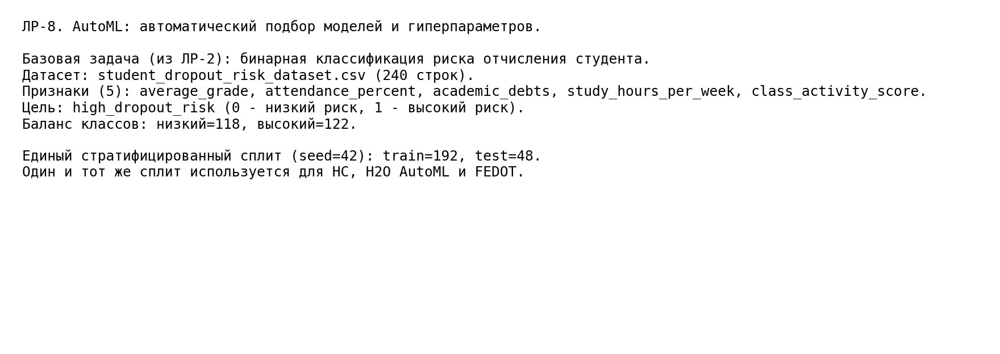

**Рисунок 2 - Базовая модель: самописная нейросеть из ЛР-2 и её метрики на тесте.**

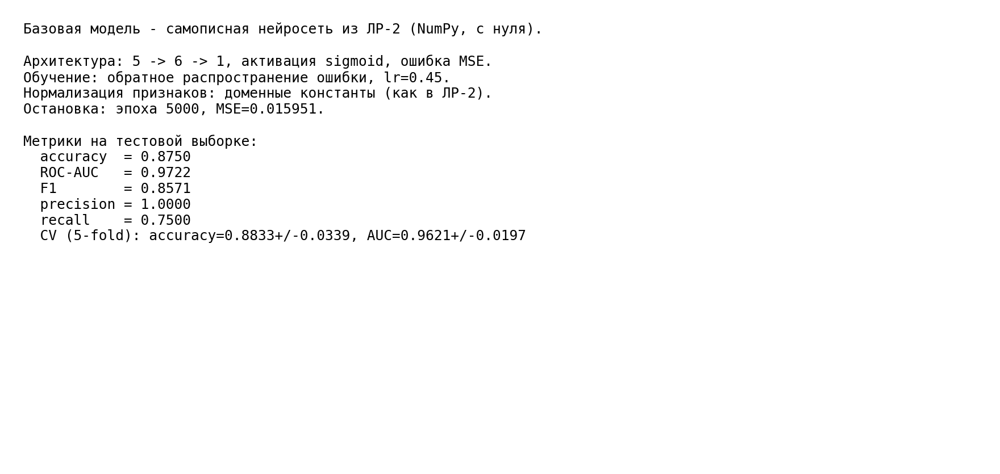

**Рисунок 3 - Что такое AutoML и какие библиотеки используются (H2O, FEDOT); обоснование отказа от AutoKeras.**

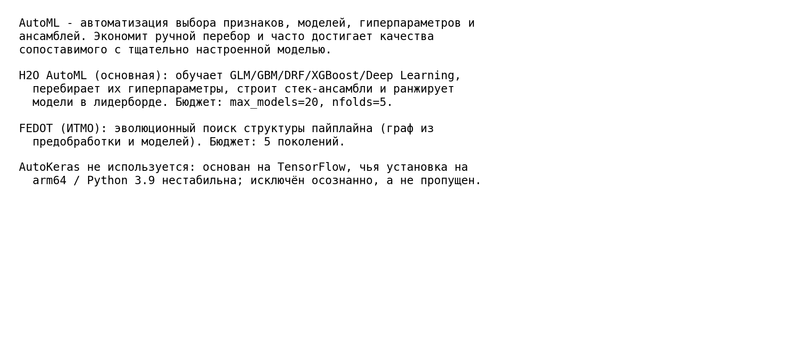

**Рисунок 4 - Лидерборд H2O AutoML (CV-метрики, сортировка по AUC) и лучшая модель.**

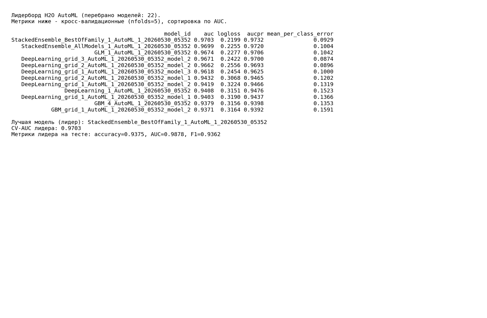

**Рисунок 5 - Структура найденного пайплайна FEDOT и его метрики на тесте.**

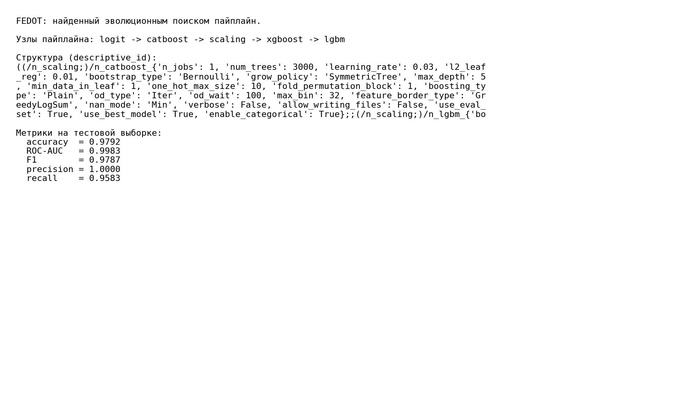

**Рисунок 6 - Таблица сравнения четырёх моделей (самописная НС, НС+Optuna, H2O AutoML, FEDOT) по единым метрикам.**

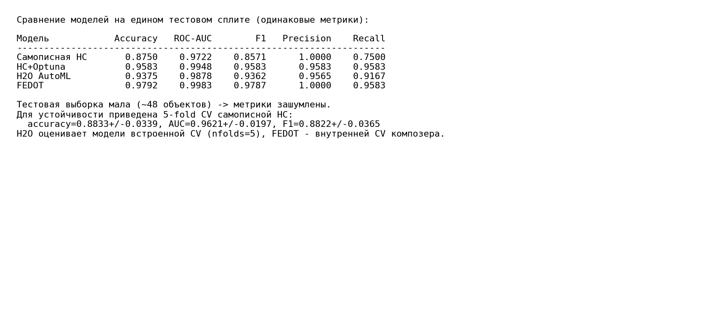

**Рисунок 7 - Столбчатое сравнение метрик четырёх моделей на тестовой выборке.**

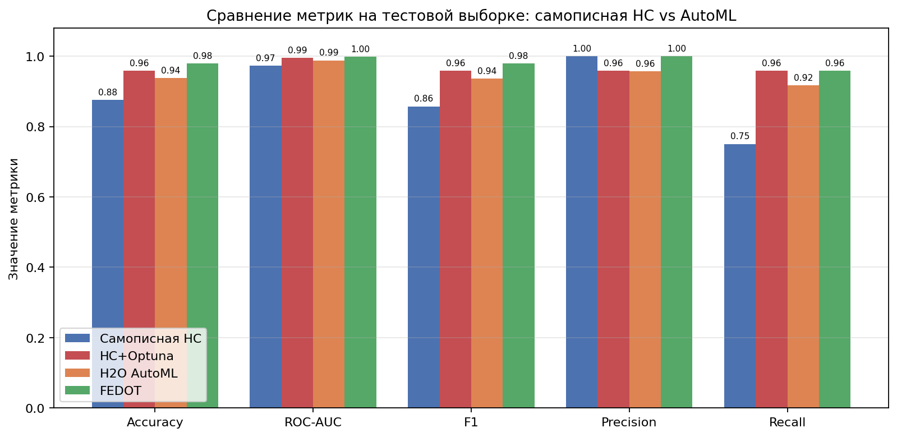

**Рисунок 8 - ROC-кривые четырёх моделей на одном графике.**

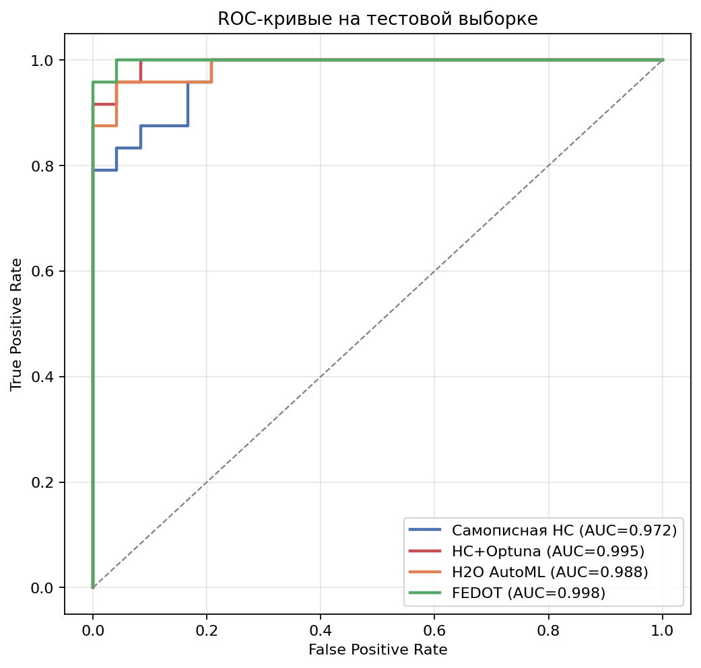

**Рисунок 9 - Матрицы ошибок (confusion matrix) для четырёх моделей.**

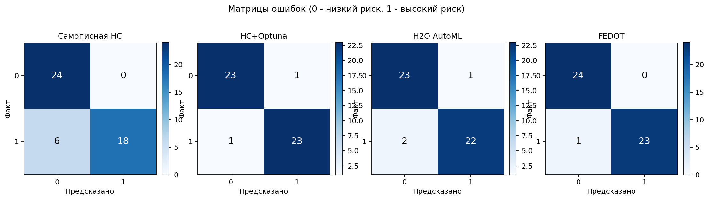

**Рисунок 10 - Важность признаков по версии лучшей базовой модели H2O.**

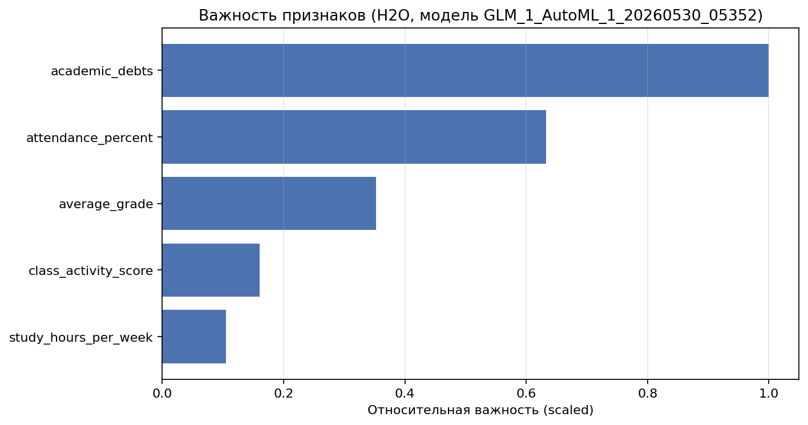

**Рисунок 11 - Подбор гиперпараметров самописной НС через Optuna: пространство поиска, лучший конфиг и сравнение базовой и настроенной сети.**

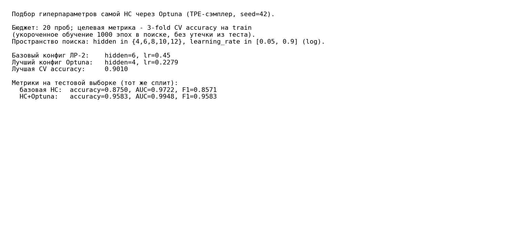

**Рисунок 12 - История подбора Optuna: значения проб и лучшее значение CV-accuracy по ходу поиска.**

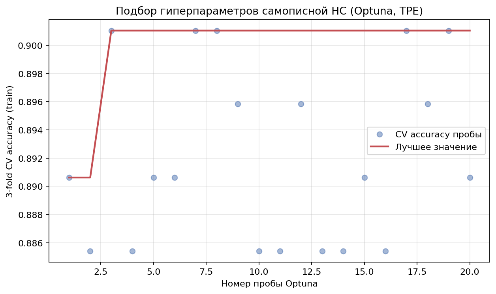

## Заключение

В ходе работы изучены принципы AutoML и применены три инструмента автоматического подбора — **Optuna** (подбор гиперпараметров самой нейросети), **H2O AutoML** и **FEDOT** — к задаче бинарной классификации риска отчисления студента из ЛР-2. Для честного сравнения использован **единый стратифицированный сплит** (train = 192, test = 48 объектов, `seed = 42`) и одинаковый набор метрик для всех моделей.

**Базовая самописная НС** (`5 → 6 → 1`, sigmoid, MSE, backprop, `lr = 0.45`), воспроизведённая из ЛР-2, на тесте показала **accuracy = 0.8750**, **ROC-AUC = 0.9722**, F1 = 0.8571, precision = 1.0000, recall = 0.7500 (результат совпал с заявленной в ЛР-2 точностью 87.5%). Её устойчивость подтверждена 5-fold кросс-валидацией: **accuracy = 0.8833 ± 0.0339**, ROC-AUC = 0.9621 ± 0.0197.

**Подбор гиперпараметров НС через Optuna** (20 проб, TPE-сэмплер, целевая метрика — 3-fold CV-accuracy на train) нашёл конфигурацию **`hidden = 4`, `learning_rate = 0.2279`** (лучшая CV-accuracy = 0.9010) вместо исходных `hidden = 6`, `lr = 0.45`. Переобученная с этими гиперпараметрами сеть на тесте дала **accuracy = 0.9583** и **ROC-AUC = 0.9948** (F1 = precision = recall = 0.9583) — то есть **только за счёт автоподбора гиперпараметров той же самой архитектуры качество выросло с 0.8750 до 0.9583**, причём recall поднялся с 0.7500 до 0.9583. Это показывает, что значительная часть отставания базовой сети объяснялась неоптимальными гиперпараметрами, а не самой моделью.

**H2O AutoML** перебрал **22 модели** (GLM, GBM, Deep Learning и их стек-ансамбли; XGBoost на данной платформе недоступен и был пропущен библиотекой). Победителем лидерборда стал **стек-ансамбль `StackedEnsemble_BestOfFamily`** с кросс-валидационным **AUC = 0.9703**; на тесте он дал **accuracy = 0.9375**, **ROC-AUC = 0.9878**, F1 = 0.9362, precision = 0.9565, recall = 0.9167. По важности признаков (GLM) ключевыми оказались число академических задолженностей (`academic_debts`) и посещаемость (`attendance_percent`) — что согласуется с природой данных.

**FEDOT** эволюционным поиском за фиксированное число поколений построил пайплайн из пяти узлов — **`logit → catboost → scaling → xgboost → lgbm`** (ансамбль логистической регрессии и градиентных бустингов) — и показал на тесте лучший результат: **accuracy = 0.9792**, **ROC-AUC = 0.9983**, F1 = 0.9787, precision = 1.0000, recall = 0.9583.

Таким образом, по accuracy на тесте модели выстроились в ряд **FEDOT (0.9792) > НС+Optuna (0.9583) > H2O AutoML (0.9375) > базовая НС (0.8750)**, а по ROC-AUC все три автоподобранных решения близки между собой (0.988–0.998) и заметно превосходят базовую сеть (0.972). Главный прирост достигнут за счёт **recall** (0.92–0.96 против 0.7500 у базовой сети): исходная НС была слишком «осторожной» и пропускала часть студентов группы риска. Показательно, что **буквальный подбор гиперпараметров самой нейросети (Optuna) поднял её до уровня полноценных AutoML-ансамблей** (а на данном сплите по accuracy даже превзошёл H2O) — то есть «подбор гиперпараметров» как метод даёт основной эффект, а более сложные ансамбли добавляют лишь небольшое преимущество. При этом важно честно отметить: **тестовая выборка мала (48 объектов)**, поэтому абсолютная разница в одну-две метрики находится в пределах статистического шума (отсюда и кросс-валидация для устойчивой оценки). Ценность AutoML здесь — прежде всего в **автоматизации**: перебор гиперпараметров, десятков моделей и построение ансамблей выполняются без ручного труда и дают как минимум сопоставимое, а на данной задаче — стабильно более высокое качество.

О воспроизводимости: подбор гиперпараметров через Optuna, базовая НС и FEDOT при фиксированном `seed = 42` **полностью детерминированы** — повторный запуск даёт идентичные числа. H2O AutoML запускается с `nthreads = 1`, но его лидерборд может **незначительно меняться** между запусками: входящие в перебор модели Deep Learning в H2O не гарантируют побитовой воспроизводимости (известная особенность библиотеки). При этом кросс-валидационный AUC лидера стабилен (≈ 0.97), а на крошечной тестовой выборке колебание затрагивает 1–2 объекта и не меняет общий вывод работы.

## Список использованных источников

1. Тюгашев А.А. Нейронные сети: учеб. пособие. - 179 с.
2. H2O AutoML documentation [Электронный ресурс]. URL: https://docs.h2o.ai/h2o/latest-stable/h2o-docs/automl.html (дата обращения 30.05.2026).
3. Nikitin N.O. et al. Automated evolutionary approach for the design of composite machine learning pipelines (FEDOT) // Future Generation Computer Systems. 2022. Vol. 127. P. 109-125. URL: https://github.com/aimclub/FEDOT (дата обращения 30.05.2026).
4. Akiba T. et al. Optuna: A Next-generation Hyperparameter Optimization Framework // KDD. 2019. URL: https://optuna.org/ (дата обращения 30.05.2026).
5. scikit-learn documentation [Электронный ресурс]. URL: https://scikit-learn.org/stable/ (дата обращения 30.05.2026).
6. Matplotlib documentation [Электронный ресурс]. URL: https://matplotlib.org/stable/ (дата обращения 30.05.2026).
